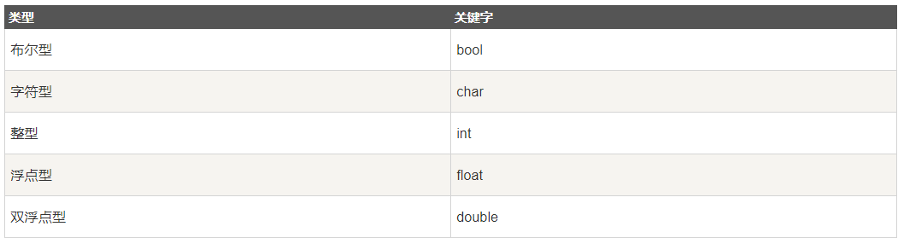
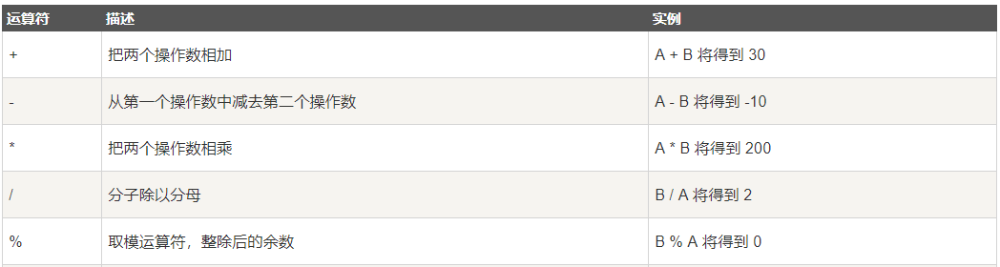
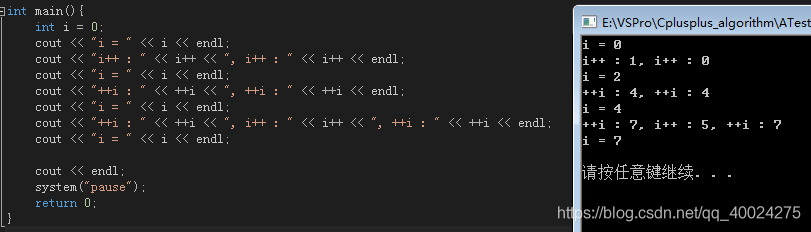

# 第一讲：变量、输入输出、表达式与顺序语句

---

**目录：**

[TOC]

---

## 一、C++的Hello World程序

``` C++
    #include <iostream>

    using namespace std;

    int main()
    {
        cout << "Hello World!" << endl;

        return 0;
    }
```

### 1.1 程序框架

* 头文件区
  格式：`#` + `include`.

  > `cstdio`：`printf()`函数和`scanf()`函数.
  > `iostream`：`cin`：读入 ; `cout`：输出.
                

    ==单独占一行，末尾不要加分号！==

* `using namespace std`
  避免工程项目命名冲突.
  包含`cin`和`cout`.

* 程序执行入口（main函数）
``` C++
    int main()
    {
        写逻辑区；
    }
```

* `return 0`
  
  程序正确执行之后返回0.

---

## 二、语法基础

### 2.1 变量的类型



* bool型：
    * 1字节
    * true：1.
    * false：0.
* char 字符型：
  * 1字节（8位）
* int 整形：
  * 4字节（32位）
  * 范围：-2147483648 ~ 2147483647
* 浮点型：
  * float（单精度浮点数）
    * 4字节
    * 精度低.
    * 有效数字为6-7位
    * 支持科学计数法：1.235e2（1.235×10^2）
        ==小数赋值给整数为下取整==
  * double（双精度浮点数）
    * 8字节
    * 15-16位
    * 精度高.
* 其他类型
  * long long int：-2^63 ~ 2^63-1
    * 8字节
  * long double：18-19位有效字符
    * 16字节
  
> B：Byte.
> b：bit.
> 1Byte = 8bit

        小知识：
        16GB内存比16GB硬盘容量大.

**关于浮点数的存储和表示的问题**

==存储形式：==

* 科学计数法.
* `x = S * 2 ^ j`.

==浮点数的比较方式：==

* 浮点数的存储不是精确值.
* 因此不能直接使用`x == y`的形式对两个浮点数进行比较.
* 通常界定一个足够小的误差容忍值：
  * 如果`fabs(x - y)`的值小于等于容忍值，则认为两个浮点数相等.
  * 如果`fabs(x - y)`的值大于容忍值，则认为两个浮点数不相等.

*判断两个浮点数是否相等：*

``` C++
  #include <cstdio>
  #include <iostream>
  using namespace std;
  int main()
  {
    float a = 1.23456789;
    printf("a = %.10f\n", a); //a = 1.1234567890.
    float b = sqrt(a);
    printf("b = %.10f\n", b); //b = 1.1111110449.

    const double eps = 1e-6;
    if (fabs(a - b) <= eps)
    {
      puts("相等！");
    }
    else
    {
      puts("不相等！");
    }

    return 0;
  }
```

*判断一个浮点数是否小于另一个浮点数：*

``` C++
  #include <cstdio>
  #include <iostream>
  using namespace std;
  int main()
  {
    float a = 1.23456789;
    printf("a = %.10f\n", a); //a = 1.1234567890.
    float b = sqrt(a);
    printf("b = %.10f\n", b); //b = 1.1111110449.

    const double eps = 1e-6;
    if (a < b - eps)
    {
      puts("a < b!");
    }
    else
    {
      puts("a >= b");
    }

    return 0;
  }
```

> `const`的用法：
> * 效果：
>   * 当后面想去修改`const`修饰的变量时，会发生报错.

### 2.2 变量的定义
变量必须先定义，才可以使用。不能重名.
变量定义的方式：
 * 先声明变量的类型
 * 表达式用逗号隔开
   * 可以是一个变量.
   * 也可以是一个赋值变量.
        ==整数可以赋值给浮点数==

        ``` C++
          int a;
          int b = 2, c = b;
          float d = 1.5, e = 1, f = 1.235e12;
          bool g = true, h = false;
          char j= 'a', k = 'b';
          long long l = 1231231LL;
          long double m = 123.45f;
        ```
  

### 2.3 输入输出

* **使用cin和cout输出：**

    输出*一个*变量：

    ``` C++
        int a, b; //定义两个变量
        cin >> a >> b;	//输入
        cout << a + b << endl;	//输出
    ```

    输出*多个*变量：

    ``` C++
        int a, b; //定义两个变量
        cin >> a;	//输入
        cin >> b;	//输入
        cout << a + b << ' ' << a * b << endl;	//输出
    ```
    > `endl` : 回车.

* **使用scanf和printf输出：**

    ``` C++
        int a, b;	//定义两个变量
        scanf("%d%d", &a, &b);
        printf("%d %d\n", a + b, a * b);
    ```

    ==float类型：==
    ``` C++
        float c, d;
        scanf("%f%f", &c, &d);
        printf("a + b = %.1f\na * b = %.2f", c + d, c * d);
    ```
    > 保留小数位数：`%.xf`：保留x位小数

    ==char类型==
    ``` C++
        char a, b;
        scanf("%c%c", &a, &b);
        printf("%c %c\n", a, b);
    ```
    > `%c%c`可能会读入空格，但`%d%d`不会.
    > `cin`可以过滤空格，`cout`不会过滤空格.

    ==double类型==
    ``` C++
        double a, b;
        scanf("%lf%lf", &a, &b);
        printf("%lf %lf\n", a, b);
    ```

    ==long long类型==
    ``` C++
        long long a, b;
        scanf("%lld%lld", &a, &b);
        printf("%lld %lld\n", a, b);
    ```

### 2.4 常见错误

> Compile Error：编译错误.
> Segmentation Error：段错误（数组越界）.

### 2.5 表达式
#### 2.5.1 表达式的类型：



``` C++
      cout << 5 % -2 << endl;
	  cout << -5 % 2 << endl;
      int b = a * 10 + 5 / 2;
	  cout << b << endl;
```

> 两个整数相除，结果得到一个整数.
> 做取模运算时，余数的符号与被除数符号相同.

#### 2.5.2 自增运算
* 对于一个变量本身而言，这两种运算完全一样.
* 对于运算来讲，++a为先自增再运算，a++为先运算再自增.
* i++与++i的详细区别：
  > i++，俗称先用后加；++i，俗称先加后用.

  > i++不可以做左值，++i可以做左值.

  * 具体实现：
    * i++：
  
        ``` C++
            const int int::operator++(int) {
              int old = *this;
              ++(*this);
              return old;
            }
        ```

        前缀形式（++i）返回的是引用形式，也就是一个地址值，说明函数的返回值可以作为左值使用，并且函数本身是无参的，意味着是在自身所在的空间增一后，再将自身的引用返回.
        
    * ++i:

        ``` C++
            int& int::operator++() {
              *this += 1;
              return *this;
            }
        ```

        后缀形式（i++）是带参的，说明在刚进入函数的时候存在另外的空间开辟，先将传入的值复制到一个副本中，将自身空间原本对应位置的值增一，最后返回的是副本的值。由于在函数的返回值传递的时候是进行值传递的，因此返回值只是一个临时变量，并不可以作为左值使用.

  * cout的执行顺序：
    cout输出的时候，先从右往左扫描，将数据读入缓冲区，然后再将缓冲区的内容依次输出.缓冲区是一种类似于栈的结构，满足先进后出的特性.

    例如：
    
      * 初始值i = 0；
      * `cout << "i++:" << i++ << "i++" << i++ << endl`
        1. 先扫描到第二个i++，i变为1，此时i++的返回值为0，则0进入缓冲区：|0|.
        2. 然后扫描到第二个i++，i变为2，此时i++的返回值为1，则1进入缓冲区：|0||1|.
        3. 输出|1| |0|.此时i = 2.
      * `cout << "++i:" << ++i << ",++i ;" << ++i << endl`
        4. 先扫描到第二个++i，i变为3，此时返回i的引用，缓冲区：|&i|.
        5. 然后扫描到第一个++i，i变为4，此时返回i的引用，缓冲区：|&i||&i|.
        6. 输出时，i此时的值为4，因此输出的时候从i对应的地址中读取数据，则输出：4 4.此时i = 4.

* 代码示例：
         
    ``` C++
        int a = 6;
        int b = a++;	//7
        int c = ++a;	//8
        cout << a << ' ' << a++ << endl;//先赋值再自增	9 8
        cout << a << ' ' << ++a << endl;//先自增再赋值	10 10
        printf("%d\n", a++);	//10
        printf("%d\n", ++a);	//12
        printf("%d %d\n", a, a++);	//13 12
        printf("%d %d\n", a, ++a);	//14 14
        printf("%d %d\n", a++, a);	//14 15
        printf("%d %d\n", ++a, a);	//16 16

        b += a;	//b = b + a;
        b -= a; //b = b - a;
        b *= a;	//b = b * a;
        b /= a;	//b = b / a;
        b %= a;	//b = b % a;
    ```

#### 2.5.3 变量的转换
* **显式类型转换：**
  * int和char依据ASCII码表（0-127）进行转换.
    * a : 97
    * A : 65
    * 0 : 48
    * 换行符 : 10
    * 空格 : 32
  * float型转为int型是舍去小数位数.

      ==int与float转换==

      ``` C++
          int a = 5;
          float b = (float)a;
          printf("%f\n", b);
          cout << b << endl;
      ```

      ``` C++
          int c = 5.23;
          float d = (int)c;
          printf("%d\n", d);
          cout << d << endl;
      ```
      ==int与char转换==
      ``` C++
          int t = 97;
          char cc = (char)t;
          cout << cc << endl;
      ```

      ``` C++
          char c = 'A';
          cout << (char)(c + 1) << endl;
      ```
      > char型和int型做运算，会将char类型变为整数.

* **隐式类型转换：**
    * 当小型数据类型与大型数据类型做运算时，输出数据会自动隐式转换为大型数据类型.

---

## 三、顺序语句

* 定义：执行语句从前往后一路到底
* 例题：
  * 输出第二个整数
    ``` C++
        int main()
        {
            int a, b, c;
            cin >> a >> b >> c;
            cout << b << endl;

            return 0;
        }
    ```

  * 计算(a + b) * c的值
    ``` C++
        int main()
        {
            int a, b, c;
            cin >> a >> b >> c;
            cout << (a + b) * c << endl;

            return 0;
        }
    ```


