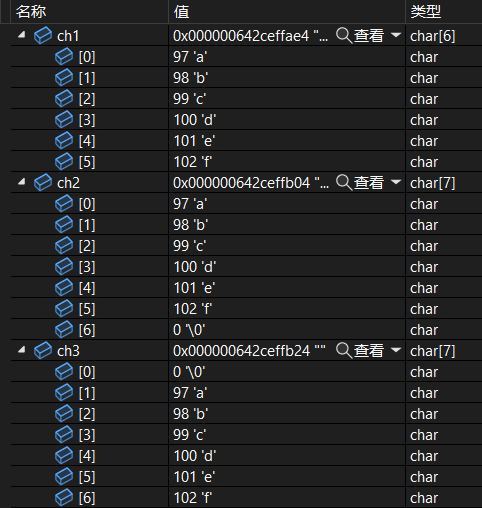
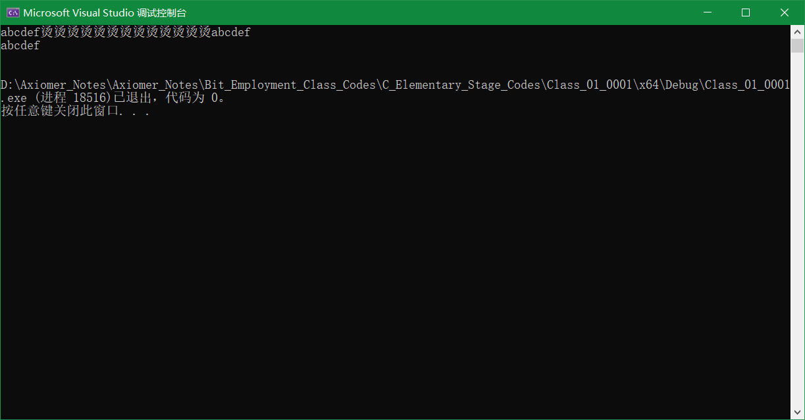
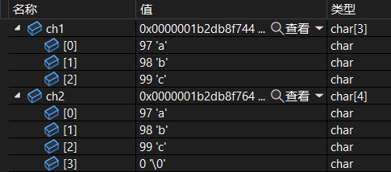
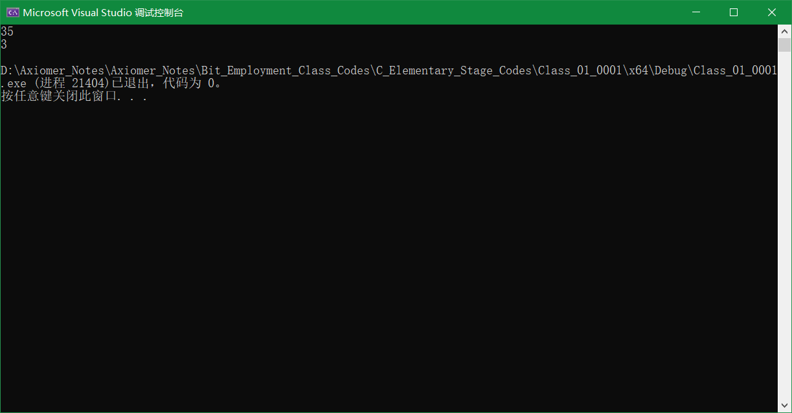

# 第一讲：初识C语言

> 坚持住！
> 学习是一个循序渐进的过程，不是一朝一夕就能有很大进步的.
> 技术的学习是量变引起质变的，慢慢积累和练习出来的.
> 永远不要高估短期的学习，但是也不要低估长期的学习价值.
> 看长期的价值！

> 基本了解C语言的基础知识，对C语言有一个大概的认识。
> 每个知识点就是简单认识，不做详细讲解，后期课程都会细讲。

---

**目录：**

[TOC]

---

## 一、第一个C语言程序

> C语言文件中，有两种文件：
> * `.h header`   头文件
> * `.c`         源文件

### 1.1 VS2022的相关操作

* ctrl + f5 ：   编译、链接、运行.
* f5        ：   调试.
* f10       ：   单步进入.

        注意：

            出现scanf_s报错：
            解决的办法：在源文件的第一行加上#define _CRT_SECURE_NO_WARNINGS 1

### 1.2 第一个C语言代码

``` C
    #include <stdio.h>

    int main()
    {
        printf("hello bit\n");
        return 0;
    }
```

> test.c -> C源程序 -> 编译 -> 链接 -> 可执行程序 -> test.exe

#### 1.2.1 `main`函数

代码一般是从`main`函数开始写.
C语言中`main`函数是程序的入口.
程序是从`main`函数的第一行开始执行的.
C语言的`main`函数有且仅有一个.

``` C
    int main()
    {
        return 0;
    }
```

* `int`与`return 0`相对应；
* `{   }`包含的是程序的函数体；

==不推荐这样写：==

``` C
void main()
{

}
```

==这样写也可以：==

*第一种：*

``` C
int main(void)
{
    return 0;
}
```

> `void`表示在这里`main`函数不接受任何形式的参数

*第二种：*

``` C
int main(int argc, char* argv[])
{
    return 0;
}
```

#### 1.2.2 printf()函数

``` C
printf("hehe");
```

> 注意：
    > * 双引号引起来的就是字符串
    > * `\n`表示换行

`printf()`输出函数，作用是将数据从内存打印（输出）到屏幕上.是一个库函数，是C语言提供的一个现成的函数，直接可以使用.

* 功能：在屏幕上打印数据.
* 在使用之前要包含头文件`stdio.h`
  * `#include <stdio.h>`

---

## 二、数据类型

### 2.1 数据类型分类

> * 字符数据类型：char.
> * 短整型：short.
> * 整型：int.
> * 长整型：long.
> * 更长的整型：long long.
> * 单精度浮点型：float.
> * 双精度浮点型：double.
> * 更长的双精度浮点型：long double.(C99)
> * 布尔类型：_Bool.(C99)

### 2.2 每种数据类型的大小

``` C
    int main()
    {
        printf("%d\n%d\n", 20, 10);
        printf("%d\n", sizeof(char));
        printf("%d\n", sizeof(short));
        printf("%d\n", sizeof(int));
        printf("%d\n", sizeof(long));
        printf("%d\n", sizeof(long long));
        printf("%d\n", sizeof(float));
        printf("%d\n", sizeof(double));

        char ch = 'w';

        return 0;
    }
```

> `"%d"`:以十进制的形式打印一个整数.

* `sizeof()`是一个操作符，是计算类型/变量所占内存空间的大小.
    * `sizeof()`算出来的单位是字节.

        计算机中的单位：
            bit     比特位（存放一个二进制位）
            Byte    字节（8 bit）
            KB          （1024 Byte）
            MB          （1024 KB）
            GB          （1024 MB）
            TB          （1024 GB）
            PB          （1024 TB）
            ...
    * sizeof(long long) >= sizeof(long).
    * sizeof(long) >= sizeof(int).


* `char ch = 'w';`创建了一个char类型的变量，向内存申请了一块`char`大小的空间.

---

## 三、变量、常量

> 不变的值，C语言中用常量的概念来表示；变的值，C语言中用变量来表示。

### 3.1 变量

#### 3.1.1 变量的分类

* 类型 变量名;
* 类型 变量名 = 初始值;

``` C
    int main()
    {
        int age1;
        int age2 = 20;

        float weight1 = 55.5f;
        double weight2 = 80.5;

        int num = 10;
        printf("%d\n", num);
        num = 20;
        printf("%d\n", num);

        return 0;
    }
```

* 小数直接写出来，编译器默认是double类型的.
  * `55.5f`这个时候就是float类型的.

            变量名只能由字母（包括大小写）、数字和下划线（_）组成.
            不能以数字开头.
            长度不能超过63个字符.
            变量名区分大小写.
            变量名不能使用关键字.
            变量名要起的有意义.

#### 3.1.2 变量的分类

* 局部变量
* 全局变量

``` C
    int a = 100; //全局变量

    int main()
    {
        int a = 10; //局部变量
        printf("a = %d\n", a);
        return 0;
    }
```

> 原则上变量名尽量不要冲突.
> 但是当全局变量和局部变量名字冲突的情况下，**局部变量优先**.

#### 3.1.2 变量的使用

写一个代码，求两个整数的和?

``` C
    int main()
    {
        //写一个代码，求两个整数的和
        int num1 = 0;
        int num2 = 0;
        int sum = 0;
        //输入两个整数的值
        scanf("%d %d", &num1, &num2);
        sum = num1 + num2;
        //打印
        printf("%d\n", sum);

        return 0;
    }
```

* `scanf()`：输入函数，作用是将数据从键盘读取到内存中.（C语言的编译器提供的现成的函数，直接可以使用.）
* `%d`：输入的格式.
  * `%c`：字符.
  * `%d`：整型.
  * `%s`：字符串.
  * `%f`：float.
  * `%lf`：double.
  * `%p`：地址的打印.
* `&`：取地址操作符，表示数据存放到哪里.

#### 3.1.3 变量的作用域和生命周期

**作用域：**
    作用域（scope）是程序设计概念，通常来说，一段程序代码中所用到的名字并不总是有效/可用的；而限定这个名字的可用性的代码范围就是这个名字的作用域。

* 局部变量的作用域

> 局部变量的作用域是变量所在的局部范围.

``` C
    int main()
    {
        {
            int a = 100;
            printf("%d\n", a);
        }
        printf("%d\n", a);  //会报错！
        
        return 0;
    }
```

变量a的作用域为：

``` C
    {
        int a = 100;
        printf("%d\n", a);
    }
```

* 全局变量的作用域

> 全局变量的作用域是整个工程.
> 全局变量不安全，尽量避免工程中使用全局变量.

``` C
    int a = 2023;

    void test()
    {
        printf("2--->%d\n", a);
    }

    int main()
    {
        printf("1--->%d\n", a);
        return 0;
    }
```

    extern ：在整个工程中引用外部文件的全局变量时使用的关键字.

**生命周期：**

变量的*生命周期*指的是变量的创建到变量的销毁之间的一个时间段.

* 局部变量的生命和周期

``` C
    int main()
    {
        {
            int a = 3;
            int b = 5;
            int c = a + b;
            printf("%d\n", c);
        }
        //...

        return 0;
    }
```

    局部变量进入作用域生命周期开始，出作用域变量销毁，把空间还给操作系统.

> 变量创建的本质是在内存中开辟一块空间，存放数据.

* 全局变量的生命和周期
  * `main`函数的生命周期就是整个程序的生命周期.
  * 全局变量的生命周期是main函数的生命周期，所以全局变量的生命周期就是整个程序的生命周期.

### 3.2 常量

> C语言中的常量和变量的定义的形式有所差异.

#### 3.2.1 常量的分类

* 字面常量.
* `const`修饰的常变量.
* `#define`定义的标识符常量.
* 

##### 3.2.1.1 字面常量

* 3.14
* 3
* 'a'
* "aabcdef123"

##### 3.2.1.2 `const`修饰的常变量

``` C
    int main()
    {
        const int a = 3;
        printf("%d\n", a);
        a = 10; //会报错！
        return 0;
    }
```

这里的a是具有常属性的，不能改变，但是本质上还是变量.

例如：

``` C
    int main()
    {
        //数组的创建
        const int n = 10;   //会报错！
        int arr[n];
        return 0;
    }
```

##### 3.2.1.3 `#define`定义的标识符常量

``` C
    #define SIZE 10
    #define MAX = 10000
    #define CH 'W'  //单引号不能去掉

    int main()
    {
        //10
        int a = SIZE;
        int arr[SIZE] = { 0 };
        printf("%c\n", CH);
        return 0;
    }
```

> `#define`定义的标识符常量名与变量名相同时也会产生冲突.

##### 3.2.1.4 枚举常量

枚举：一一列举.
生活中有些值是可以一一列举的，比如：性别（男、女），三原色（红、绿、蓝），血型（A、B、O）.

**关键字**：`enum`.

``` C
    enum SEX
    {
        //列出了枚举类型的可能取值
        //枚举常量
        MALE = 4,
        FEMALE, //5
        SECRET  //6
    };

    int main()
    {
        enum SEX s = FEMALE;

        MALE = 5;   //会报错！
        printf("%d\n", MALE);
        printf("%d\n", FEMALE);
        printf("%d\n", SECRET);

        return 0;
    }
```

* 不同的枚举常量，初始值（如果不进行赋值）从0开始，依次向下递增1：0，1，2，... .
* 两组枚举类型不预允许重名.

---

## 四、字符串、转义字符、注释

### 4.1 字符

`'c'`这种由单引号（Apostrophe）引起来的是C语言中的字符.

### 4.2 字符串

`"hello bit!\n"`这种由双引号（Double Quote）引起来的一串字符称为字符串字面值（String Literal），或者简称字符串（常量）.
字符串就是一串字符.

``` C
    int main()
    {
        "abcdef";
        //char ch1 = 'a';
        //char ch2 = 'b';
        //char ch3 = 'c';
        char ch1[6] = { 'a', 'b', 'c', 'd', 'e', 'f' };
        char ch2[] = "abcdef";
        char ch3[] = {'\0', 'a', 'b', 'c', 'd', 'e', 'f' };

        printf("%s\n", ch1);
        printf("%s\n", ch2);
        printf("%s\n", ch3);
        return 0;
    }
```

调试结果：



运行结果：



> `printf()`以`%s`打印字符串的时候，就从给定的地址开始打印，一直打印到遇到`\0`时停止.

``` C
    int main()
    {
        char ch1[] = {'a', 'b', 'c'};   //[a][b][c]
        char ch2[] = "abc"; //[a][b][c][\0]
        int len1 = strlen(ch1);
        int len2 = strlen(ch2);
        printf("%d\n", len1);   //得到的会是一个随机值
        printf("%d\n", len2);
        return 0;
    }
```

调试结果：



运行结果：



> `strlen()`是库函数，用来求字符串长度，就是从给定的地址，向后数字符，直到遇到`\0`结束，`\0`不统计在内.

> 字符串的结束标志是一个`\0`的转义字符。在计算字符串长度的时候`\0`是结束标志，不算作字符串内容.

### 4.3 转义字符

转义字符：转变原来的意思.

``` C
    int main()
    {
        printf("(are you ok??)");
        //are you ok]
        //??) -> 三字母词 -> 代表 ]
        printf("(are you ok\?\?)");

        printf("ab\ndef");

        printf("C:\test\test.c");
        printf("C:\\test\\test.c");

        printf("%c\n", 'a');
        printf("%c\n", ''');    //出错！
        printf("%c\n", '\'');

        printf("%c\n", "abc");
        printf("%c\n", "a");
        printf("%c\n", "\"");

        printf("%c\n", "'");    //$
        printf("%s\n", "'");    //'

        printf("%c\n", "a\\tb");

        printf("%s\n", "abc\bdef");

        printf("%c\n", '\130'); //X
        //八进制的130转换成十进制的88后，把88作为ASCII值代码代表的字符
        printf("%c\n", '\133'); //[
        printf("%s\n", "\13045612"); //X45612

        printf("%d\n", strlen("c:\test\x11\328\test.c"));   //字符串长度为15
        // /32为一个转义字符，不含下一位的8，因为八进制数字不含有8

        return 0;
    }
```

| 转义字符 | 释义 |
| ----  | ---- |
| \? | 在书写连续多个问号时使用，防止他们被解析成三字母词 |
| \' | 用于表示字符常量' |
| \" | 用于表示一个字符串内部的双引号 |
| \\ | 用于表示一个反斜杠，防止它被解释为一个转义序列符 |
| \a | 警告字符，蜂鸣 |
| \b | 退格符 |
| \f | 进纸符 |
| \n | 换行 |
| \r | 回车 |
| \t | 水平制表符 |
| \v | 垂直制表符 |
| \ddd | ddd表示1~3个八进制的数字。 如： `\130`表示字符`X` |
| \xdd | dd表示1~2个十六进制数字。 如： `\x31`表示字符`1` |

    不同的进制只是数据的表示形式而已（各个数位的底数权值不同）：
        例如，15的各个不同进制下的数据表示形式为：
          * 十进制：15
          * 八进制：17
          * 二进制：1111
          * 十六进制：F

> 键盘上的字符在计算机中是用字符的编号（二进制）表示和存储的，称为ASCII码（美国标准信息交换代码）值.
> `A`（65）与`a`（97）之间相差32.

### 4.4 注释

**注释：** 一些解释性的语句.

* 代码中有不需要的代码可以直接删除，也可以注释掉
* 代码中有些代码比较难懂，可以加一下注释文字

**注释的两种方式：**

* 以`//`开头的注释是属于C++的注释风格.
* /**/是属于C语言的注释风格，但是不支持嵌套.


``` C
    /*
    * C语言的注释风格.
    */

    /*
        //...
        /*
            //...
        */
    */
    //C语言的注释不支持嵌套注释.

    //C++的注释风格.
```

---

## 五、选择语句

* if语句

``` C
    int main()
    {
        printf("加入比特就业课学习\n");
        printf("你愿意好好学习吗？(1/0)>:");
        int flag = 0;
        scanf("%d", &flag);

        if (flag == 1)
        {
            printf("好offer\n");
        }
        else if (flag == 0)
        {
            printf("卖红薯\n");
        }
        else
        {
            //三种以上的情况才会用到这种模式.
        }

        return 0;
    }
```

> C语言中的判断用判断符号`==`.

* switch语句

---

## 六、循环语句

* while 语句

``` C
    int main()
    {
        int line = 0;
        while (line < 50000)
        {
            if (...)
            {
                //...
            }
            printf("敲代码：%d\n", line);
            line++;
        }

        if (line == 50000)
            printf("好offer\n");
        else
            printf("差点意思\n");

        return 0;
    }
```

* `for` 语句
* `do...while` 语句

> * 在整个工程中，`.c`文件中的`main`函数有且仅有一个.
> * 一个工程内可以放多个`.c`文件.
> * 报错：（1）找到一个或多个多重定义的符号；（2）_main已经在源.obj中定义.
> * 解决方案和项目文件是同一个意思.

---

## 七、第一次作业

**第一题**

* 内置的数据类型：C语言本身就具有的类型.
* 自定义类型：允许你创建出来的类型.
* `Struct stu`：结构体类型.

**第二题**

写博客不是答题，要以写文章的方式来写博客.

**第三题**

* Git：分布式管理工具.
  * Git Bush：命令行窗口.
    * `git add *`：在文件夹下添加所有未被添加的文件.
    * `git commit -m "提示信息"`：提交文件.
    * `git push`：推送文件.
  * TortoiseGit（小乌龟图形化工具）：图形化的界面，是Git的辅助工具.
* Gitee：代码托管平台，使用Git工具，可以把代码维护在Gitee这个网站的代码仓库中.
* 千万不要以为Git只有三板斧，功能还有很多，后期可以研究一下.

**第四题**

题目：据说智商140以上者称为天才，KiKi想知道他自己是不是天才，请帮他编程判断。输入一个整数表示一个人的智商，如果大于等于140，则表明他是一个天才，输出“Genius”。

``` C
    int main() {
        int a = 0;
        //输入
        while (scanf("%d", &a) == 1)
        {
            if (a >= 140)
            {
                printf("Genius\n");
            }
        }
        return 0;
    }
```

> 如果想要代码停下来，按三次`ctrl + Z`，就可以让`scanf()`返回一个`EOF`.

* `scanf()`
  * `int scanf ( const char * format, ... )`;
  * `scanf()`函数返回的是读取到的数据的个数.
    * 如果`scanf()`函数读取失败会返回`EOF`.
    * `EOF`：`file` 文件结束标志.
    * `#define EOF -1`.

    ``` C
        int iq = 0;
        int eq = 0;
        int n = scanf("%d %d", &iq, &eq);
        //输出n = 2.
    ``` 

* 在线OJ：online judge - 在线判题.
* 找工作：
  * 笔试＋面试（一面、二面、HR面）.
  * 很多公司笔试都是在线笔试的，采用的就是在线OJ的方式.
  * 熟悉牛客等平台环境是很有必要的.

---

## 八、第二次作业

**题目一**

* 局部变量的作用域是局部变量所在的局部范围.

**题目二**

* 字符串的结束标志是`'\0'`.

**题目五**

* 全局变量和局部变量一起出现的时候，局部变量优先.

**题目六**

``` C
    #include <stdio.h>
    #include <string.h>
    int main()
    {
        printf("%d\n", strlen("c:\test\121"));
        //strlen("c:\test\121") = 7.
        return 0;
    }
```

* `strlen("c:\test\121")`是一个字符串，在字符串的结束位置有字符串结束标志`'\0'`;

**题目七**

``` C
    int main()
    {
        printf("%d\n", 9 / 5);  //1
        printf("%d\n", 9 % 5);  //4
        return 0;
    }
```

* C语言中`/`表示除，计算的是商；`%`表示取余，计算的是除法之后的余数.

**题目八**

* 一个整型能表示的最大整数为21亿多一点.

**题目十一**

* 数学中：乘号`✖`；除号`➗`.
* C语言中：乘号`*`；除号`/`.

---

## 九、函数

> 函数可以理解为一个模块的代码，完成一个独立的功能.

> 函数的特点就是简化代码，代码复用.

``` C
    #include <stdio.h>
    int Add(int x, int y)/*形式参数x和y*/
    {
        int z = x + y;
        return z;
    }
    int main()
    {
        //求两个整数的和
        int a = 0;
        int b = 0;

        //输入
        scanf("%d %d", &a, &b);
        int sum = Add(a, b)/*实际参数a和b*/;
        //输出
        printf("%d\n", sum);

        return 0;
    }
```

* 工厂（`Add`函数）生产轮胎，需要原材料：塑料、橡胶、化学材料...
* 有一家车企（`main`函数），要下订单（调用`Add`函数）：要求工厂生产一批轮胎，并给工厂原材料（整型`a`和`b`）.
* 经过工厂加工，最后生产出我们的轮胎（返回计算好的和`a + b`）.
* 如果不需要函数返回值，那么函数的返回类型为`void`；

---

## 十、数组

数组：一组相同类型元素的集合.

### 10.1 数组定义

``` C
    #include <stdio.h>
    int main()
    {
        int arr[10] = {1, 2, 3, 4, 5, 6, 7, 8, 9, 10};//这是一个整型数组，最多放10个元素
        char ch[8];//这是一个字符数组
        return 0;
    }
```

### 10.2 数组的下标

* C语言规定：数组的每个元素都有一个下标，下标是从0开始的。
* 数组可以通过下标来访问的。

``` C
int arr[10] = { 0 };
//如果数组有10个元素，下标的范围是0-9.
```

### 10.3 数组的使用

``` C
    #include <stdio.h>
    int main()
    {
        int arr[10] = { 1, 2, 3, 4, 5, 6, 7, 8, 9, 10 };//这是一个整型数组，最多放10个元素
        //              0  1  2  3  4  5  6  7  8  9
        char ch[8];//这是一个字符数组

        //打印下标为5的数组元素.
        printf("%d\n", arr[5]);
        //遍历数组元素并打印.
        int i = 0;
        while (i < 10)
        {
            printf("%d ", arr[i]);
            i++;    //i = i + 1.
        }

        return 0;
    }
```

---

## 十一、操作符

> C语言有很多的操作符，所以就很灵活，甚至可以操作到二进制位.

**算数操作符**

| 表达式名称 | 表达式表示方式 |
| --- | --- |
| 加 | + |
| 减 | - |
| 乘 | * |
| 除 | / |
| 取余 | % |

用法：

* `/`
  * 得到的计算结果是整出之后得到的商.
  * 除法有整数除法和浮点数除法两种区分.
  * 浮点数除法要保证除数和被除数至少要有一个数是浮点数.
    * 7.0：默认为double类型.
    * 7.0f：float类型.

    ``` C
        #include <stdio.h>
        int main()
        {
            printf("%d\n", 7 / 2);	//7
            printf("%lf\n", 7.0 / 2);   //3.5
            printf("%lf\n", 7.0 / 2.0);   //3.5
            printf("%lf\n", 7 / 2.0);   //3.5
        }
    ```

* `%`（取余操作符或取模操作符）
  * 得到的是余数.
  * 只适用于整数运算，对于小数是不适用的.

**移位操作符**

| 表达式名称 | 表达式表示方式 |
| --- | --- |
| 左移 | << |
| 右移 | >> |

注意：

* 移位操作符移动的是二进制位.

**位操作符**

| 表达式名称 | 表达式表示方式 |
| --- | --- |
| 按位与 | & |
| 按位异或 | ^ |
| 按位或 | \| |

注意：

* 位操作符操作的是二进制位.

**赋值操作符**

| 表达式名称 | 表达式表示方式 |
| --- | --- |
| 赋值 | = |
| 加等于 | += |
| 减等于 | -= |
| 乘等于 | *= |
| 除等于 | /= |
| 按位与等 | &= |
| 按位异或等 | ^= |
| 按位或等 | \|= |
| 右移等 | >>= |
| 左移等 | <<= |

注意：

* `a += 5`：等价于`a = a + 5`，复合赋值.

**单目操作符**

| 表达式名称 | 表达式表示方式 |
| --- | --- |
| 逻辑反操作 | ! |
| 赋值 | - |
| 正值 | + |
| 取地址 | & |
| 操作数的类型长度（以字节为单位） | sizeof |
| 对一个数的二进制按位取反 | ~ |
| 自减 | -- |
| 自加 | ++ |
| 间接访问操作符（解引用操作符） | * |
| 强制类型转换 | (类型) |

`!`的用法：

``` C
    #include <stdio.h>
    int main()
    {
        int a = 0;
        if (a)  //a为真进入if
        {
            //...
        }
        if (!a) //a为假进入if
        {
            //...
        }

        printf("%d\n", !a); //1

        return 0;
    }
```

> C语言中用0表示假，用非零表示真.

`sizeof`的用法：

``` C
    #include <stdio.h>
    int main()
    {
        int a = 100;
        printf("%d\n", sizeof(a));
        printf("%d\n", sizeof a);
        printf("%d\n", sizeof(int));
        //printf("%d\n", sizeof int); //这是一个错误的示范.

        return 0;
    }
```

> sizeof()是一个操作符，不是函数.
> sizeof()计算的是变量占有内存的大小，单位是字节.

`++`（自增操作符）的用法：

``` C
    #include <stdio.h>
    int main()
    {
        int a = 1;

        //前置++
        int b = ++a;
        printf("a = %d, b = %d\n", a, b);   //a = 2, b = 2.
        /*
            a = a + 1;
            b = a;
        */

        //后置++
        int c = a++
        printf("a = %d, b = %d\n", );   //a = 3, b = 2.
        /*
            b = a;
            a = a + 1;
        */

        return 0;
    }
```

> 前置++：先++后使用.
> 后置++：先使用后++.

强制类型转换的用法：

``` C
    #include <stdio.h>
    int main()
    {
        int a = (int)3.14;
        printf("%d\n", a);
        return 0;
    }
```

小小总结：

                单目操作符：有一个操作数.
                双目操作符：有两个操作数.

**关系操作符**

| 表达式名称 | 表达式表示方式 |
| --- | --- |
| 大于 | > |
| 小于 | < |
| 大于等于 | >= |
| 小于等于 | <= |
| 不等于（用于测试“不相等”） | != |
| 等于（用于测试“相等”） | == |

``` C
    #include <stdio.h>
    int main()
    {
        int a = 4;
        int b = 5;
        if (a != b)
        {
            printf("hehe\n");
        }
        else
        {
            printf("haha\n");
        }

        return 0;
    }
```

* C语言中的关系操作符和数学中的关系操作符写法不一样！
* 用于判断大小关系的操作符.
* 字符串不可以用关系操作符比较.

**逻辑操作符**

| 表达式名称 | 表达式表示方式 |
| --- | --- |
| 逻辑与 | && |
| 逻辑或 | \|\| |

``` C
    #include <stdio.h>
    int main()
    {
        int a = 0;
        int b = 5;
        if (a || b)
        {
            printf("hehe\n");
        }
        else if (a && b)
        {
            printf("haha\n");
        }

        if (a && b)
	    {
		    printf("hehe\n");
	    }
	    if (a || b)
	    {
		    printf("haha\n");
	    }
        return 0;
    }
```

* `&&`
  * 并且（逻辑与）.
  * 两个操作数都为真，才为真；只要有一个为假，则为假.
* `||`
  * 或者（逻辑或）.
  * 两个操作数只要有一个为真，才为真；两个同时为假，才为假.

**条件操作符（三目操作符）**

`exp1 ? exp2 : exp3`
表达式1 ? 表达式2 : 表达式3

``` C
    #include <stdio.h>
    int main()
    {
        int a = 0;
        int b = 0;
        //输入
        scanf("%d", &a);
        scanf("%d", &b);
        int m = 0;
        //(a > b) ? (m = a) : (m = b);
        m = a > b ? a : b;
        /*
        if (a > b) m = a;
        else m = b;
        */
        printf("%d\n", m);
        return 0;
    }
```

用法：

* 如果表达式1为真，表达式2执行，表达式3不执行，表达式3的结果是整个表达式的结果.
* 如果表达式1为假，表达式2不执行，表达式3执行，表达式23的结果是整个表达式的结果.
* 不要把三目操作符写的太复杂，比如使用嵌套三目操作符.

> 如果不对局部变量赋初始值，则局部变量中存储的是一个随机数，所以如果不对局部变量进行初始化，编译器可能会报错.

**逗号表达式**

`exp1, exp2, exp3, …expN`

``` C
#include <stdio.h>
int main()
{
	int a = 3;
	int b = 2;
	int c = 5;
	int d = (a += 3, b = 5, c = a + b, c - 4);  //d = 7.
	return 0;
}
```

* 由逗号隔开的一连串表达式，它会从左向右依次计算.
* 逗号表达式的结果是最后一个表达式的结果.
* 不能只算最后一个表达式！

**下标引用、函数调用和结构成员**

| 表达式名称 | 表达式表示方式 |
| --- | --- |
| 下标引用操作符 | [ ] |
| 函数调用操作符 | () |
| 结构成员访问操作符（1） | . |
| 结构成员访问操作符（2） | -> |

* `arr[5]`有两个操作数，一个是`arr`，另一个是`5`.

下标引用操作符用法：

``` C
    #include <stdio.h>
    int main()
    {
        int arr[10] = { 1, 2, 3, 4, 5, 6, 7, 8, 9, 10 };
        //下标：			0  1  2  3  4  5  6  7  8  9
        printf("%d\n", arr[5]);
        //arr[5]有两个操作数，一个是arr，另一个是5.

        return 0;
    }
```

> C99支持变长数组.

函数调用操作符用法：
``` C
    #include <stdio.h>
    int Add(int x, int y)
    {
        return x + y;
    }
    int main()
    {
        int z = Add(3, 5);	//函数调用操作符.
        printf("hehe\n");

        return 0;
    }
```

* 对于`Add(3, 5)`来说，操作数分别为`Add`，`x`，`y`.

---

## 十二、常见关键字

> C语言提供了丰富的关键字，这些关键字是语言本身预先设定好的，用户自己是不能创造关键字的.

**注意：`define`不是关键字！**

**关键字 `auto`**

`auto` - 自动的.

``` C
    #include <stdio.h>
    int main()
    {
        auto int num = 0;
        return 0;
    }
```

* 局部变量是进入作用域创建，出了作用域销毁了，自动创建、自动销毁的.
* `auto`就是用于修饰这样的局部变量的关键字，局部变量本身前面有`auto`修饰，但是常常会省略.

**关键字`break`、`continue`、`default`、`do`、`else`、`for`、`while`和`case`**

`break` - 终止，停止.
`default` - 默认.

用法：
* 循环语句.
* 分支语句.
  * `switch`语句.

**关键字`const`**

`const` - 常属性.

**关键字`enum`**

`enum` - 枚举类型（是一种自定义类型）.

**关键字`extern`**

用于声明外部符号的，用于修饰变量，表示这个变量或符号名来自外部.

**关键字`goto`**
`
分支语句中使用.

**关键字`register`**

`register` - 寄存器关键字.

用法
* 用于修饰变量.

**关键字`return`**

用法
* 用于函数的返回.

**关键字`signed`、`unsigned`**

`signed` - 有符号的.
* 用于描述有符号数.
`unsigned` - 无符号数.
* 只能描述正数.

**关键字`sizeof`**

**关键字`static`**

`static` - 静态的.

**关键字`struct`、`union`**

`struct` - 结构体类型.
`union` - 联合体类型.

**关键字`typedef`**

用法
* 用于类型重命名.

**关键字`void`**

`void` - 无、空.

用法
* 用于函数的返回值.
* 用于函数的参数传递.
* 用于修饰指针.

**关键字`volatile`**

用法
* 类型修饰符.

### 12.1 `typedef`

> `typedef` 顾名思义是类型定义，这里应该理解为类型重命名.

``` C
    #include <stdio.h>
    typedef unsigned int u_int;
    typedef unsigned long long ull;
    int main()
    {
        unsigned int num1 = 0;
        u_int num2 = 0;
        ull num3 = 0;

        return 0;
    }
```

``` C
    typedef struct Node
    {
        int dada;
        struct Node* next;
    }Node;
```

### 12.2 `static`

用法：
* 修饰局部变量.
  * 称为静态局部变量.
* 修饰全局变量.
  * 称为静态全局变量.
* 修饰函数.
  * 称为静态函数.

**修饰局部变量**

``` C
    #include <stdio.h>
    void test()
    {
        int a = 5;
        a++;
        printf("%d ", a);
    }
    int main()
    {
        int i = 0;
        while (i < 10)
        {
            test();
            i++;
        }
        return 0;
    }
    //执行结果：6 6 6 6 6 6 6 6 6 6 
```

``` C
    #include <stdio.h>
    void test()
    {
        static int a = 5;   //存放在静态变量区（静态区）.
        a++;
        printf("%d ", a);
    }
    int main()
    {
        int i = 0;
        while (i < 10)
        {
            test();
            i++;
        }
        return 0;
    }
    //执行结果：6 7 8 9 10 11 12 13 14 15 
```

> 变量在创建之后，地址和值在编译时就设置好了，变量的值可以发生变化，但是变量的地址空间不变.

> 变量在程序彻底结束之后才把变量的内存空间还给操作系统.

C/C++代码学习的时候，我们把内存大概划分为三个区域：
* 栈区（具有临时作用的变量）
  * 变量特点：
    * 进入作用域创建，出了作用域销毁，还给操作系统.
  * 一般存放的变量类型：
    * 局部变量.
    * 形式参数.
* 静态区.
  * 变量特点：
    * 创建好后直到程序结束才销毁，还给操作系统.
  * 一般存放的变量类型：
    * 全局变量.
    * 静态变量.
* 堆区.
  * 用于动态内存分配.
  * 一般用于堆区的函数类型：
    * `malloc`
    * `calloc`
    * `realloc`
    * `free`

`static`修饰局部变量的时候，本来一个局部变量是存放在栈区的；如果被`static`修饰，就会存储到静态区，这使得它的存储类型（存储位置）发生变化，最终使得这个静态变量的生命周期变长了，直到程序结束生命周期才结束；但是作用域没有发生变化.

> 与全局变量的区别：被`static`修饰的局部变量还是一个局部变量，仍然只能在局部范围内使用.

**修饰全局变量**

==正确情形：==

``` C
    //add.c:
    #include <stdio.h>
    int g_val = 2023;
```

``` C
    #include <stdio.h>
    //Test.c:
    extern int g_val;	//声明外部符号 - 只是声明类型和位置，不涉及变量的具体值.
    int main()
    {

        printf("%d\n", g_val);
        return 0;
    }

    //正确执行！
```

==报错情形：==

全局变量具有外部链接属性，在编译链接时会在全局文件中寻找该全局变量，所以在其他源文件内部依然可以使用.

``` C
    //add.c:
    #include <stdio.h>
    static int g_val = 2023;
```

``` C
    #include <stdio.h>
    //Test.c:
    extern int g_val;	//声明外部符号 - 只是声明类型和位置，不涉及变量的具体值.
    int main()
    {

        printf("%d\n", g_val);
        return 0;
    }

    //会报错！
```

`static`修饰全局变量，改变了这个全局变量的链接属性，由外部链接变成了内部链接属性；这个静态变量只能在自己所在的源文件内部使用，不能在其他源文件内部使用了，相当于添加了隔绝.

`static`修饰的全局变量只是限制了变量的使用范围，但是变量的空间内存的位置没有发生变化.

**修饰函数**

`static`修饰函数和`static`修饰全局变量是一样的.

==正确情形：==

``` C
    #include <stdio.h>
    //add.c:
    int Add(int x, int y)
    {
        return (x + y);
    }
```

``` C
    #include <stdio.h>
    //Test.c
    extern int Add(int x, int y);   //声明外部函数符号 - 只是声明函数的类型、名称和参数预计参数类型，不涉及函数参数的具体值.
    int main()
    {
        int a = 0;
        int b = 0;
        scanf("%d %d", &a, &b);
        int s = Add(a, b);
        printf("%d\n", s);
        return 0;
    }

    //正确执行！
```

一个函数本身具有外部链接属性.

==报错情形：==

``` C
    #include <stdio.h>
    //add.c:
    static int Add(int x, int y)
    {
        return (x + y);
    }
```

``` C
    #include <stdio.h>
    //Test.c
    extern int Add(int x, int y);   //声明外部函数符号 - 只是声明函数的类型、名称和参数预计参数类型，不涉及函数参数的具体值.
    int main()
    {
        int a = 0;
        int b = 0;
        scanf("%d %d", &a, &b);
        int s = Add(a, b);
        printf("%d\n", s);
        return 0;
    }

    //会报错！
```

一个函数如果被`static`修饰，就变成了内部链接属性，使得这个函数只能在自己所在的源文件中使用，不能在其他源文件中使用.

### 12.3 `register`

电脑上的产生的数据可以放在以下位置：
* 硬盘.
* 内存.
* 寄存器.
* 缓存.
* 网盘.

寄存器的读写速度特别快！

``` C
    #include <stdio.h>
    int main()
    {
        register int num = 10;

        return 0;
    }
```

> `register`仅仅是建议的作用.

> `register`建议放在寄存器中，但是不是真的放在寄存器中，取决于编译器.

---

## 十三、`#define`定义常量和宏

==define定义标识符常量==

``` C
    #include <stdio.h>
    #define M 100
    int main()
    {
        int arr[M] = { 0 };
        int m = M;
        printf("%d\n", sizeof(arr));    //400
        printf("%d\n", M);
        printf("%d\n", m);

        return 0;
    }
```

在预处理阶段已经将M全部替换了，这里M不是一个变量，不需要内存空间进行存储.

==宏==
宏的组成：
* `ADD` - 名字.
* `(x, y)` - 参数.   
* `((x) + (y))` - 宏的实现体.
* 没有返回类型.

``` C
    #include <stdio.h>
    #define ADD(x, y) ((x) + (y))
    int main()
    {
        int a = 10;
        int b = 20;
        int c = ADD(a, b);
        //int c = ((a) + (b));
        printf("%d\n", c);
        //返回30.
        return 0;
    }
```

---

## 十四、结构体`struct`

> C语言中引入结构体，使得C语言有能力描述复杂类型.

基本结构：

``` C
struct 结构体名称
{
    //结构体的相关属性...
    //...
    //...
};

struct 结构体名称 结构体变量名称;
```

举例：

``` C
    #include <stdio.h>
    struct Stu
    {
        //定义学生的相关属性：
        char name[20];	//名字.
        int age;		//年龄.
        char sex[5];	//性别.
        char id[15];	//学号.
    };

    struct Book
    {
        //定义书籍的相关属性：
        char name[20];  //成员
        char author[10];    //成员
        double price;   //成员
    };

    int main()
    {
        struct Stu s = { "张三", 18, "男" };	//创建一个对象并且初始化.
        struct Book b = { "《鹏哥C语言》", "鹏哥", 66.6f };

        printf("%s %s %f\n", b.name, b.author, b.price);
        return 0;
    }
```

注意：
* 一个汉字占两个字符（`char`变量）.
* 浮点数在内存中不能精确保存.

**结构体的成员访问：**

结构体成员访问操作符：
* `.`：
  * `结构体变量.结构体成员`.
  * `t.name`.
    * `t`为结构体变量.
* `->`：
  * `结构体指针->结构体成员`.
  * `t->name`.
    * `t`为结构体指针.

``` C
    #include <stdio.h>
    struct Stu
    {
        char name[20];
        int age;
        float score;
    };
    void print1(struct Stu t)
    {
        printf("%s %d %f\n", t.name, t.age, t.score);
    }
    void print2(struct Stu* ps)
    {
        printf("%s %d %f\n", (*ps).name, (*ps).age, (*ps).score);
        printf("%s %d %f\n", ps->name, ps->age, ps->score);
    }
    int main()
    {
        struct Stu s = { "zhangsan", 20, 85.5f };
        print1(s);
        print2(&s);
        return 0;
    }
```

> `*` 的运算优先级比`->`的运算优先级要高.

---

## 十五、第三次作业

**题目一**

``` C
    #include <stio.h>
    int main()
    {
        int arr[] = {1, 2, 3};
        return 0;
    }
```

* 数组的下标是从`0`开始的.
* 数组如果初始化，可以不指定数组的大小.
  * 会根据初始化的内容确定大小.
  * 如果初始化的空间大于初始给定的元素个数，则剩余的元素默认初始化为`0`.

**题目二**

* 数组的大小用变量指定会存在一定的问题.
  * `C99`之前数组的大小是不能是变量的.
    * 在`C99`标准中，引入了变长数组的概念，这时允许数组的大小是变量，但是这种数组不能直接初始化.
  * `gcc`就是支持`C99`变长数组的.

==gcc中创建并使用变长数组：==

``` C
    int main()
    {
        int n = 10;
        int arr[n]; //变长数组不能进行初始化操作.
        int i = 0;
        while (i < 10)
        {
            arr[i] = i;
            ++i;
        }
        while (i < 10>)
        {
            printf("%d\n", arr[i]);
            ++i
        }
        return 0;
    }
```

> `gcc Test.c -o Test.exe`：
> * 命令`gcc`编译`Test.c源文件`，并且输出`Test.exe可执行文件`.

**题目三**

求两个数的较大值函数：

``` C
    int Max(int x, int y)
    {
        return (x > y ? x : y);
    }
```

> 代码中`scanf()格式化输入`的格式应该与`运行程序时输入数据的格式`保持一致.

**题目四**

`printf()`函数：
* 输入值：
  * 没有输入值.
* 返回值：
  * 如果调用成功，那么返回在屏幕上打印的字符个数.

**题目五**

`pow()`函数：
* 功能：
  * 求一个数的次方.
* 位置：
  * 包含在库`<math.h>`中.

**题目六**

* `int`：
  * 一个`int型`整数表示的数据范围大致为：
    * `-21亿` ~ `+21亿` 左右.
  * 占位大小：
    * 四个字节.
* `long long`：
  * 占位大小：
    * 八个字节.

==手动定义整型数据大小方法：==

``` C
    #include <limits.h>
    #define INT_MAX;
    int main()
    {
        //int整型数据的最大值.
        INT_MAX;
        return 0;
    }
```

---

## 十六、第四次作业

**题目二**

static修饰的变量值可以改变.

**题目三**

用在`switch`语句中的关键字不包含`continue`.

**题目四**

`define`和`include`都不是关键字.

> `#define`：
> * 预处理指令.
> 
> `#include`：
> * 预处理指令.

**题目五**

格式化输出方式：

==位数不够用前导0补齐：==

``` C
printf("%02d\n", x);
```

==位数不够用前导空格补齐：==

``` C
printf("%2d\n", x);
```

**题目六**

字符转`ASCII码`值方法：

``` C
    char c = 0;
    scanf("%c", &c);
    printf("%d\n", c);
```

---

## 十七、指针

> 要学习**指针**，就要理解**内存**.
> 指针其实是用来**管理和访问内存**的.

### 17.1 内存

* **内存**是电脑上特别重要的存储器，计算机中程序的运行都是在内存中进行的.
  * 计算机中的进程在运行时都会加载进内存.
  * 计算机中的进程在运行时都会申请占用内存空间.
* 所以为了有效的使用内存，就把内存划分成一个个小的**内存单元**，每个内存单元的大小是`1个字节`.
* 为了能够有效的访问到内存的每个单元，就给内存单元进行了**编号**，这些编号（也叫做地址）被称为**该内存单元的地址**.
  * 地址产生方式：
    * 在计算机上，有**地址线**（物理的电线）.
      * `32位`计算机：有`32`根地址线.
    * 通电之后产生高低电平的电信号.
    * 高低电平信号最后转换成数字信号：`1/0`.

> `bit` -> `Byte` -> `KB` -> `MB` -> `GB` -> `TB` -> `PB`
> * `bit`：
>   * 存放一个`二进制位`.
> * 换算进制：
>   * `1Byte = 8bit`.
>   * `1KB = 1024Byte`.
>   * `1MB = 1024KB`.
>   * ... ...

> C语言中：
> * `char -> 1Byte`.
> * `short -> 2Byte`.
> * `int -> 4Byte`.
> * ... ...

``` C
    #include <stdio.h>
    int main()
    {
        //a是int类型的.
        //所以向内存申请了4个字节的内存空间.
        int a = 15;
        //虽然a占用4个字节，但是当我们&a的时候，拿到的是4个字节中第一个字节的地址.
        return 0;
    }
```

> **四个二进制位**（`BIN`）可以表示**一位十六进制**（`0x`）**数字**.

### 17.2 地址和指针

在C语言中，把**内存单元地址**叫编号，也叫**指针**.

**打印地址的方式：**

``` C
//打印出的地址是十六进制表示的.
printf("%p\n", &a);
```

**存放地址的方式：**

``` C
int a = 15;
//pa是存放a的地址的，是一个变量.
//指针变量pa：
int* pa = &a;
```

指针变量`pa`：
* 性质：
  * 是一个变量.
* 功能：
  * 用来存放指针的变量.
* 声明：
  * `int* pa;`
    * `*`：说明`pa`是指针变量.
    * `int`：说明`pa`指向的是`int类型`的变量.

**两种关于地址的操作符：**
* `&`
  * 取地址操作符.

    ``` C
    int a = 15;
    //取地址操作符.
    //拿出的是数据的首地址.
    int* pa = &a;
    ```

* `*`
  * 解引用操作符.
    * 通过解引用获得数据的地址，通过地址修改数据.

    ``` C
    int a = 15;
    int* pa = &a;
    //解引用操作符.
    //*pa就是a.
    *pa = 30;
    ```

**其它类型的指针变量：**

==double类型的指针变量：==

``` C
double d = 3.14;
double* pd = &d;
*pd = 0;
```

==char类型的指针变量：==

``` C
char ch = 'a';
char* pc = &ch;
*ch = 'b';
```

**指针小结**

        指针相当于一个指示牌.
        通过指示牌找到相应的地址.

### 17.3 指针变量的大小

指针变量是用来存放地址的.
* 在`32位`机器上：
  * 地址是`32`个二进制位.
  * 地址要存储的话需要`4个字节`.
  * 所以在`32位`机器上，指针变量的大小是`4个字节`.
* 在`64位`机器 上：
  * 地址是`64`个二进制位.
  * 地址要存储的话需要`8个字节`.
  * 所以在`64位`机器上，指针变量的大小是`8个字节`.

``` C
    #include <stdio.h>
    int main()
    {
        int a = 10;
        int* pa = &a;
        sizeof()返回值的类型位
        printf("%zd\n", sizeof(pa));
        printf("%zd\n", sizeof(int*));

        return 0;
    }
```

> `sizeof()`：
> * 返回值类型：
>   * `size_t`.
> * 格式化输出：
>   * `printf("%zd\n", sizeof(int*));`.
>       * `z`：无符号的.