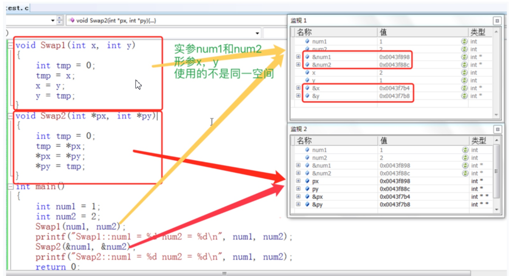
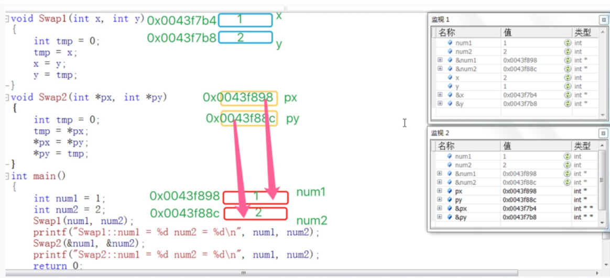
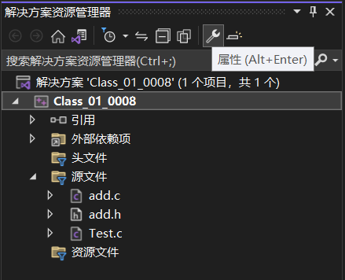
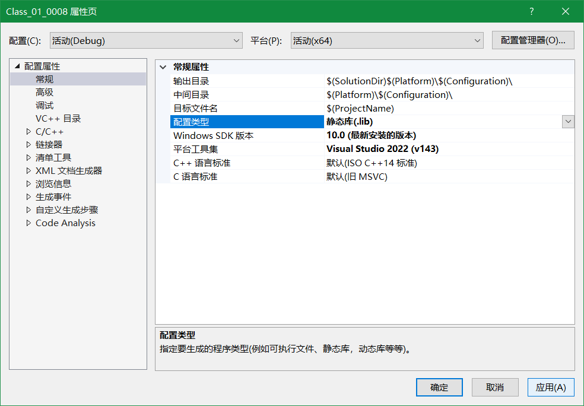
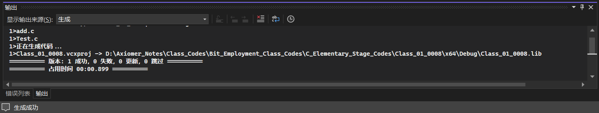
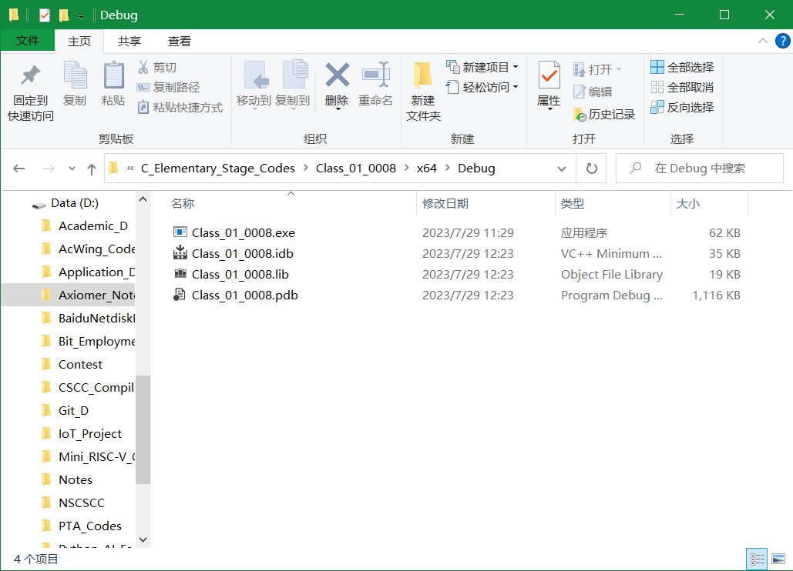

# 第三讲：函数

> 一日之计在于晨 —— 早起的魅力！

> 拓宽拓深自己的技术栈，不要浮于表面.

---

**目录：**

[TOC]

---

## 一、函数是什么？

维基百科中对**函数**的定义：**子程序**.

> * 在计算机科学中，子程序（英语：`Subroutine, procedure`, `function`, `routine`, `method`, `subprogram`, `callable unit`），是一个大型程序中的某部分代码，由一个或多个语句块组成.它负责完成某项特定任务，而且相较于其他代码，具备相对的独立性.
> * 一般会有输入参数并有返回值，提供对过程的封装和细节的隐藏.这些代码通常被集成为**软件库**.

---

## 二、C语言中函数的分类

### 2.1 库函数

#### 2.1.1 库函数的定义及分类

C语言中把频繁大量使用的常用的功能，进行了封装，封装成一个个的函数，提供出来大家都可以使用，是由C语言的编译器直接提供的，这些函数被称为**库函数**.

常见的库函数包括：`scanf()`、`printf()`、`strlen()`、`strcmp()`、`rand()`、`srand()`、`time()`.

> 注意：
> * C语言并不去直接实现库函数，而是提供了**C语言的标准和库函数的约定**.
>   * 标准和约定包括：==功能==、==名字==、==参数==、==返回值==等.
> * 库函数的实现一般是由**编译器**去实现的.
>   * 例如：`VS2022`、`gcc`.
> * 库函数学习手册：`www.cplusplus.com`.
>   * `function`：功能函数.
>   * `Parameters`：参数.
>   * `Return Value`：返回值.
>   * `Example`：代码示例.
>   * `Output`：代码示例输出结果.
>   * `See also`：相关库函数.

简单的总结，C语言常用的库函数都有：
* IO函数（输入输出函数）.
  * `scanf()`、`printf()`、`getchar()`、`putchar()`.
* 字符串操作函数.
  * `strlen()`、`strcmp()`.
* 字符操作函数.
  * `islower`（判断字符是否为小写字符）、`isupper`（判断字符是否为大写字符）.
* 内存操作函数.
  * `memset()`、`malloc()`.
* 时间/日期函数.
  * `time()`.
* 数学函数.
  * `sin()`、`cos()`、`tan()`、`sqrt()`.
* 其他库函数.

> 注意：
> * 库函数必须知道的一个秘密就是：使用库函数，必须包含 `#include` 对应的头文件.

#### 2.1.2 库函数学习方法举例

> 常用的查询工具：
> * `MSDN`(`Microsoft Developer Network`).
> * `www.cplusplus.com`.
> * `http://en.cppreference.com`（英文版）.
> * `http://zh.cppreference.com`（中文版）.

**库函数`strcmp()`：**
* ==函数声明==：`char * strcpy ( char * destination, const char * source )`.
* ==位置==：包含在头文件`<string.h>`中.
* ==功能==：拷贝`source`指向的C字符串到`destination`指向的字符串空间中，并包含字符串结束标志`\0`.
* ==参数==：
  * `destination`：目标空间的地址.
  * `source`：被拷贝空间的地址.
* ==返回值==：`destination`将会被返回.
* ==示例代码==：
  ``` C
    #include <stdio.h>
    #include <string.h>

    int main()
    {
      char arr_1[] = "Hello BIT!";			//源头数据.
      char arr_2[20] = "xxxxxxxxxxxxxxxx";	//目的地数据.
      //对于数组，数组名其实是数组第一个元素的地址，也就是数据的起始地址.
      strcpy(arr_2, arr_1);	//将arr_1中的字符串（包含字符串结束标志）拷贝至arr_2中.
      printf("arr_2 中的内容为：%s\n", arr_2);

      return 0;
    }
  ```

> 注意：
> * 库函数`strcpy()`被编译器`VS2022`认为是不安全的，因此在`VS2022`编译器环境下使用库函数`strcpy()`时会爆出警告，需要在`.c文件`首行添加宏定义`#define _CRT_SECURE_NO_WARNINGS 1`.

**库函数`memset()`：**
* ==函数声明==：`void * memset ( void * ptr, int value, size_t num )`.
* ==位置==：包含在头文件`<string.h>`中.
* ==功能==：设置内存块数据，即把`ptr`指向内存块的前`num`个字节的内容初始化为`value`值.
* ==参数==：
  * `ptr`：指向待被填充的内存块.
  * `value`：设置的初始化数值.
  * `num`：待被`value`填充的内存块的字节数.
* ==返回值==：`ptr`将会被返回.
* ==示例代码==：
  ``` C
    #include <stdio.h>
    #include <string.h>

    int main()
    {
      char arr[] = "Hello BIT!";
      memset(arr, 'x', 5);
      printf("arr 的内容为：%s\n", arr);

      return 0;
    }
  ```

> `memset()`函数名称解析：
> * `mem`：`memory`的缩写，意为内存.
> * `set`：意为设置.

### 2.2 自定义函数

> 注意：
> * 自定义函数**可以没有参数和返回值类型**，根据需要给出.
> * 函数的实参可能是**变量**，也可能是**常量**，也可能是**宏**，也可能是**指针**等等.
> * 在使用库函数时，必须要**包含该库函数所在的头文件**，否则编译器将不能识别.
> * 有了库函数之后还是需要自定义函数.
>   * 库函数是语言设计者为了让用户能够更好的使用，而给出的，但并不能解决用户的所有问题，因此其他问题还需要用户自己写方法解决.
> * 在不同的函数中可以使用**相同名字**的变量.
>   * 不同的函数属于不同的作用域，因此不同的函数中定义相同名字的变量不会冲突.
> * **函数中的形式参数是在栈中保存**.
>   * 在C语言中，函数的形参一般都是通过**参数压栈**的方式传递的.
> * 在一个函数内定义的变量只在本函数范围内有效.
>   * 在函数内定义的变量，称为**局部变量**，局部变量只能在其定义的函数中使用.
> * 在一个函数内复合语句中定义的变量只能在复合语句中使用（复合语句指函数中的成对括号（`{}`）构成的代码）.

**自定义函数的定义：**

自定义函数和库函数一样，有==函数名==，==返回值类型==和==函数参数==.

但是不一样的是这些都是我们自己来设计，这给程序员一个很大的发挥空间.

> 函数就像生活中的工厂.
> 如果有人下订单需要工厂生产桌子，那么需要木材、零件等原材料；工厂会采购原材料并加工生产出桌子.
> 对于函数，`main()`函数对自定义函数的调用相当于给工厂下订单，函数的参数相当于工厂的原材料，返回值相当于工厂加工生产出的桌子.

**函数的组成：**

``` C
ret_type fun_name(para1, * )
{
  /* 函数体： */
  statement;  //语句项.
}
```

* 返回类型：`ret_type`.
  * 当函数不需要返回值时，返回类型为`void`.
* 函数名：`fun_name`.
* 函数参数：`paral`.

**函数的示例代码：**

* 示例一：写一个函数可以找出两个整数中的最大值.

``` C
  #include <stdio.h>

  int get_max(int x, int y)
  {
    return (x > y ? x : y);
  }

  int main()
  {
    int a = 0;
    int b = 0;
    //输入：
    scanf("%d %d", &a, &b);
    //计算：
    int m = get_max(a, b);
    //输出：
    printf("较大值是：%d\n", m);

    return 0;
  }
```

* 示例二：写一个函数可以交换两个整形变量的内容.

``` C
  #include <stdio.h>

  /* 实现成函数，但是不能完成任务（过程错误）： */
  void Swap_1(int x, int y)	//形式参数 —— 形参.
  {
    int tmp = x;
    x = y;
    y = tmp;
  }
  /* 正确的版本： */
  void Swap_2(int* pa, int* pb) //形式参数 —— 形参.
  {
    int tmp = 0;
    tmp = *pa;		//tmp = a;
    *pa = *pb;		//a = b;
    *pb = tmp;		//b = tmp;
  }

  int main()
  {
    int a = 0;
    int b = 0;
    scanf("%d %d", &a, &b);

    printf("交换前：a = %d，b = %d\n", a, b);
    //Swap_1(a, b);	//实际参数 —— 实参.
    Swap_2(&a, &b);	//实际参数 —— 实参.
    printf("交换后：a = %d，b = %d\n", a, b);

    return 0;
  }
```

> 注意：
> * **形参** —— **形式参数**；**实参** —— **实际参数**.
> * 当实参传递给形参的时候（形参实例化），形参是实参的一份临时拷贝，所以对形参的修改不会影响实参的数值.
> * 当想要在自定义函数内部改变从外部传递来的变量的数值时，就需要使形参和实参映射到同一地址，将形参和实参的数值建立真实联系；此时需要使用指针变量作为形参，同时实参传递需要改变的变量的地址.

---

## 三、函数的参数

> 在向函数传递参数时，一个逗号表达式算作一个函数参数.
> 例如，函数调用`exec((vl, v2), (v3, v4), v5, v6);`中，实参的个数为`4`，分别是：
> * `(v1, v2)`，真实的参数是`v2`.
> * `(v3, v4)`，真实的参数是`v4`.
> * `v5`.
> * `v6`.

### 3.1 实际参数（实参）

真实传给函数的参数，叫实参.

实参可以是：==常量==、==变量==、==表达式==、==函数调用==等.

无论实参是何种类型的量，在进行函数调用时，**它们都必须有确定的值**，以便把这些值传送给形参.

### 3.2 形式参数（形参）

形式参数是指函数名后括号中的变量，因为**形式参数只有在函数被调用的过程中才实例化（分配内存单元）**，所以叫形式参数.

形式参数当函数调用完成之后就**自动销毁**了，因此形式参数只在函数中有效.

在函数的示例代码的示例二中，`Swap_1()` 和 `Swap_2()` 函数中的参数 `x`，`y`，`pa`，`pb` 都是形式参数；在`main()`函数中传给 `Swap_1()` 的 `num1`，`num2` 和传给 `Swap2()` 函数的 `&num1`，`&num2` 是实际参数.

这里我们对函数的实参和形参进行分析：



代码对应的内存分配如下：



这里可以看到 `Swap1()` 函数在调用的时候，`x`，`y` 拥有自己的空间，同时拥有了和实参一模一样的内容.

所以我们可以简单的认为：**形参实例化之后其实相当于实参的一份临时拷贝**.

> 计算机程序运行过程中的内存空间分配：
> * 栈区：
>   * 局部变量.
>   * 形式参数.
> * 堆区：
>   * 动态内存管理.
>     * `malloc`.
>     * `realloc`.
>     * `calloc`.
>     * `free`.
> * 静态区：
>   * 静态变量.
>   * 全局变量.

---

## 四、函数的调用

### 4.1 传值调用

函数的形参和实参分别占有不同内存块，即形参使实参的一份临时拷贝，对形参的修改不会影响实参.

**示例代码：**

``` C
  void Swap_1(int x, int y)	//形式参数 —— 形参.
  {
    int tmp = x;
    x = y;
    y = tmp;
  }
```

### 4.2 传址调用

传址调用是把函数外部创建变量的内存地址传递给函数参数的一种调用函数的方式.

这种传参方式可以让函数和函数外边的变量建立起真正的联系，也就是函数内部可以直接操作函数外部的变量.

**示例代码：**

``` C
  void Swap_2(int* pa, int* pb) //形式参数 —— 形参.
  {
    int tmp = 0;
    tmp = *pa;		//tmp = a;
    *pa = *pb;		//a = b;
    *pb = tmp;		//b = tmp;
  }
```

### 4.3 函数调用课堂练习

* 练习一

题目：写一个函数可以判断一个数是不是素数。

``` C
  #include <stdio.h>
  #include <math.h>
  int is_prime(int n)
  {
    int j = 0;
    for (j = 2; j <= sqrt(n); j++)
    {
      if (n % j == 0)
        return 0;
    }
    return 1;
  }

  int main()
  {
    int i = 0;
    int count = 0;
    for (i = 100; i <= 200; i++)
    {
      //判断i是否为素数：
      if (is_prime(i) == 1)
      {
        printf("%d ", i);
        count++;
      }
    }

    printf("\ncount = %d\n", count);
  }
```

* 练习二：

题目：写一个函数判断一年是不是闰年。

``` C
  #include <stdio.h>

  /* 2. 再实现函数. */
  int is_leap_year(int y)
  {
    return (((y % 4 == 0) && (y % 100 != 0)) || (y % 400 == 0));
  }
  int main()
  {
    int y = 0;
    int count = 0;
    for (y = 1000; y <= 2000; y++)
    {
      /* 1. 先想清楚函数怎么用. */
      if (is_leap_year(y) == 1)
      {
        printf("%d ", y);
        count++;
      }
    }
    printf("\ncount = %d\n", count);
    return 0;
  }
```

> `TDD` —— 测试驱动开发（`Test Driven Development`）.

* 练习三：

题目：写一个函数，实现一个整形有序数组的二分查找。

``` C
  #include <stdio.h>

  int binary_search(int arr[], int k, int sz)
  {
    int mid;
    int left = 0;
    int right = sz - 1;

    while (left <= right)
    {
      mid = (left + right) / 2;
      if (arr[mid] < k)
      {
        left = mid + 1;
      }
      else if (arr[mid] > k)
      {
        right = mid - 1;
      }
      else
      {
        return mid;
      }
    }
    return -1;
  }
  int main()
  {
    int arr[] = { 1, 2, 3, 4, 5, 6, 7, 8, 9, 10 };
    int k = 7;
    int sz = sizeof(arr) / sizeof(arr[0]);
    /* 二分查找. */
    //找到了：返回下标.
    //找不到：返回 -1.
    int ret = binary_search(arr, k, sz);
    if (ret == -1)
      printf("找不到！\n");
    else
      printf("找到了，下标是：%d\n", ret);

    return 0;
  }
```

> 注意：
> * 因为`int`型变量具有最大值和最小值，所以如果`left`和`right`过大，那么就会出现`mid`的数值被截断的情况.
> * 解决方法：
>   * 在计算`mid`的数值时，使用公式`int mid = left + (right - left) / 2`即可避免数值溢出的情况.

* 练习四

题目：写一个函数，每调用一次这个函数，就会将 num 的值增加1。

==方法一：==

``` C
  #include <stdio.h>

  int test(int n)
  {
    return (n + 1);
  }

  int main()
  {
    int num = 0;
    num = test(num);
    num = test(num);
    printf("num 的值为：%d\n", num);

    return 0;
  }
```

==方法二：==

``` C
  #include <stdio.h>

  void test(int* p)
  {
    (*p)++;	//解引用操作.
  }

  int main()
  {
    int num = 0;
    test(&num);
    test(&num);
    printf("num 的值为：%d\n", num);

    return 0;
  }
```

---

## 五、函数的嵌套调用和链式访问

函数和函数之间可以根据实际的需求进行组合的，也就是互相调用的.

### 5.1 嵌套调用

示例代码：

``` C
  #include <stdio.h>

  void new_line()
  {
    printf("hehe\n");
  }
  void three_line()
  {
    int i = 0;
    for (i = 0; i < 3; i++)
    {
      new_line();
    }
  }

  int main()
  {
    three_line();
    return 0;
  }
```

> 注意：函数**可以嵌套调用，但是不能嵌套定义**.

### 5.2 链式访问

把一个函数的返回值作为另外一个函数的参数，称为**链式访问**.

示例代码一：

``` C
  #include <stdio.h>
  #include <string.h>
  int main()
  {
    char arr[20] = "hello";
    int ret = strlen(strcat(arr, "bit"));
    printf("%d\n", ret);
    return 0;
  }
```

> 注意：
> * `strcat()`函数的功能为向目标字符串追加字符，追加时会将原来字符串的字符串结束标志`\0`覆盖掉；返回值为追加后的字符串的首地址.

示例代码二：

``` C
  #include <stdio.h>
  int main()
  {
    printf("%d", printf("%d", printf("%d", 43)));     //4321.
    printf("%d ", printf("%d ", printf("%d ", 43)));  //43 3 2 .
    
    return 0;
  }
```

> 注意：
> * `printf()`函数的返回值为本次调用此函数后在屏幕上打印出的字符的个数.

---

## 六、函数的声明、定义和调用（分文件书写形式）

### 6.1 函数声明

告诉编译器有一个函数叫什么，参数是什么，返回类型是什么。但是具体是不是存在，函数声明决定不了.

函数的声明一般出现在函数的使用之前。要满足**先声明后使用**.

函数的声明一般要放在头文件中的.

一般情况下，函数的声明需要放在`xxx.h`头文件中：

``` C
//add.h：
  #pragma once
  /* 函数的声明. */
  int Add(int a, int b);
```

> 注意：
> * 函数在声明时，函数的形参变量名称可以省略不写.

### 6.2 函数定义

函数的定义是指函数的具体实现，交待函数的功能实现.

一般情况下，函数的定义需要单独放在`xxx.c`函数体文件中：

``` C
//add.c：
  /* 函数的定义. */
  int Add(int x, int y)
  {
    return x + y;
  }
```

> 注意：
> * 函数定义也是一种特殊的函数声明.

### 6.3 函数调用

函数调用的语法格式如下：

`函数名([[实参列表1], [实参列表2], ...])`.

从上面的语法格式可以看出，当我们调用一个函数时，需要明确函数名和实参列表.

实参列表中的参数可以是常量、变量、表达式或者空，并且各参数之间要使用英文逗号分隔开来.

根据函数在程序中出现的位置，有下列三种函数调用方式：
* 将函数作为**表达式**调用.
* 将函数作为**语句**调用.
* 将函数作为**实参**调用.

一般情况下，函数需要在主程序中调出使用：

``` C
//test.c：
  #include <stdio.h>
  #include "add.h"

  int main()
  {
    int a = 0;
    int b = 0;
    //输入.
    scanf("%d %d", &a, &b);
    //加法.
    int c = Add(a, b);	/* 函数的调用. */
    //打印.
    printf("%d\n", c);

    return 0;
  }
```

### 6.4 函数返回

函数在返回时，一个函数只能`return`一个结果.

如果想要把函数处理结果的二个数据返回给主调函数，通常有以下方式：
* 形参用数组.
* 形参用二个指针.
* 用二个全局变量.

### 6.5 分文件书写形式

在一个项目工程中，一般情况下会将实现不同功能的代码块和代码段进行拆分，同时封装成不同的功能模块.

对于每一个功能模块，一般会包括三部分子模块：
* 函数的实现.
  * 功能函数的实现过程一般会封装在`xxx.c`函数体文件中，不会对外开放函数的具体实现过程，保证程序的安全性.
* 函数的声明.
  * 功能函数的声明一般会放在`xxx.h`头文件中.
* 函数的调用.
  * 功能函数的调用一般会在主程序`test.c`文件中进行.

通常在C语言中，一个完整的项目程序是不可能在一个函数中实现所有的功能；而是由若干功能不同的函数来实现，并且函数之间会存在互相调用的情况.

对项目工程采用分文件书写形式的优点是容易将主函数与功能函数拆分开来，便于功能模块的修改、调试与维护.

采用分文件书写形式的另一个优点在于可以增强功能模块的隐私性与安全性.

采用分文件书写形式，当想要将功能模块对外开放使用时，不必开放功能函数的具体实现过程；只需要将功能模块生成的`.lib`静态库与模块函数声明头文件`.h`打包封装并对外开放，即可实现对功能模块的调用.

以下介绍在VS2022编译器环境下如何将功能模块编译链接生成功能模块静态库：

1. 首先，在解决方案资源管理器的资源管理界面选中功能模块所在解决方案，这里以“Class_01_0008”解决方案为例；之后，在解决方案资源管理器的工具栏中单击“属性”并打开属性设置界面.

2. 然后，在属性设置界面，将`配置属性 -> 常规 -> 常规属性`下的`配置类型`改为静态库（`.lib`），最后点击应用（`A`），单击确定退出属性页.

3. 使用快捷键`Ctrl + F5`运行主程序，将会生成目标静态库文件`.lib`.


4. 在使用功能模块静态库时，需要将功能模块的头文件`.h`和静态库`.lib`同时包含在项目工程文件中.

调用功能模块静态库时，**需要同时包含`.h`头文件并导入`.lib`静态库**：

``` C
/* 包含头文件： */
#include "add.h"
/* 导入静态库： */
#pragma comment(lib, "add.lib")
```

---

## 七、函数递归

> 递归只能在**特殊场景**下使用，并不意味着递归可以运用在任何场景下.

### 7.1 什么是递归？

程序调用自身的编程技巧称为**递归**（`recursion`）.

递归做为一种算法在程序设计语言中广泛应用.

递归是一个过程或函数在其定义或说明中有直接或间接调用自身的一种方法，它通常把一个大型复杂的问题层层转化为一个与原问题相似的规模较小的问题来求解.

递归策略只需少量的程序就可描述出解题过程所需要的多次重复计算，大大地减少了程序的代码量.

递归的主要思考方式在于：**把大事化小**.

递归程序示例：

``` C
  #include <stdio.h>

  int main()
  {
    printf("Hello BIT!\n");
    /* 在main()函数中调用main()函数自身. */
    main();
    return 0;
  }
```

该程序是一个递归程序的错误示例，在这个示例中递归无法跳出，称为**死递归**.

死递归会导致**栈溢出**（`Stack overflow`），程序异常终止.

> 函数的调用堆栈与函数栈帧：
> * **每一次函数调用都要创建栈帧：** 函数调用时将会在内存中的栈区分配一块内存空间，用来保存函数在调用调用中的上下文的信息（==保护现场==）.
> * 当函数调用完成时，用来保存函数的栈区中的内存空间将会被释放，归还操作系统.

### 7.2 递归的两个必要条件

* **存在限制条件：** 
  * 当满足这个限制条件的时候，递归便不再继续.

* **调用之后逼近限制条件：** 
  * 每次递归调用之后越来越接近这个限制条件.

#### 7.2.1 递归练习一

接受一个整型值（无符号），按照顺序打印它的每一位.

例如：
* 输入：`1234`.
* 输出：`1 2 3 4`.

> 思路：
> * 将按照顺序打印无符号整型值的每一位的操作拆分成两个子过程（假设该无符号整型值为`num`，其位数为`n`）：
>   * 首先，打印传入函数的无符号整型值的前`(n - 1)`位利用`print()`函数自身打印在屏幕上.
>     * `print(num / 10)`.
>   * 然后，打印传入函数的无符号整型值的第`n`位.
>     * `printf("num % 10")`.

``` C
  #include <stdio.h>

  void print(unsigned int n)
  {
    if (n > 9)
    {
      print(n / 10);
    }
    printf("%d ", n % 10);
  }

  int main()
  {
    unsigned int num = 0;
    //输入：
    scanf("%d", &num);

    print(num);

    return 0;
  }
```

#### 7.2.2 递归练习二

编写函数不允许创建临时变量，求字符串的长度.

> 思路：
> * `my_strlen("abc") = 1 + my_strlen("bc")`.
> * `my_strlen("bc") = 1 + my_strlen("c")`.
> * `my_strlen("c") = 1 + my_strlen("")`.
> * `my_strlen("") = 0`.

``` C
  #include <stdio.h>
  #include <string.h>

  /* 递归求解： */
  int my_strlen(char* s)
  {
    if (*s == '\0')
    {
      return 0;
    }
    else
    {
      return 1 + my_strlen(s + 1);
    }
  }

  int main()
  {
    char arr[] = "abc";
    //[a, b, c, \0].
    int len = my_strlen(arr);
    printf("%d\n", len);

    return 0;
  }
```

### 7.3 递归与迭代

> 许多问题是以递归的形式进行解释的，这只是因为它比非递归的形式更为清晰.
>
> 但是这些问题的迭代实现往往比递归实现效率更高，虽然代码的可读性稍微差些.
>
> 当一个问题相当复杂，难以用迭代实现时，此时递归实现的简洁性便可以补偿它所带来的运行时开销.

#### 7.3.1 练习一

求n的阶乘（不考虑溢出）.

==方法一（迭代循环法）：==

``` C
  #include <stdio.h>

  int Fac(int n)
  {
    int r = 1;
    int i = 0;
    for (i = 1; i <= n; i++)
    {
      r = r * i;
    }
    return r;
  }

  int main()
  {
    int n = 0;
    scanf("%d", &n);
    int ret = Fac(n);
    printf("%d\n", ret);

    return 0;
  }
```

==方法二（递归法）：==

``` C
  #include <stdio.h>

  int Fac(int n)
  {
    if (n <= 1)
      return 1;
    else
    {
      return n * Fac(n - 1);
    }
  }

  int main()
  {
    int n = 0;
    scanf("%d", &n);
    int ret = Fac(n);
    printf("%d\n", ret);

    return 0;
  }
```

#### 7.3.2 练习二

求第`n`个斐波那契数（不考虑溢出）.

> 斐波那契数列：
> * 数列形式：
>   * `1 1 2 3 5 8 13 21 34 55 ...`.
> * 数列规律：
>   * 前两个数的和是第三个数.

==方法一（迭代循环法）：==

``` C
  #include <stdio.h>

  int Fib(int n)
  {
    int a = 1;
    int b = 1;
    int c = 1;

    while (n >= 3)
    {
      c = a + b;
      a = b;
      b = c;

      n--;
    }

    return c;
  }

  int main()
  {
    int n = 0;
    scanf("%d", &n);
    int ret = Fib(n);
    printf("%d\n", ret);

    return 0;
  }
```

==方法二（递归法）：==

``` C
  #include <stdio.h>

  int Fib(int n)
  {
    if (n <= 2)
    {
      return 1;
    }
    else
    {
      return Fib(n - 1) + Fib(n - 2);
    }
  }

  int main()
  {
    int n = 0;
    scanf("%d", &n);
    int ret = Fib(n);
    printf("%d\n", ret);
    
    return 0;
  }
```

但是我们发现有问题：
* 在使用 `Fib` 这个函数的时候如果我们要计算第`50`个斐波那契数字的时候特别耗费时间.
* 使用 `factorial` 函数求`10000`的阶乘（不考虑结果的正确性），程序会崩溃.

为什么呢？
* 我们发现 `Fib` 函数在调用的过程中很多计算其实在一直重复.

那我们如何改进呢？
* 在调试 `factorial` 函数的时候，如果你的参数比较大，那就会报错： `Stack overflow`（栈溢出）这样的信息.
* 系统分配给程序的栈空间是有限的，但是如果出现了死循环，或者（死递归），这样有可能导致一直开辟栈空间，最终产生栈空间耗尽的情况，这样的现象我们称为栈溢出.

解决方法：
* 将递归改写成非递归.
* 使用`static`对象替代 `nonstatic` 局部对象.
  * 在递归函数设计中，可以使用 `static` 对象替代`nonstatic` 局部对象（即栈对象），这不仅可以减少每次递归调用和返回时产生和释放 `nonstatic` 对象的开销，而且 `static` 对象还可以保存递归调用的中间状态，并且可为各个调用层所访问.

#### 7.3.3 练习三

编写一个函数 `reverse_string(char* string)`（递归实现）.

**实现：**将参数字符串中的字符反向排列，不是逆序打印.

**要求：**不能使用C函数库中的字符串操作函数.

比如：`char arr[] = "abcdef";`，逆序之后数组的内容变成：`fedcba`.

``` C
  #include <stdio.h>

  int my_strlen(char* s)
  {
    int count = 0;
    while (*s != '\0')
    {
      count++;
      s++;
    }

    return count;
  }

  void reverse_string(char* string)
  {
    if (*string == '\0')
      return;

    int len = my_strlen(string);
    char tmp = string[0];
    string[0] = string[len - 1];
    string[len - 1] = '\0';
    if (my_strlen(string + 1) >= 2)
    {
      reverse_string(string + 1);
    }
    string[len - 1] = tmp;
  }

  int main()
  {
    char string[10000];
    scanf("%s", string);
    reverse_string(string);
    printf("%s\n", string);

    return 0;
  }
```

---

## 八、函数递归的经典题目探究

### 8.1 汉诺塔问题

### 8.2 青蛙跳台阶问题

> 青蛙跳台阶问题**本质**上是斐波那契数列问题.

---

## 九、函数栈帧的创建和销毁

> 在C语言的学习过程中，可能会产生以下的疑问与困惑：
> * 局部变量是怎么创建的？
> * 为什么局部变量的值是随机值？
> * 函数是怎么传参的？传参的顺序是怎么样的？
> * 形参和实参是什么关系？
> * 函数调用是怎么做的？
> * 函数调用结束后是怎么返回的？
>
> 以下关于函数栈帧的创建和销毁的讲解将会解开以上疑惑.
>
> 要注意，越高级的编译器，越不容易观察和学习；同时，在不同的编译器下，函数调用过程中栈帧的创建是略有差异的，具体的实现细节取决于编译器的实现.

要想充分理解函数栈帧的创建和销毁过程，首先要认识寄存器.

寄存器是CPU中的一个重要组成部分，它是CPU内部的临时存储单元.寄存器既可以用来存放数据和地址，也可以存放控制信息或CPU工作时的状态.在CPU中增加寄存器的数量，可以使CPU把执行程序时所需的数据尽可能地放在寄存器件中，从而减少访问内存的次数，提高其运行速度.

CPU中有若干寄存器，例如`eax`、`ebx`、`ecx`、`edx`、`ebp`、`esp`.其中与函数栈帧相关的寄存器为`ebp`、`esp`.

`ebp`、`esp`这两个寄存器中存放的是地址，这两个地址是用来维护函数栈帧的.

> 注意：
> * 栈的增长是由高地址向低地址方向增长的.
> * 栈的相关操作：
>   * 压栈（`push`）：给栈顶放一个元素.
>   * 出栈（`pop`）：从栈顶删除一个元素.

* `ebp`：存放栈底（高地址）指针.
* `esp`：存放栈顶（低地址）指针.

每一个函数调用，都要在栈区创建一个空间，即函数栈帧.

对于当前调用的函数，将会在栈区创建该函数的栈帧；在栈帧的边界处，`ebp`寄存器存放函数栈帧的高地址边界地址，`esp`寄存器存放函数栈帧的低地址边界地址.

每一个函数调用，都要在栈区创建一个空间.

> 注意：
> * `main()`函数也会被其他函数调用.
>   * `main()`函数将会被`__tCRTStartup()`函数调用.
>   * `__tCRTStartup()`函数将会被

函数在传参过程中，实参列表向形参列表传递参数的顺序为从右向左压栈传递；形参列表接收参数的顺序为从左向右读栈接收.

---

## 十、