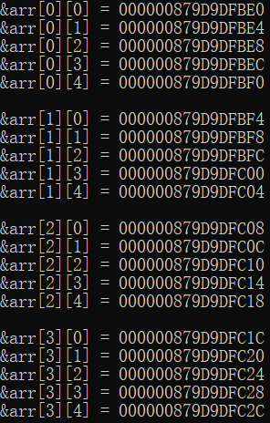

# 第四讲：数组

> 最重要的两件事情：
> * 认真**听课**.
> * 及时**做作业**.

> 为自己的未来拼一把！

> 一天比自己优秀一点点，一天比别人优秀一点点.

> 钻研有价值的东西，实现自己的人生价值.

---

**目录：**

[TOC]

---

> 数组：
> * 定义：数组是一组相同类型元素的集合.

## 一、一维数组的创建和初始化

### 1.1 数组的创建

数组是一组相同类型元素的集合。
数组的创建方式：

``` C
type_t   arr_name   [const_n];
//type_t 是指数组的元素类型.
//arr_name 是数组名.
//const_n 是一个常量表达式，用来指定数组的大小.
```

数组创建的实例：

``` C
//代码1
/* 局部的变量，这些局部的变量或者数组是存放在栈区. */
/* 存放在栈区上的数组，如果不初始化的话，默认是随机值. */
int arr1[10];

//代码2
int count = 10;
int arr2[count];    //数组是否可以正常创建？

//代码3
char arr3[10];
float arr4[1];
double arr5[20];
```

> 注意：
> * 数组创建，在C99标准之前， `[]` 中要给一个常量才可以，不能使用变量，即数组的大小只能是常量表达式；在C99标准支持了变长数组的概念，使得数组在创建的时候可以使用变量，但是这样的数组==不能初始化==.
> * 并不是所有的编译器都支持变长数组的使用.
>   * VS2019、VS2022这样的IDE不支持C99中的变长数组.
>   * 而gcc这样的编译器支持变长数组的使用.

### 1.2 数组的初始化

数组的初始化是指，在创建数组的同时给数组的内容一些**合理初始值**（==初始化==）.

示例代码：

``` C
int arr1[10] = {1,2,3}; //不完全初始化，剩余的元素默认都是0.
int arr2[] = {1,2,3,4}; //省略数组的大小，数组必须初始化，数组的大小是根据初始化的内容来确定.
int arr3[5] = {1，2，3，4，5}； //完全初始化.
//int arr4[] = {};    //会报错“不完全的类型”.
char arr4[3] = {'a',98, 'c'};   //数组中包含3个元素，分别为'a'，'b'，'c'.
char arr5[] = {'a','b','c'};    //数组中包含3个元素.
char arr6[] = "abcdef"; //数组中包含7个元素，其中 arr[6] = '\0'.
```

数组在创建的时候如果想不指定数组的确定的大小就得初始化，那么数组的元素个数将会根据初始化的内容来确定.

但是对于下面的代码要区分，内存中如何分配：

``` C
char arr1[] = "abc";
char arr2[3] = {'a','b','c'};
```

上述代码中，数组`arr1`包含`4`个元素，分别为`'a'`，`'b'`，`'c'`，`'\0'`；而数组`arr2`包含`3`个元素，分别为`'a'`，`'b'`，`'c'`.

### 1.3 一维数组的使用

对于数组的使用我们之前介绍了一个操作符： `[ ]` （**下标引用操作符**）.

它其实就数组访问的操作符.

示例代码：

``` C
    #include <stdio.h>

    int main()
    {
        int arr[10] = { 1, 2, 3, 4, 5, 6, 7, 8, 9, 10 };    //大小为 4* 10（字节）.
        //下标为：		0  1  2  3  4  5  6  7  8  9.
        printf("%d\n", arr[5]);	//[ ] 下标引用操作符.
        printf("%d\n", arr[0]);	//[ ] 下标引用操作符.

        int i = 0;
        printf("%d\n", sizeof(arr));    //40 -> 计算的是数组的总大小，单位是字节.
        int sz = sizeof(arr) / sizeof(arr[0]);	//数组大小为10.
        for (i = 0; i < sz; i++)
        {
            printf("%d  ", arr[i]);
        }
        printf("\n");

        for (i = 0; i < sz; i++)
        {
            scanf("%d", &arr[i]);
        }
        for (i = 0; i < sz; i += 2)
        {
            printf("%d  ", arr[i]);
        }

        return 0;
    }
```

**总结：**
* 数组是使用下标来访问的，下标是从`0`开始.
* 数组的大小可以通过计算得到.
  * `arr_size = sizeof(arr) / sizeof(arr[0]);`.

### 1.4 一维数组在内存中的存储

接下来我们探讨数组在内存中的存储.

示例代码：

``` C
    #include <stdio.h>

    int main()
    {
        int arr[10] = { 1, 2, 3, 4, 5 };
        int sz = sizeof(arr) / sizeof(arr[0]);
        int i = 0;
        for (i = 0; i < sz; i++)
        {
            printf("&arr[%d] = %p\n", i, &arr[i]);
        }

        return 0;
    }
```

输出结果：


> 注意：
> * 一个内存单元占一个字节.

仔细观察输出的结果，我们知道，随着数组下标的增长，元素的地址，也在有规律的递增.

由此可以得出结论：**一维数组在内存中是连续存放的**.


---

## 二、二维数组的创建和初始化

### 2.1 二维数组的创建

``` C
//数组创建
int arr1[3][4];
char arr2[3][5];
double arr3[2][4];
```

### 2.2 二维数组的初始化

``` C
//数组初始化
int arr1[3][4] = { {1, 2, 3, 4}, {2, 3, 4, 5}, {3, 4, 5, 6} };   //完全初始化.
int arr2[3][4] = {1,2,3,4};  //不完全初始化，缺省元素默认补0.
int arr3[3][4] = { {1, 2}, {3}, {4, 5, 6}};  //不完全初始化，缺省元素默认补0.
int arr4[3][4] = {{1,2},{4,5}};  //不完全初始化，缺省元素默认补0.
int arr5[][4] = {{2,3},{4,5}};//二维数组如果有初始化，行可以省略，列不能省略.
```

### 2.3 二维数组的使用

二维数组的使用也是通过下标的方式.

二维数组的行与列的下标都是从`0`开始的.

示例代码：

``` C
    #include <stdio.h>

    int main()
    {
        int arr[4][5] = { {1, 2, 3, 4, 5}, {2, 3, 4, 5, 6}, {3, 4, 5, 6, 7}, {4, 5, 6, 7, 8} };
        printf("arr[2][3] = %d\n", arr[2][3]);
        printf("\n");

        int i = 0;	//行号.
        for (i = 0; i < 4; i++)
        {
            int j = 0;	//列号.
            for (j = 0; j < 5; j++)
            {
                printf("%d ", arr[i][j]);
            }
            printf("\n");
        }

        return 0;
    }
```

### 2.4 二维数组在内存中的存储

像一维数组一样，这里我们尝试打印二维数组的每个元素：

``` C
    #include <stdio.h>

    int main()
    {
        int arr[4][5] = { {1, 2, 3, 4, 5}, {2, 3, 4, 5, 6}, {3, 4, 5, 6, 7}, {4, 5, 6, 7, 8} };

        int i = 0;	//行号.
        for (i = 0; i < 4; i++)
        {
            int j = 0;	//列号.
            for (j = 0; j < 5; j++)
            {
                printf("&arr[%d][%d] = %p\n", i, j, &arr[i][j]);
            }
            printf("\n");
        }

        return 0;
    }
```

输出结果：



通过结果我们可以分析到，其实**二维数组在内存中也是连续存储的**.


因此**二维数组的初始化不可以省略列数，因为只有知道列数才能确定下一行的起始位置**；但是可以省略行数，因为**即使不知道行数，也可以采用默认补0的方式进行初始化**.

如果将二维数组中的一维数组看作独立元素，那么可以**将二维数组看作是“一维数组”的数组**.

---

## 三、数组越界

数组的下标是**有范围限制**的.

数组的下规定是从`0`开始的，如果数组有`n`个元素，最后一个元素的下标就是`n-1`.

所以数组的下标如果小于`0`，或者大于`n-1`，就是数组越界访问了，超出了数组合法空间的访问.

**C语言本身是不做数组下标的越界检查，编译器也不一定报错**，但是编译器不报错，**并不意味着程序就是正确的**.

所以程序员写代码时，最好自己做越界的检查.

``` C
    #include <stdio.h>
    int main()
    {
    int arr[10] = {1,2,3,4,5,6,7,8,9,10};
       int i = 0;
       for(i=0; i<=10; i++)
      {
           printf("%d\n", arr[i]);//当i等于10的时候，越界访问了.
      }
    return 0;
    }
```

二维数组的行和列也可能存在越界.

---

## 四、数组作为函数参数

往往我们在写代码的时候，会将数组作为参数传个函数.

假设需要将一个整型数组排序，我们考虑以下排序算法：
* 冒泡排序.
* 选择排序.
* 插入排序.
* 希尔排序.
* 归并排序.
* 快速排序.
* 堆排序.
* 计数排序.
* 桶排序.
* 基数排序.

例如，要实现一个冒泡排序函数将一个整形数组排序.

**冒泡排序**的核心思想是==两两相邻的元素进行比较==.

一趟冒泡排序可以使至少一个值来到最终应该出现的位置上.

冒泡排序算法**实现思路**：
1. 确定冒泡排序的趟数.
2. 一趟冒泡排序的实现.
3. 可设置`flag`变量判断某一趟冒泡排序完成之后数组是否提前排成有序状态.

冒泡排序**示例代码**：

``` C
    #include <stdio.h>

    int main()
    {
        int arr[10] = { 0 };
        //输入数据：
        int i = 0;
        int sz = sizeof(arr) / sizeof(arr[0]);
        for (i = 0; i < sz; i++)
        {
            scanf("%d", &arr[i]);
        }
        //冒泡排序 -- 升序：
        for (i = 0; i < sz - 1; i++)
        {
            int j = 0;
            //在一趟冒泡排序中相互比较的对数：
            for (j = 0; j < sz - i - 1; j++)
            {
                if (arr[j] > arr[j + 1])
                {
                    //交换元素：
                    int tmp = arr[j];
                    arr[j] = arr[j + 1];
                    arr[j + 1] = tmp;
                }
            }
        }

        for (i = 0; i < sz; i++)
        {
            printf("%d ", arr[i]);
        }

        return 0;
    }
```

### 4.1 冒泡排序函数的错误设计

``` C
//方法一：

    #include <stdio.h>

    void bubble_sort(int arr[10])	//这里的arr的本质还是指针变量.
    {
        /* 由于这里传参传入的arr的本质仍是指针变量，因此sizeof(arr)的计算结果为指针变量的大小——8字节. */
        int sz = sizeof(arr) / sizeof(arr[0]);	//sz = 2.
        int i = 0;
        for (i = 0; i < sz - 1; i++)
        {
            int j = 0;
            //在一趟冒泡排序中相互比较的对数：
            for (j = 0; j < sz - i - 1; j++)
            {
                if (arr[j] > arr[j + 1])
                {
                    //交换两个元素：
                    int tmp = arr[j];
                    arr[j] = arr[j + 1];
                    arr[j + 1] = tmp;
                }
            }
        }
    }

    int main()
    {
        int arr[10] = { 0 };
        //输入数据：
        int i = 0;
        int sz = sizeof(arr) / sizeof(arr[0]);
        for (i = 0; i < sz; i++)
        {
            scanf("%d", &arr[i]);
        }
        //冒泡排序 -- 升序：
        bubble_sort(arr);	//数组传参，实质上传递的是数组首元素的地址.

        for (i = 0; i < sz; i++)
        {
            printf("%d ", arr[i]);
        }
        printf("\n");

        return 0;
    }
```

运行程序后，数组并未如期排成升序，该方法存在一定的问题.

调试之后，可以观察到在函数`bubble_sort()`内部，代表数组大小的`sz`的值为`2`.

> 调试小技巧：
> * 在上述调试过程中，当程序运行至函数`bubble_sort()`内部时，在监视窗口内添加监视项`arr`并不能显示出整个数组，只能显示出`arr[0]`的数值.
> * 而当在上述监视窗口内添加监视项`arr, 10`之后，便可以显示出整个`arr`数组的元素数据.

因此可以猜想到，数组作为函数参数的时候，不能把整个数组直接都传递过去.

经过思考和讲解，发现**数组传参，实质上传递的是数组首元素的地址**；因此函数`bubble_sort()`在接收参数时，接收到的`arr`的本质还是指针变量，由于这里传参传入的`arr`的本质仍是指针变量，因此`sizeof(arr)`的计算结果为指针变量的大小 —— `8`字节，所以在函数`bubble_sort()`内部计算出的数组大小`sz`的值为`2`，因此数组排序出现错误.

### 4.2 数组名的深入理解

示例程序：

``` C
    #include <stdio.h>

    int main()
    {
        int arr[10] = { 1, 2, 3, 4, 5, 6 };

        //输出结果：
        printf("arr = %p\n", arr);
        printf("arr + 1 = %p\n", arr + 1);
        printf("\n");

        printf("&arr[0] = %p\n", &arr[0]);
        printf("&arr[0] + 1 = %p\n", &arr[0] + 1);
        printf("\n");

        printf("&arr = %p\n", &arr);
        printf("&arr + 1 = %p\n", &arr + 1);
        printf("\n");

        printf("*arr = %d\n", *arr);
        printf("\n");

        return 0;
    }
```

输出结果：


由以上示例代码及程序运行结果可得，`arr`、`&arr[0]`、`&arr`存在如下区别与联系：

| 表达式 | 含义 | `表达式 + 1` 表示含义 |
| ---- | ---- | ---- |
| `arr` | 数组首元素的地址 | 数组首元素的下一个数组元素的地址 |
| `&arr[0]` | 数组首元素的地址 | 数组首元素的下一个数组元素的地址 |
| `&arr` | 数组的地址（亦即数组首元素的地址） | 跳过整个数组，即数组结束之后的下一段的起始位置地址 |

以下为数组名`arr`、数组名取地址`&arr`、数组首地址`&arr[0]`的详细解析：
* 数组名`arr`：
  * 数组名可以作为数组第一个元素的指针.我们由数组和指针的关系知道，`arr`代表这个地址数值，它相当于一个指针，指向第一个元素（`&arr[0]`），即指向数组的首地址.
  * 数组中的其他元素可以通过`arr`的位移得到，此时的进阶是以数组中单个的元素类型为单位的，即`arr + i = &arr[i]`.
* 数组名取地址`&arr`：
  * 对于一个普通的变量`b`，`&b`是指用取地址符号取得变量`b`的存放地址；`arr`在内存中没有分配空间，只对数组`arr`的各个元素分配了存储空间，此处数组名字`arr`显然不是普通的变量，`&arr`也不代表所取`arr`的存储地址.
  * `&arr`在数值上等于`&arr[0]`，也等于`arr`.此时，`&arr`数值上等于整个数组的起始位置地址，含义上代表整个数组所占内存的大小，因为它的进阶单位是整个数组的字节长度，`(&a + 1)`等于的是数组结束之后的下一段的起始位置地址.
* 数组首地址`&arr[0]`：
  * 这个就是取地址的最直接的应用，`arr[0]`在内存中实际分类存储空间，而`&arr[0]`就是取该存储空间的地址，这与对于任意满足范围的`i`，`&arr[i]`就是取第`i`个元素的存储地址一样.

通过以上分析，可知**数组名字**、**数组名字取地址**、**数组首元素取地址**、**指向首元素的指针值**这四个变量的数值大小是相等的.

由此可以得出结论：**数组名是数组首元素的地址，是常量的值；数组的首元素的地址和数组的地址相同**.

但是有两个例外：
* `sizeof(数组名)`.
  * 数组名单独放在`sizeof()`内部，这里的数组名表示整个数组，计算的是==整个数组的大小==.
* `&数组名`.
  * 这里的数组名也表示整个数组，这里取出的是==整个数组的地址==，因此`数组名 + 1`将会直接跳过整个数组.

除此之外所有遇到的数组名都表示数组首元素的地址.

### 4.3 冒泡排序函数的正确设计

当数组传参的时候，实际上只是把数组的首元素的地址传递过去了.

所以即使在函数参数部分写成数组的形式（`int arr[]`），参数表示的依然是一个指针（`int* arr`）.

那么，函数内部的 `sizeof(arr)` 结果是`8`.

由上述错误原因分析，得出冒泡排序函数的正确设计方法：

``` C
//方法二：

    #include <stdio.h>

    void bubble_sort(int arr[10], int sz)   //参数接收数组元素个数
    {
        int i = 0;
        for (i = 0; i < sz - 1; i++)
        {
            int j = 0;
            //在一趟冒泡排序中相互比较的对数：
            for (j = 0; j < sz - i - 1; j++)
            {
                if (arr[j] > arr[j + 1])
                {
                    //交换两个元素：
                    int tmp = arr[j];
                    arr[j] = arr[j + 1];
                    arr[j + 1] = tmp;
                }
            }
        }
    }

    int main()
    {
        int arr[10] = { 0 };
        //输入数据：
        int i = 0;
        int sz = sizeof(arr) / sizeof(arr[0]);
        for (i = 0; i < sz; i++)
        {
            scanf("%d", &arr[i]);
        }
        //冒泡排序 -- 升序：
        bubble_sort(arr, sz);	//数组传参，实质上传递的是数组首元素的地址.

        for (i = 0; i < sz; i++)
        {
            printf("%d ", arr[i]);
        }
        printf("\n");

        return 0;
    }
```

由于实参传递给形参的参数是数组首元素的地址，其实质上仍然是指针变量，因此函数`bubble_sort()`的声明可以有变种：
* `void bubble_sort(int arr[10], sz);`.
* `void bubble_sort(int arr[], sz);`.
* `void bubble_sort(int* arr, sz);`.

同时，传入形参之后，并不会创建新的数组.

> 注意：
> * 当传入二维数组作为函数参数时，同样可以缺省行数，但不可以缺省列数.

### 4.4 冒泡排序算法的改进

在上述冒泡排序算法中，如果传入的数组本身已经接近排好序的状态，在此状态下仍旧循环`arr_size - 1`趟冒泡排序过程就显出冗余.

因此，可以设计并引入一个标志值`flag`，其值在每一趟冒泡排序进行之前总初始化为`1`；当某一趟冒泡排序中元素位置没有发生变动（即数组元素已经排好序）时，令`flag`值变为`0`；通过在每一趟冒泡排序结束之后检测`flag`的值即可得知数组是否已经提前排好序，如果提前排好序，则跳出循环.

以下为改进之后的冒泡排序算法代码：

``` C
//方法三：

    #include <stdio.h>

    void bubble_sort(int* arr, int sz)  //这里的arr的本质是指针.
    {
        int i = 0;
        for (i = 0; i < sz - 1; i++)
        {
            int flag = 1;   //在每一趟冒泡排序开始之前，总认为待排序的数组是已经有序的.
            int j = 0;
            //在一趟冒泡排序中相互比较的对数：
            for (j = 0; j < sz - i - 1; j++)
            {
                if (arr[j] > arr[j + 1])
                {
                    //交换两个元素：
                    int tmp = arr[j];
                    arr[j] = arr[j + 1];
                    arr[j + 1] = tmp;

                    //设置flag表示此趟排序中数组不是已经有序的.
                    flag = 0;
                }
            }

            if (flag == 1)
            {
                //数组已经提前排好序.
                break;
            }
        }
    }

    int main()
    {
        int arr[10] = { 0 };
        //输入数据：
        int i = 0;
        int sz = sizeof(arr) / sizeof(arr[0]);
        for (i = 0; i < sz; i++)
        {
            scanf("%d", &arr[i]);
        }
        //冒泡排序 -- 升序：
        //趟数.
        //arr作为数组进行了传参，是数组首元素的地址.
        bubble_sort(arr, sz);	//数组传参，传递的是地址 —— 实质上传递的是数组首元素的地址.

        //输出：
        for (i = 0; i < sz; i++)
        {
            printf("%d ", arr[i]);
        }
        printf("\n");

        return 0;
    }
```

### 4.5 逆置数组元素函数实例

使用函数实现数组操作：
* 创建一个整形数组，完成对数组的操作.
  * 实现函数`init()` 初始化数组为全0.
  * 实现`print()`  打印数组的每个元素.
  * 实现`reverse()`  函数完成数组元素的逆置.

**要求：** 自己设计以上函数的参数，返回值.

程序实现代码：

``` C
    #include <stdio.h>

    void print(int arr[], int sz)
    {
        int i = 0;
        for (i = 0; i < sz; i++)
        {
            printf("%d ", arr[i]);
        }
        printf("\n");
    }

    void reverse(int arr[], int sz)
    {
        int left = 0;
        int right = sz - 1;

        while (left < right)
        {
            int tmp = arr[left];
            arr[left] = arr[right];
            arr[right] = tmp;

            left++;
            right--;
        }
    }

    void init(int arr[], int sz)
    {
        int i = 0;
        for (i = 0; i < sz; i++)
        {
            arr[i] = 0;
        }
    }

    int main()
    {
        int arr[10] = { 1, 2, 3, 4, 5, 6, 7, 8, 9, 10 };
        int sz = sizeof(arr) / sizeof(arr[0]);

        //打印数组的每个元素：
        print(arr, sz);

        //逆置数组元素：
        reverse(arr, sz);
        print(arr, sz);

        init(arr, sz);
        print(arr, sz);

        return 0;
    }
```

**要求：** 自己设计以上函数的参数，返回值.
## 五、数组实例

### 5.1 数组的应用实例1：三子棋

三子棋的实现：
* 游戏不退出，继续玩下一把（使用循环来实现）.
* 应用多文件的形式写项目工程代码.

> 三子棋游戏实现思路：
> * 游戏在进行的过程中，需要进行数据的存储.
>   * 可以使用 3 * 3 的二维数组.
>       * `char board[3][3]`.
> * 未下棋之前，数组中应存放空格.

三子棋游戏具体实现代码：

``` C
//Game.h：
    #pragma once

    #include <stdio.h>
    #include <stdlib.h>
    #include <time.h>

    #define ROW 3
    #define COL 3

    void InitBoard(char board[ROW][COL], int row, int col);
    void DisplayBoard_01(char board[ROW][COL], int row, int col);
    void DisplayBoard_02(char board[ROW][COL], int row, int col);
    void DisplayBoard_03(char board[ROW][COL], int row, int col);
    void PlayerMove(char board[ROW][COL], int row, int col);
    void ComputerMove(char board[ROW][COL], int row, int col);
    char IsWin(char board[ROW][COL], int row, int col);
    int IsFull(char board[ROW][COL], int row, int col);
```

``` C
//Game.c：
    #define _CRT_SECURE_NO_WARNINGS 1
    #include "Game.h"

    /* 初始化棋盘为 '空格'. */
    void InitBoard(char board[ROW][COL], int row, int col)
    {
        int i = 0;
        for (i = 0; i < row; i++)
        {
            int j = 0;
            for (j = 0; j < col; j++)
            {
                board[i][j] = ' ';
            }
        }
    }

    /* 棋盘显示_版本1. */
    void DisplayBoard_01(char board[ROW][COL], int row, int col)
    {
        int i = 0;
        for (i = 0; i < row; i++)
        {
            int j = 0;
            for (j = 0; j < col; j++)
            {
                printf("%c ", board[i][j]);
            }
            printf("\n");
        }
    }

    /* 棋盘显示_版本2. */
    void DisplayBoard_02(char board[ROW][COL], int row, int col)
    {
        int i = 0;
        for (i = 0; i < row; i++)
        {
            //1. 打印数据.
            printf(" %c | %c | %c \n", board[i][0], board[i][1], board[i][2]);
            //2. 打印分割线.
            if (i < row - 1)
                printf("---|---|---\n");
        }
    }

    /* 棋盘显示_版本3. */
    void DisplayBoard_03(char board[ROW][COL], int row, int col)
    {
        int i = 0;
        for (i = 0; i < row; i++)
        {
            //1. 打印数据.
            int j = 0;
            for (j = 0; j < col; j++)
            {
                printf(" %c ", board[i][j]);
                if (j < col - 1)
                    printf("|");
            }
            printf("\n");

            //2. 打印分割线.
            if (i < row - 1)
            {
                int p = 0;
                for (p = 0; p < col; p++)
                {
                    printf("---");
                    if (p < col - 1)
                        printf("|");
                }
                printf("\n");
            }
        }
    }

    /* 玩家下棋. */
    void PlayerMove(char board[ROW][COL], int row, int col)
    {
        int x = 0;
        int y = 0;
        printf("玩家下棋：>\n");
        while (1)
        {
            printf("请输入下棋的坐标，中间使用空格：\n");
            scanf("%d %d", &x, &y);
            //判断玩家输入坐标的合法性：
            if (x >= 1 && x <= row && y >= 1 && y <= col)
            {
                if (board[x - 1][y - 1] == ' ')
                {
                    //可以落子.
                    board[x - 1][y - 1] = '*';
                    break;
                }
                else
                {
                    //不能落子.
                    printf("坐标被占用，不能落子，请重新输入坐标！\n");
                }
            }
            else
            {
                printf("坐标非法，重新输入！\n");
            }
        }
    }

    /* 电脑随机下棋. */
    void ComputerMove(char board[ROW][COL], int row, int col)
    {
        int x = 0;	//0 ~ row - 1.
        int y = 0;	//0 ~ col - 1;

        printf("电脑下棋：>\n");
        while (1)
        {
            x = rand() % row;
            y = rand() % col;
            //判断电脑生成坐标的合法性：
            if (board[x][y] == ' ')
            {
                board[x][y] = '#';
                break;
            }
        }
    }

    /* 判断棋盘是否已满. */
    int IsFull(char board[ROW][COL], int row, int col)
    {
        int i = 0;
        for (i = 0; i < row; i++)
        {
            int j = 0;
            for (j = 0; j < col; j++)
            {
                if (board[i][j] == ' ')
                {
                    return 0;
                }
            }
        }
        return 1;
    }

    /* 判断输赢. */
    char IsWin(char board[ROW][COL], int row, int col)
    {
        //玩家赢 -- 返回 '*'.
        //电脑赢 -- 返回 '#'.
        //平	 局 -- 返回 'Q'.

        //判断是否某一方获胜.
        //判断行：
        int i = 0;
        for (i = 0; i < row; i++)
        {
            if (board[i][0] == board[i][1] && board[i][1] == board[i][2] && board[i][0] != ' ')
            {
                return board[i][0];
            }
        }
        //判断列：
        for (i = 0; i < col; i++)
        {
            if (board[0][i] == board[1][i] && board[1][i] == board[2][i] && board[0][i] != ' ')
            {
                return board[0][i];
            }
        }
        //判断对角线：
        if (board[0][0] == board[1][1] && board[1][1] == board[2][2] && board[1][1] != ' ')
            return board[1][1];
        if (board[0][2] == board[1][1] && board[1][1] == board[2][0] && board[1][1] != ' ')
            return board[1][1];

        //判断是否平局：
        if (IsFull(board, row, col) == 1)
            return 'Q';

        //继续游戏：
        return 'C';
    }
```

``` C
//Test.c：
    #define _CRT_SECURE_NO_WARNINGS 1
    #include <stdio.h>
    #include "game.h"

    void menu()
    {
        printf("***********************************\n");
        printf("************* 1. play *************\n");
        printf("************* 0. exit *************\n");
        printf("***********************************\n");
    }

    void game()
    {
        char board[ROW][COL] = { 0 };
        //初始化棋盘：
        InitBoard(board, ROW, COL);	//3行3列的棋盘.
        //打印棋盘：
        DisplayBoard_03(board, ROW, COL);

        //下棋：
        char ret = 0;
        while (1)
        {
            //玩家下棋：
            PlayerMove(board, ROW, COL);
            DisplayBoard_03(board, ROW, COL);
            //判断输赢：
            ret = IsWin(board, ROW, COL);
            if (ret != 'C')
            {
                break;
            }
            //电脑下棋：
            ComputerMove(board, ROW, COL);
            DisplayBoard_03(board, ROW, COL);
            //判断输赢：
            ret = IsWin(board, ROW, COL);
            if (ret != 'C')
            {
                break;
            }
        }
        if (ret == '*')
            printf("玩家赢！\n");
        else if (ret == '#')
            printf("电脑赢！\n");
        else
            printf("平局！\n");
    }

    int main()
    {
        int input = 0;
        srand((unsigned int)time(NULL));
        do
        {
            menu();
            printf("请选择：>\n");
            scanf("%d", &input);
            switch (input)
            {
            case 1:
                printf("三子棋游戏：\n");
                game();
                break;
            case 0:
                printf("退出游戏！\n");
                break;
            default:
                printf("选择错误，重新选择！\n");
                break;
            }
        } while (input);
    }
```

> 注意：
> * `int`整型数据存在最值.
>   * 查找位置：`<limits.h>`.
>   * 最值情况：
>       * `INT_MIN`：最小值.
>       * `INT_MAX`：最大值.
> * 可以使用函数`isalpha()`判断输入字符是否为一个字母.
>   * 函数所在位置：
>       * 包含于头文件`<ctype.h>`中.
>   * 函数声明：
>       * `int isalpha ( int c );`.
>   * 函数功能：
>       * 如果输入字符是字母，则返回非零数值.
>       * 如果输入字符不是字母，则返回`0`值.
>   * 输入参数：
>       * `c`：待检查的字符，转换为整数或`EOF`.
>   * 返回值：
>       * `int`：返回非零数值（如果输入字符是字母）或`0`值（如果输入字符不是字母）.

### 5.2 数组的应用实例2：扫雷游戏

扫雷的实现：
* 首先要有一个棋盘.
  * 为了防止在统计坐标周围的雷的个数的时候，数组产生越界情况，因此可以在最上方和最下方分别增加一行、在最左方和最右方分别增加一列.
* 其次需要布置雷.
  * 扫雷游戏要存储布置好的雷的信息，需要两个二维数组.
    * 第一个二维数组存放布置好的雷的信息.
      * 如果不是雷，放置字符'0'.
      * 如果是雷，放置字符'1'.
    * 第二个二维数组存放游戏进行过程中排查出的某一单元格周边雷的信息.
      * 如果不是雷，放置字符'*'.
      * 如果是雷，放置字符'#'.

扫雷游戏具体实现代码：

``` C
//Game.h：
    #pragma once

    #include <stdio.h>
    #include <stdlib.h>
    #include <time.h>
    #include <windows.h>

    #define EASY_COUNT 10
    #define ROW 9
    #define COL 9
    #define ROWS ROW + 2
    #define COLS COL + 2

    void InitBoard(char board[ROWS][COLS], int rows, int cols, char set);
    void DisplayBoard(char board[ROWS][COLS], int row, int col);
    void SetMine(char board[ROWS][COLS], int row, int col);
    int GetMineCount(char mine[ROWS][COLS], int x, int y);
    void FindMine(char mine[ROWS][COLS], char show[ROWS][COLS], int row, int col);
```

``` C
//Game.c：
    #define _CRT_SECURE_NO_WARNINGS 1

    #include "Game.h"

    /* 初始化棋盘. */
    void InitBoard(char board[ROWS][COLS], int rows, int cols, char set)
    {
        int i = 0;
        for (i = 0; i < rows; i++)
        {
            int j = 0;
            for (j = 0; j < cols; j++)
            {
                board[i][j] = set;
            }
        }
    }

    /* 打印棋盘. */
    void DisplayBoard(char board[ROWS][COLS], int row, int col)
    {
        int i = 0;
        printf("--------扫雷游戏-------\n");
        //打印列号：
        for (i = 0; i < col + 1; i++)
        {
            printf("%d ", i);
        }
        printf("\n");

        for (i = 1; i < 1 + row; i++)
        {
            //打印行号：
            printf("%d ", i);
            int j = 0;
            for (j = 1; j < 1 + col; j++)
            {
                printf("%c ", board[i][j]);
            }
            printf("\n");
        }
    }

    /* 随机布置雷. */
    void SetMine(char board[ROWS][COLS], int row, int col)
    {
        //布置10个雷.
        //1. 生成随机的坐标，布置雷.
        int count = EASY_COUNT;
        while (count)
        {
            int x = rand() % row + 1;
            int y = rand() % col + 1;

            //判断生成的坐标是否合理：
            if (board[x][y] == '0')
            {
                board[x][y] = '1';
                count--;
            }
        }
    }

    /* 计算某一单元格周边雷的个数. */
    int GetMineCount(char mine[ROWS][COLS], int x, int y)
    {
        return (mine[x - 1][y] + mine[x - 1][y - 1] + mine[x][y - 1] + mine[x + 1][y - 1] + mine[x + 1][y] +
            mine[x + 1][y + 1] + mine[x][y + 1] + mine[x - 1][y + 1] - 8 * '0');
    }

    /* 排查雷. */
    void FindMine(char mine[ROWS][COLS], char show[ROWS][COLS], int row, int col)
    {
        int x = 0;
        int y = 0;
        int win = 0;

        while (win < row * col - EASY_COUNT)
        {
            printf("请输入要排查的坐标：>\n");
            scanf("%d %d", &x, &y);
            if (x >= 1 && x <= row && y >= 1 && y <= col)
            {
                if (mine[x][y] == '1')
                {
                    printf("BOOM!!!\n");
                    printf("BOOM!!!\n");
                    printf("BOOM!!!\n");
                    printf("很遗憾，你被炸死了！\n");
                    printf("本局游戏雷的位置分布如下：\n");
                    DisplayBoard(mine, ROW, COL);
                    printf("\n");

                    Sleep(5000);
                    break;
                }
                else
                {
                    //该位置不是雷，统计这个坐标周围有几个雷：
                    int cnt = GetMineCount(mine, x, y);
                    show[x][y] = cnt + '0';
                    DisplayBoard(show, ROW, COL);
                    win++;
                }
            }
            else
            {
                printf("坐标非法，请重新输入！\n");
            }
        }

        if (win == row * col - EASY_COUNT)
        {
            printf("恭喜你，排雷成功！\n");
            printf("本局游戏雷的位置分布如下：\n");
            DisplayBoard(mine, ROW, COL);

            Sleep(5000);
        }
    }
```

``` C
//Test.c：
    #define _CRT_SECURE_NO_WARNINGS 1

    #include "Game.h"
    void menu()
    {
        printf("*******************************\n");
        printf("*********** 1. play ***********\n");
        printf("*********** 0. exit ************\n");
        printf("*******************************\n");
    }

    void game()
    {
        char mine[11][11];	//存放布置好的雷.
        char show[11][11];	//存放排查出的雷的信息.

        //初始化棋盘：
        //1. mine数组最开始是全'0'.
        //2. show数组最开始是全'*'.
        InitBoard(mine, ROWS, COLS, '0');
        InitBoard(show, ROWS, COLS, '*');
        //打印棋盘：
        /*DisplayBoard(mine, ROW, COL);*/
        DisplayBoard(show, ROW, COL);
        //1. 布置雷：
        SetMine(mine, ROW, COL);
        /*DisplayBoard(mine, ROW, COL);*/
        //2. 排查雷：
        FindMine(mine, show, ROW, COL);
    }

    int main()
    {
        srand((unsigned int)time(NULL));
        int input = 0;
        do
        {
            menu();
            printf("请选择：>\n");
            scanf("%d", &input);
            switch (input)
            {
            case 1:
                printf("扫雷游戏：\n");
                game();
                break;
            case 0:
                printf("退出游戏！\n");
                break;
            default:
                printf("选择错误，重新选择！\n");
            }
        } while (input);
        return 0;
    }
```

针对以上扫雷游戏的实现，可以对其进行改进，使之具有以下特性：
* 排查周围无雷的单元格时，可同时将该单元格周围同样具有“周围无雷”特性的单元格展开，实现“指数展开”的效果（这里的“周围”是指与该单元格相邻的四周8个单元格）.

改进方法为：
* 对选中排查的单元格及其展开单元格进行判断：
  * 该坐标不是雷.
  * 该坐标周围没有雷.
  * 该坐标没有被排查过.
* 引入并实现一个展开函数，该函数的功能为展开某一单元格周围同样具有“周围无雷”特性的单元格.

通过上述分析，可采用递归方式对原实现思路与代码进行改进.