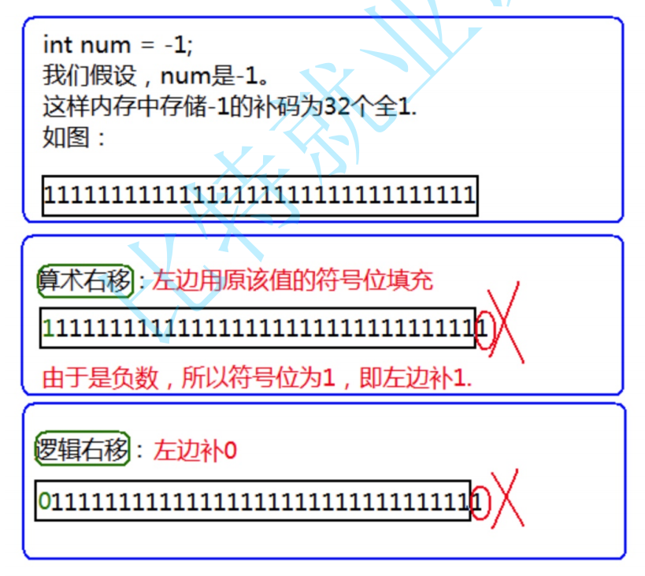
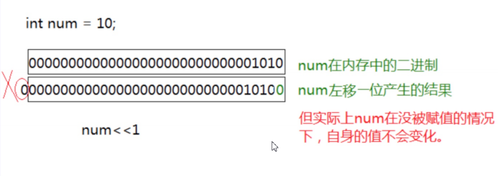

# 第五讲：操作符详解

> 一日之计在于晨！

> 不要给自己找借口的机会！

---

**目录：**

[TOC]

---

> 本讲主要内容：
> * 各种操作符的介绍.
> * 表达式求值.

## 一、操作符分类

* 算术操作符.
  * `+`、`-`、`*`、`/`、`%`.
* 移位操作符.
  * `<<`、`>>`.
* 位操作符.
  * `&`、`|`、`^`.
* 赋值操作符.
  * `=`、`+=`、`-=`、`*=`、`/=`... .
* 单目操作符.
  * `!`、`sizeof()`、`+`、`-`、`~`、`&`、`*`.
* 关系操作符.
  * `>`、`<`、`>=`、`<=`、`==`、`!=`.
* 逻辑操作符.
  * `&&`、`||`.
* 条件操作符.
  * `? : `.
* 逗号表达式.
  * `,`.
* 下标引用、函数调用和结构体成员.
  * `[ ]`、`()`、`.`、`->`.

---

## 二、算数操作符

常见的算术操作符有`+`、`-`、`*`、`/`、`%`.

对于 `/` 操作符，如果两个操作数都为整数，执行**整数除法**；而 `/` 操作符两端只要有一端为浮点数执行的就是**浮点数除法**.

``` C
    #include <stdio.h>

    int main()
    {
        int r = 7 / 2;
        printf("%d\n", r);	//3
        double d = 7 / 2;
        printf("%lf\n", d);	//3.000000

        double d_2 = 7.0 / 2.0;
        printf("%lf\n", d_2);	//3.500000

        return 0;
    }
```

> 除法中，除数不可以为`0`.

对于 `%` 操作符（取模操作符），两个操作数必须为**整数**.返回的是整除之后的余数.

`%` 操作符的应用：求一个整型数据的某一位.

``` C
    #include <stdio.h>

    int main()
    {
        int r = 15 % 8;	//% 得到的是整除后的余数.
        printf("%d\n", r);

        return 0;
    }
```

除了 `%` 操作符之外，其他的几个操作符可以作用于整数和浮点数.

---

## 三、移位操作符

移位操作符包括 `<<` 左移操作符和 `>>` 右移操作符.

> 移位操作符移动的是二进制（补码），且移位操作符的操作数只能是整数.

计算机能够处理的是二进制的数据，可以将待操作的数据转换成二进制，计算机就能够使用移位操作符对数据进行处理.

> 一个整型是`4`个字节 = `32bit`位.

对于整数，其二进制表示形式有三种：**原码**、**反码**和**补码**.
* 正整数的原码、反码和补码是相同的.
* 负的整数的原码、反码和补码是需要计算的.

二进制序列中，最高一位为符号位，其中符号位是`1`表示负数，符号位是`0`表示负数.

首先，不管是正整数还是负整数都可以写出二进制原码.
* 根据正负直接写出的二进制序列就是原码.
  * 例如：`int a = 15;` --> `15`的原码为`0...1111`.
* 对于负数，将其原码的符号位不变，其他位按位取反得到的就是反码.
* 对于负数，其`补码 = 反码 + 1`.

整数在内存中存储的是**补码**，计算的时候也是使用**补码**计算的.

对于移位运算符，**不要移动负数位，这个是标准未定义的**.

例如：

``` C
int num = 10;
num>>-1;    //error
```

### 3.1 右移操作符（`>>`）

> 右移分为两种移动方式：
> * 算术右移：右边丢弃，左边补原来的符号位.
> * 逻辑右移：右边丢弃，左边直接补`0`.
>
> 
> 
> C语言没有明确规定到底是算术右移还是逻辑右移，一般编译器上采用的是**算术右移**.

对于正数，向右移动一位有除以`2`的作用，并且向下取整.

``` C
    #include <stdio.h>

    int main()
    {
        int a = 15;
        int b = a >> 1;

        printf("%d\n", b);	//b = 7.
        printf("%d\n", a);	//a = 15.

        a = -15;
        b = a >> 1;

        printf("%d\n", b);	//b = -8.
        printf("%d\n", a);	//a = -15.

        return 0;
    }
```

### 3.2 左移操作符（`<<`）

左移操作二进制数据时，左移二进制序列并丢弃最高位，在最低位补`0`.

``` C
    #include <stdio.h>

    int main()
    {
        int a = 6;
        int b = a << 1;

        printf("%d\n", b);	//b = 12.
        printf("%d\n", a);	//a = 6.

        return 0;
    }
```



向左移动一位有乘以`2`的作用.

---

## 四、位操作符

### 4.1 按位与（`&`）、按位或（`|`）、按位异或（`^`）操作符

位操作符也是对二进制（补码）位进行操作，位操作符包括：`&`（按位与）、`|`（按位或）、`^`（按位异或）.

> 位操作符的操作数必须是整数.

对于按（二进制）位与（`&`）操作，对应二进制位有`0`则为`0`，两个同时为`1`，才是`1`.

``` C
    #include <stdio.h>

    int main()
    {
        int a = 3;
        //00000000000000000000000000000011 - 补码.
        int b = -5;
        //10000000000000000000000000000101 - 原码.
        //11111111111111111111111111111010 - 反码.
        //11111111111111111111111111111011 - 补码.
        int c = a & b;
        //00000000000000000000000000000011
        //11111111111111111111111111111011
        //
        //00000000000000000000000000000011 - 补码.
        //
        printf("%d\n", c);	//c = 3.
        return 0;
    }
```

对于按（二进制）位或（`|`）操作，对应的二进制位有`1`则为`1`，两个同时为`0`才是`0`.

``` C
    #include <stdio.h>

    int main()
    {
        int a = 3;
        //00000000000000000000000000000011 - 补码.
        int b = -5;
        //10000000000000000000000000000101 - 原码.
        //11111111111111111111111111111010 - 反码.
        //11111111111111111111111111111011 - 补码.
        int c = a | b;
        //00000000000000000000000000000011
        //11111111111111111111111111111011
        //
        //11111111111111111111111111111011 - 补码.
        //
        printf("%d\n", c);	//c = -5.
        return 0;
    }
```

对于按（二进制）位异或（`^`）操作，对应的二进制位相同为`0`，相异为`1`.

``` C
    #include <stdio.h>

    int main()
    {
        int a = 3;
        //00000000000000000000000000000011 - 补码.
        int b = -5;
        //10000000000000000000000000000101 - 原码.
        //11111111111111111111111111111010 - 反码.
        //11111111111111111111111111111011 - 补码.
        int c = a ^ b;
        //00000000000000000000000000000011
        //11111111111111111111111111111011
        //
        //11111111111111111111111111111000 - 补码.
        //
        printf("%d\n", c);	//c = -8.
        return 0;
    }
```

> 按位异或操作的应用：**在不创建临时变量（第三个变量）的条件下，实现两个数的交换**.
> ``` C
> //这种方式下可能出现计算得到的数值超出整型数据所能表示的最大范围而出现截断的情况.
> /*a = a + b;
> b = a - b;
> a = a - b;*/
> 
> //使用异或操作.
> a = a ^ b;
> b = a ^ b;  //b = a ^ b ^ b = a ^ 0 = a.
> a = a ^ b;  //a = a ^ b ^ a = a ^ a ^ b = 0 ^ b = b.
> ```
> 我们知道，`a ^ a = 0`，`a ^ 0 = a`，因此可得`a ^ b ^ a = b`，`a ^ a ^ b = b`，显然==异或支持交换律==.
>
> 另外，通过使用异或操作，可以得到某一数值的指定二进制位.
> 例如，通过`a & 1`可以得到`a`的二进制最低位.

### 4.2 位操作符应用实例

**应用实例 1：**

> 写一个函数返回参数二进制中 `1` 的个数.
>
> 比如： `15`    `0000 1111`    `4` 个 `1`.

==方法一：==

实现思路：
* 令待求参数`num`与`2`做取模运算：
  * 如果余数为`1`，则令计数器`count`自增`1`.
  * 如果余数为`0`，则计数器`count`值保持不变.
* 每一次取模运算结束后，将`num / 2`的值重新赋给`num`.

循环进行如上操作，直至`num`值变为`0`.

需要注意的是，考虑到参数可能为负数，因此需要用无符号整型类型`unsigned int`声明参数`num`.

``` C
    #include <stdio.h>

    int number_of_1(unsigned int num)
    {
        int count = 0;
        while (num)
        {
            if (num % 2 == 1)
            {
                count++;
            }
            num /= 2;
        }

        return count;
    }

    int main()
    {
        //-1.
        //10000000000000000000000000000001 - 原码.
        //11111111111111111111111111111110 - 反码.
        //11111111111111111111111111111111 - 补码 - 32个1.

        int num = 0;
        scanf("%d", &num);
        int ret = number_of_1(num);

        printf("%d\n", ret);

        return 0;
    }
```

==方法二：==

实现思路：
* 将待求参数的二进制序列的最后一位与`1`进行按位与，判断该位是否为`1`.
* 每一次判断后都将待求参数的二进制序列向右移动移位.

循环进行上述操作，直至将待求参数的`32`位全部移动并丢弃.

但是该方法存在缺陷与不足：
* 只能对整型数据（`32`位）进行求取，可变性不强.
* 如果数据二进制序列中`1`的数量很少（例如整型数据`1`，二进制序列中仅包含最低位的一位`1`），仍需要判断并移动`32`次，时间开销较大.

``` C
    #include <stdio.h>

    int number_of_1(int num)
    {
        int count = 0;
        int i = 0;

        for (i = 0; i < 32; i++)
        {
            if (((num >> i) & 1) == 1)
                count++;
        }

        return count;
    }

    int main()
    {
        //-1.
        //10000000000000000000000000000001 - 原码.
        //11111111111111111111111111111110 - 反码.
        //11111111111111111111111111111111 - 补码 - 32个1.

        int num = 0;
        scanf("%d", &num);
        int ret = number_of_1(num);

        printf("%d\n", ret);

        return 0;
    }
```

==方法三：==

引入公式：`n = n & (n - 1)`，这个表达式会让`n`的二进制序列中最右边的`1`消失.

例如，对于`n = 14`，其二进制序列为`1110`：
* `n = 1110，n - 1 = 1101`，则`n = n & (n - 1) = 1100`.
* `n = 1100，n - 1 = 1011`，则`n = n & (n - 1) = 1000`.
* `n = 1000，n - 1 = 0111`，则`n = n & (n - 1) = 0000`.

基于上述示例，我们可以得出规律：`n`的二进制序列中有`k`个`1`，表达式`n = n & (n - 1)`执行一次去掉一个`1`；在`n`变成`0`之前能执行多少次，就代表`n`的二进制序列中有多少个`1`.

需要注意的是，当`n`在循环进行如上操作最终变为`0`（即`n`的二进制序列中的`1`全部消失）时，再次进行操作`n = n & (n - 1)`，结果将会一直保持为`0`而不改变；因此需要格外注意循环的终止条件（即边界条件需要仔细检查到位）.

``` C
    #include <stdio.h>

    int number_of_1(int num)
    {
        int count = 0;

        while (num)
        {
            num = num & (num - 1);
            count++;
        }

        return count;
    }

    int main()
    {
        //-1.
        //10000000000000000000000000000001 - 原码.
        //11111111111111111111111111111110 - 反码.
        //11111111111111111111111111111111 - 补码 - 32个1.

        int num = 0;
        scanf("%d", &num);
        int ret = number_of_1(num);

        printf("%d\n", ret);

        return 0;
    }
```

**应用实例 2：**

> 获取一个整数二进制序列中所有的偶数位和奇数位，分别打印出二进制序列.

实现思路：
* 提取所有的奇数位，如果该位是`1`，输出`1`，是`0`则输出`0`.
* 以同样的方式提取偶数位置.

检测`num`中某一位是`0`还是`1`的方式：
1. 将`num`向右移动i位.
2. 将移完位之后的结果与`1`按位与，如果：
   * 结果是`0`，则第`i`个比特位是`0`.
   * 结果是非`0`，则第`i`个比特位是`1`.

``` C
    #include <stdio.h>

    int main()
    {
        int n = 0;
        scanf("%d", &n);

        int i = 0;
        //30 28 26 ... 4 2 0.
        for (i = 30; i >= 0; i -= 2)
        {
            printf("%d ", (n >> i) & 1);
        }
        printf("\n");
        //31 29 27 ... 5 3 1.
        for (i = 31; i >= 1; i -= 2)
        {
            printf("%d ", (n >> i) & 1);
        }
        printf("\n");

        return 0;
    }
```

**应用实例 3：**

> 编程实现：两个`int`（`32`位）整数`m`和`n`的二进制表达中，有多少个位(`bit`)不同？ 
>
> 输入例子:`1999` `2299`.
> 输出例子:`7`.

实现思路：
* 先将`m`和`n`进行按位异或，此时`m`和`n`相同的二进制比特位清零，不同的二进制比特位为`1`.
* 统计异或完成后结果的二进制比特位中有多少个`1`即可.

``` C
    #include <stdio.h>

    int number_of_1(int num)
    {
        int count = 0;
        while (num)
        {
            num = num & (num - 1);
            count++;
        }

        return count;
    }

    int main()
    {
        int m = 0;
        int n = 0;
        scanf("%d %d", &m, &n);

        //^ 异或 - 相同为0，相异为1.
        int ret = number_of_1(m ^ n);

        printf("%d\n", ret);

        return 0;
    }
```

**应用实例 4：**

> 判断一个数字`num`是否为`2`的幂次方.

实现思路：由于`2`的幂次方数字的数字特点为其二进制序列只包含唯一一个`1`；因此当判断条件`num & (num - 1) == 0`为真时，该数字`num`一定是`2`的幂次方.

``` C
    #include <stdio.h>

    int Is_Pow_2(int num)
    {
        return num & (num - 1);
    }

    int main()
    {
        int num = 0;
        scanf("%d", &num);

        if (Is_Pow_2(num) == 0)
            printf("%d 是2的幂次方！\n", num);
        else
            printf("%d 不是2的幂次方！\n", num);

        return 0;
    }
```

---

## 五、赋值操作符

赋值操作符是一个很棒的操作符，他可以让你得到一个你之前不满意的值——也就是你可以给自己重新赋值.

``` C
int weight = 120;//体重.
weight = 89;//不满意就赋值.
double salary = 10000.0;
salary = 20000.0;//使用赋值操作符赋值.
```

赋值操作符可以连续使用，比如：

``` C
int a = 10;
int x = 0;
int y = 20;
a = x = y+1;//连续赋值.
```

同样的语义，但是以下的写法是不是更加清晰爽朗而且易于调试：

``` C
x = y+1;
a = x;
```

复合操作符包括`+=`、`-=`、`*=`、`/=`、`%=`、`>>=`、`<<=`、`&=`、`|=`、`^=`，这些运算符都可以写成复合的效果.

比如：

``` C
int x = 10;
x = x+10;
x += 10;//复合赋值.
//其他运算符一样的道理，这样写更加简洁.
```

---

## 六、单目操作符

单目操作符，==只有一个操作数==.

常见的单目运算符包括：

| 单目运算符 | 表示含义 |
| ---- | ---- |
| `!` | 逻辑反操作符 |
| `-` | 负值操作符 |
| `+` | 正值操作符 |
| `&` | 取地址操作符 |
| `*` | 间接访问操作符（解引用操作符） |
| `sizeof()` | 以字节为单位计算操作数的类型长度 |
| `~` | 对一个数的二进制按位取反 |
| `--` | （前置、后置）自减 |
| `++` | （前置、后置）自增 |
| `(类型)` | 强制类型转换 |

### 6.1 逻辑反操作符（`！`）

``` C
    #include <stdio.h>

    int main()
    {
        int flag = 5;

        if (flag == 0)
        {
            printf("Test flag == 0\n");
        }
        if (!flag)	//flag为假，执行此分支.
        {
            printf("Test !flag\n");
        }
        if (flag)
        {
            printf("Test flag\n");
        }

        return 0;
    }
```

### 6.2 取地址操作符（`&`）与解引用操作符（`*`）

`&`（取地址操作符）和`*`（解引用操作符）应用于指针.

``` C
    #include <stdio.h>

    int main()
    {
        int a = 10;
        int* pa = &a;	//& - 取地址操作符，取出a的地址.

        *pa;	//* - 解引用操作符，通过pa中存放的地址，找到指向的空间（内容）.
        int c = *pa;
        return 0;
    }
```

### 6.3 取操作数的类型长度操作符（`sizeof()`）

`sizeof`其实我们之前已经见过了，可以求变量（类型）所占空间的大小.

``` C
    #include <stdio.h>

    int main()
    {
        printf("%d\n", sizeof(int));

        int a = 10;
        printf("%d\n", sizeof(a));

        printf("%d\n", sizeof a);

        //printf("%d\n", sizeof int);	//error.

        return 0;
    }
```

> 注意：
> * `sizeof()`不是函数，是**操作符**.
> * `sizeof()`计算的是类型创建变量的大小，单位是**字节**.

`sizeof()`也可以对数组进行操作，计算数组所占空间的大小.

``` C
    #include <stdio.h>

    int main()
    {
        int arr[10] = { 0 };

        printf("%d\n", sizeof(arr));	//40 - 计算整个数组的大小，单位为字节.
        printf("%d\n", sizeof(int[10]));

        return 0;
    }
```

> `sizeof()`和`strlen()`的对比：
> * `sizeof()`是操作符，`strlen()`是库函数.
> * `sizeof()`计算的是占有内存的大小，单位是字节，不关注内存中存放的具体数据.
> * `strlen()`是求字符串长度的，只能针对字符串，统计的是字符串中'`\0`'之前出现的字符的个数；即`strlen()`会寻找字符串中的'`\0`'，统计的是'`\0`'之前的字符.

### 6.4 按位取反操作符（`~`）

`~`（按位取反操作符）会对被操作数按补码二进制位取反.

``` C
    #include <stdio.h>

    int main()
    {
        int a = 0;
        //00000000000000000000000000000000 - 补码.
        printf("%d\n", ~a);	//~a = -1.
        //11111111111111111111111111111111 - 按位取反之后的补码.
        //10000000000000000000000000000001 - 原码为 -1.

        int a = 13;
        //00000000000000000000000000001101
        //00000000000000000000000000010000
        a |= (1 << 4);
        printf("%d\n", a);
        //00000000000000000000000000011101
        //11111111111111111111111111101111
        //00000000000000000000000000001101
        a &= (~(1 << 4));
        printf("%d\n", a);
        
        return 0;
    }
```

> 按位取反操作符（`~`）可以用于**多组输入的场景**.
> ``` C
> //scanf()读取失败返回的是EOF.
> while (~scanf("%d", &a))
> {
>     ...
> }
> ```
> 假设`scanf()`读取失败，返回`EOF`（`-1`），则对`-1`按位取反得`0`，退出循环.

### 6.5 自增（`++`）、自减（`--`）运算符

后置`++`（`--`）：先使用，后`++`（`--`）.
前置`++`（`--`）：先`++`（`--`），后使用.

``` C
    #include <stdio.h>

    int main()
    {
        int a = 1;
        int b = a++;	//b = a, a = a + 1.

        printf("a = %d, b = %d\n", a, b);	//a = 2, b = 1.

        int c = 1;
        int d = --c;	//c = c - 1, d = c.

        printf("c = %d, d = %d\n", c, d);	//c = 0, d = 0.

        return 0;
    }
```

### 6.6 强制类型转换操作符（`(类型)`）

``` C
    #include <stdio.h>

    int main()
    {
        //强制类型转换.
        int a = (int)3.14;
        printf("%d\n", a);

        //int a = int(3.14);	//error.

        return 0;
    }
```

---

## 七、关系操作符

关系操作符包括`>`、`>=`、`<`、`<=`、`!=`（用于测试“不相等”）、`==`（用于测试“相等”）.

关系操作符只能应用到合适的类型上，不可用于结构体等自定义类型上.

> 注意：
> * 在编程的过程中`==`和`=`不小心写错，导致的错误.

---

## 八、逻辑操作符

逻辑操作符包括`&&`（逻辑与）、`||`（逻辑或）.

逻辑与等同于“并且”，逻辑或等同于“或者”.

示例代码：

``` C
    #include <stdio.h>

    int main()
    {
        int a = 0;
        int b = 0;

        scanf("%d %d", &a, &b);
        //a 和 b都是5，打印 Case &&.
        if (a == 5 && b == 5)
        {
            printf("Case &&\n");
        }
        //a 或者 b是5，打印Case ||.
        if (a == 5 || b == 5)
        {
            printf("Case ||\n");
        }

        return 0;
    }
```

对于一个表达式，`&&` 和 `||` 操作符的计算顺序为从左向右依次计算，但是要注意短路特性：
* `&&` 操作符，如果左边为假，右边就不计算了.
* `||` 操作符，如果左边为真，右边就不计算了.

以下为一道360笔试题：

``` C
    #include <stdio.h>

    int main()
    {
        int i = 0, a = 0, b = 2, c = 3, d = 4;
        i = a++ && ++b && d++;
        //Case 1：i = 0, a = 1, b = 2, c = 3, d = 4.
        printf("Case 1：i = %d, a = %d, b = %d, c = %d, d = %d.\n", i, a, b, c, d);

        i = 0, a = 1, b = 2, c = 3, d = 4;
        i = a++ && ++b && d++;
        //Case 2：i = 1, a = 2, b = 3, c = 3, d = 5.
        printf("Case 2：i = %d, a = %d, b = %d, c = %d, d = %d.\n", i, a, b, c, d);

        i = 0, a = 0, b = 2, c = 3, d = 4;
        i = a++ || ++b || d++;
        //Case 3：i = 1, a = 1, b = 3, c = 3, d = 4.
        printf("Case 3：i = %d, a = %d, b = %d, c = %d, d = %d.\n", i, a, b, c, d);

        i = 0, a = 1, b = 2, c = 3, d = 4;
        i = a++ || ++b || d++;
        //Case 4：i = 1, a = 2, b = 2, c = 3, d = 4.
        printf("Case 4：i = %d, a = %d, b = %d, c = %d, d = %d.\n", i, a, b, c, d);

        return 0;
    }
```

> 注意**区分逻辑与和按位与、逻辑或和按位或**.
> * 逻辑与（`&&`）、逻辑或（`||`）、逻辑反（`!`）不关注数值的二进制位，只关注计算结果的真假性：计算结果是真，使用`1`表示.
>   * `1&&2---->1`.
>   * `1||2---->1`.
> * 按位与（`&`）、按位或（`|`）只关注数值的二进制位.
>   * `1&2----->0`.
>   * `1|2----->3`.

---

## 九、条件操作符

条件操作符也叫做**三目操作符**，有三个操作数.

具体形式：`exp1 ? exp2 : exp3.`

判断表达式1（`exp1`）的真假：
* 如果表达式1为真，则计算表达式2（`exp2`），表达式3（`exp3`）不计算，表达式2的结果就是整个表达式的结果.
* 如果表达式1为假，则计算表达式3（`exp3`），表达式2（`exp2`）不计算，表达式3的结果就是整个表达式的结果.

则条件表达式`b = ((a > 5) ? (3) : (-3));`等价于以下条件判断语句：

``` C
/*b = ((a > 5) ? (3) : (-3));*/
    if (a > 5)
        b = 3;
    else
        b = -3;
```

示例代码：

> 使用条件表达式实现找两个数中较大值.

``` C
    #include <stdio.h>

    int main()
    {
        int a = 0;
        int b = 0;
        int m = 0;

        scanf("%d%d", &a, &b);
        /*if (a > b)
            m = a;
        else
            m = b;*/
        m = (a > b ? a : b);

        printf("%d\n", m);

        return 0;
    }
```

---

## 十、逗号表达式

逗号表达式，就是用逗号隔开的多个表达式.

具体形式：`exp1, exp2, exp3, …expN`.

逗号表达式，**从左向右**依次执行，前面的计算将会影响后面的结果；整个表达式的结果是**最后一个表达式的结果**.

示例代码：

``` C
//代码1.
int a = 1;
int b = 2;
int c = (a>b, a=b+10, a, b=a+1);//逗号表达式，最终 c = 13.
```

``` C
//代码2.
if (a =b + 1, c=a / 2, d > 0)
```

``` C
//代码3.
a = get_val();
count_val(a);
while (a > 0)
{
    //业务处理...
    a = get_val();
    count_val(a);
}

//如果使用逗号表达式，改写：
while (a = get_val(), count_val(a), a>0)
{
    //业务处理...
}

//也可以使用do...while语句进行改写.
```

> 逗号表达式的优先级低于赋值操作符，是所有操作符中优先级最低的.
>
> 例如以下代码：
> ``` C
> b = ++c, c++, ++a, a++;
> ```
> 该段代码在运行时，首先执行赋值表达式`b = ++c`，之后依次执行逗号表达式子式`c++`，`++a`，`a++`.
>
> 易错点：误认为首先依次执行逗号表达式子式`++c`，`c++`，`++a`，`a++`，最后将子式`a++`的值赋给`b`作为表达式的最终结果.

---

## 十一、下标引用、函数调用和结构成员操作符

### 11.1 下标引用操作符 `[ ]`

操作数：`一个数组名` + `一个索引值`.

示例代码：

``` C
    #include <stdio.h>

    int main()
    {
        int arr[10] = { 1, 2, 3, 4, 5 };
        //				0  1  2  3  4  ...  9 .
        //数组的起始是有下标的，下标是从0开始的.
        printf("%d\n", arr[2]);	//[] - 下标引用操作符，arr 和 2 是 [] 的两个操作数.

        return 0;
    }
```

### 11.2 函数调用操作符 `()`

接受一个或者多个操作数：第一个操作数是**函数名**，剩余的操作数就是**传递给函数的参数**.

示例代码：

``` C
    #include <stdio.h>

    int Add(int x, int y)
    {
        return x + y;
    }

    void test()
    {
        printf("BIT\n");
    }

    int main()
    {
        int len = strlen("abc");	//() - 函数调用操作符.
        //() 的操作数是：strlen，"abc".
        printf("%d\n", len);

        int c = Add(3, 5);	//() - 函数调用操作符.
        //() 的操作数是：Add，3，5.
        printf("%d\n", c);

        test();	//() - 函数调用操作符.
        //() 的操作数是：test.
        return 0;
    }
```

对于函数调用操作符来说，最少有`1`个操作数.

> 注意：
> * `printf()`函数中函数调用操作符`()`的参数个数是可变的.
>   * 可变参数列表 - 参数的个数是可变的.

### 11.3 访问一个结构的成员

结构访问操作符分为两种：
* `.` - `结构体.成员名`.
* `->` - `结构体指针->成员名`.

在C语言中，`char`、`short`、`int`、`long`、`long long`、`float`、`double`等数据类型称为内置类型，是C语言已经定义好的内置变量类型；而结构体称为复杂类型，也叫做自定义类型.

结构体类型示例：

``` C
struct Book
{
    char name[30];  //书名.
    char author[20];    //作者名.
    float price;    //价格.

};
```

示例代码：

``` C
    #include <stdio.h>

    struct Book
    {
        //结构体成员：
        char name[30];
        char author[20];
        float price;
    };

    int main()
    {
        //struct Book 为结构体变量类型.
        struct Book b1 = { "C语言第一课", "鹏哥", 66.5f };	//第一本书.
        struct Book b2 = { "数据结构第一课", "杭哥", 88.6f };	//第二本书.

        //结构体变量.成员名：
        printf("%s %s %.1f\n", b1.name, b1.author, b1.price);
        printf("%s %s %.1f\n", b2.name, b2.author, b2.price);

        return 0;
    }
```

对结构体成员的访问有两种方式：
* 如果得到的是**结构体变量**，则使用`结构体变量.成员名`访问结构体的成员.
* 如果得到的是**结构体变量指针**，则使用`结构体变量指针->成员名`访问结构体的成员.

示例代码：

``` C
    #include <stdio.h>

    struct Book
    {
        //结构体成员：
        char name[30];	//成员1.
        char author[20];	//成员2.
        float price;	//成员3.
    };

    Print(struct Book* p)	//参数类型为结构体变量指针.
    {
        //对指针变量先解引用后访问结构体成员：
        //. 的用法：(结构体变量指针)*.结构体成员 .
        printf("%s %s %.1f\n", (*p).name, (*p).author, (*p).price);

        //使用结构体变量指针直接访问结构体成员：
        //-> 的用法：结构体指针->结构体成员名 .
        printf("%s %s %.1f\n", p->name, p->author, p->price);
    }

    int main()
    {
        //struct Book 为结构体变量类型.
        struct Book b1 = { "C语言第一课", "鹏哥", 66.5f };	//第一本书.
        struct Book b2 = { "数据结构第一课", "杭哥", 88.6f };	//第二本书.

        Print(&b1);
        printf("\n");
        Print(&b2);
        printf("\n");

        //使用结构体变量访问结构体成员：
        //. 的用法：结构体变量.成员名 .
        printf("%s %s %.1f\n", b1.name, b1.author, b1.price);
        printf("%s %s %.1f\n", b2.name, b2.author, b2.price);
        printf("\n");

        return 0;
    }
```

---

## 十二、表达式求值

表达式求值的顺序一部分是由操作符的优先级和结合性决定.

同样，有些表达式的操作数在求值的过程中可能需要转换为其他类型.

> 学习内容：
> * 表达式在计算的过程中，有哪些类型转换？
> * 表达式的求值顺序是怎么样的？

C语言中类型转换分为两种：
* 整型提升.
* 算术转换.

### 12.1 隐式类型转换

C的整型算术运算总是**至少以缺省整型类型的精度**来进行的.

为了获得这个精度，**表达式中的字符和短整型操作数在使用之前被转换为普通整型**，这种转换称为**整型提升**.

示例代码：

``` C
    #include <stdio.h>

    int main()
    {
        char c_1 = 5;
        //00000000000000000000000000000101.
        //00000101 - c_1.
        char c_2 = 127;
        //00000000000000000000000001111111.
        //01111111 - c_2.

        char c_3 = c_1 + c_2;	//计算时（使用前）首先会转换为普通整型，这种转换称为整型提升.
        //00000101 -> 按高位补0进行整型提升为00000000000000000000000000000101.
        //01111111 -> 按高位补0进行整型提升为00000000000000000000000001111111.
        //
        //00000000000000000000000010000100.
        //10000100 -> c_3（负数）.

        printf("%d\n", c_3);	//%d - 十进制的形式打印有符号的整数.
        //10000100 -> 按高位补0进行整型提升为11111111111111111111111110000100 - 补码.
        //111111111111111111111111111110000011 - 反码.
        //100000000000000000000000000001111100 - 原码 - -124.

        return 0;
    }
```

`ch_1`和`ch_2`的值被提升为普通整型，然后再执行加法运算；加法运算完成之后，结果将被截断，然后再存储于`ch_3`中.

以上转换过程均为隐式转换，在编译器调试功能的监视窗口中无法观察到转换过程.

> 注意：
> * `char -> unsigned char`.

整型提升的意义：

> 表达式的整型运算要在CPU的相应运算器件内执行，CPU内整型运算器(ALU)的操作数的字节长度一般就是`int`的字节长度，同时也是CPU的通用寄存器的长度.
> 
> 因此，即使两个`char`类型的相加，在CPU执行时实际上也要先转换为CPU内整型操作数的标准长度.
> 
> 通用CPU（`general-purpose CPU`）是难以直接实现两个`8`比特字节直接相加运算（虽然机器指令中可能有这种字节相加指令）。所以，表达式中各种长度可能小于`int`长度的整型值，都必须先转换为`int`或`unsigned int`，然后才能送入CPU去执行运算.

如何进行整型提升呢？

> 整形提升是按照变量的数据类型的符号位来提升的.

``` C
//负数的整形提升
char c1 = -1;
变量c1的二进制位(补码)中只有8个比特位：
1111111
因为 char 为有符号的 char
所以整形提升的时候，高位补充符号位，即为1
提升之后的结果是：
11111111111111111111111111111111
//正数的整形提升
char c2 = 1;
变量c2的二进制位(补码)中只有8个比特位：
00000001
因为 char 为有符号的 char
所以整形提升的时候，高位补充符号位，即为0
提升之后的结果是：
00000000000000000000000000000001
//无符号整形提升，高位补0
```

整型提升的例子：

==实例 1：==

``` C
    #include <stdio.h>
    //实例1：
    int main()
    {
        char a = 0xb6;		//a = 10110110.
        short b = 0xb600;
        int c = 0xb6000000;
        if (a == 0xb6)		//此处0xb6为无符号十六进制数据，在整型提升之后与a在整型提升之后的值不相同.
            printf("a");
        if (b == 0xb600)
            printf("b");
        if (c == 0xb6000000)
            printf("c");
        return 0;
    }
```

实例1中的`a`，`b`要进行整型提升，但是`c`不需要整型提升.

`a`，`b`整型提升之后，变成了负数，所以表达式 `a==0xb6`，`b==0xb600` 的结果是假；但是`c`不发生整型提升，则表达式 `c==0xb6000000` 的结果是真.

所以程序输出的结果是：

> c

> 注意：
> * 有符号数的最高位规定为符号位，其余位为有效位.
> * 无符号数的每一位都为有效位.

==实例 2：==

``` C
    #include <stdio.h>
    //实例2
    int main()
    {
        char c = 1;
        //%u - 十进制的形式打印无符号的整数.
        printf("%u\n", sizeof(c));
        printf("%u\n", sizeof(+c));
        printf("%u\n", sizeof(-c));
        return 0;
    }
```

实例2中的`c`只要参与表达式运算,就会发生整型提升，表达式 `+c` ，就会发生提升；所以 `sizeof(+c)` 是`4`个字
节.

表达式 `-c` 也会发生整型提升，所以 `sizeof(-c)` 是`4`个字节；但是 `sizeof(c)` 就是`1`个字节.

### 12.2 算术转换

如果某个操作符的各个操作数属于不同的类型，那么除非其中一个操作数的转换为另一个操作数的类型，否则操作就无法进行.

下面的层次体系称为**寻常算术转换**：

`long double` <- `double` <- `float` <- `unsigned long int` <- `long int` <- `unsigned int` <- `int`.

如果某个操作数的类型在上面这个列表中排名较低，那么首先要转换为另外一个操作数的类型后执行运算.

注意：但是算术转换要合理，要不然会有一些潜在的问题！

``` C
float f = 3.14;
int num = f;//隐式转换，会有精度丢失
```

### 12.3 操作符的属性

复杂表达式的求值有三个影响的因素：
* 操作符的**优先级**.
* 操作符的**结合性**.
* 是否控制**求值顺序**.

两个相邻的操作符先执行哪个？
* 取决于他们的**优先级**.
* 如果两者的优先级相同，取决于他们的**结合性**.

**相邻**操作符优先级高的先算，低的后算.
**相邻**操作符的优先级相同的情况下，结合性起作用.

==示例问题代码 1：==

``` C
//表达式的求值部分由操作符的优先级决定.
//表达式1：
a*b + c*d + e*f
```

> 注释：代码`1`在计算的时候，由于`*`比`+`的优先级高，只能保证，`*`的计算是比`+`早，但是优先级并不能决定第三个`*`比第一个`+`早执行.

所以表达式的计算机顺序就可能是：

1. `a*b`.
2. `c*d`.
3. `a*b + c*d`.
4. `e*f`.
5. `a*b + c*d + e*f`.

或者：

1. `a*b`.
2. `c*d`.
3. `e*f`.
4. `a*b + c*d`.
5. `a*b + c*d + e*f`.

因此，以上表达式无法确定求值和计算的路径，是**有歧义的**，可能对最终的计算结果产生影响.

==示例问题代码 2：==

``` C
//表达式2：
c + --c;
```

> 注释：同上，操作符的优先级只能决定自减`--`的运算在`+`的运算的前面，但是我们并没有办法得知，`+`操作符的左操作数的获取在右操作数之前还是之后求值，所以结果是不可预测的，是**有歧义**的.

==示例问题代码 3：==

``` C
    //代码3-非法表达式 —— from 《C和指针》.
    int main()
    {
    int i = 10;
    i = i-- - --i * ( i = -3 ) * i++ + ++i;
    printf("i = %d\n", i);
    return 0;
    }
```

表达式3在不同的编译器中的测试结果各不相同.

==示例问题代码 4：==

``` C
    //代码4
    int fun()
    {
        static int count = 1;
        return ++count;
    }
    int main()
    {
        int answer;
        answer = fun() - fun() * fun();
        printf( "%d\n", answer);//输出多少？
        return 0;
    }
```

以上代码在实际运行下存在问题.

虽然在大多数的编译器上求得结果都是相同的，但是上述代码 `answer = fun() - fun() * fun();` 中我们只能通过操作符的优先级得知：先算乘法，再算减法，**函数的调用先后顺序**无法通过操作符的优先级确定.

==示例问题代码 5：==

``` C
    //代码5
    #include <stdio.h>
    int main()
    {
    int i = 1;
    int ret = (++i) + (++i) + (++i);
    printf("%d\n", ret);
    printf("%d\n", i);
    return 0;
    }
    //尝试在linux 环境gcc编译器，VS2019环境下都执行，看结果.
```

同样的代码在不同的编译器环境下产生了不同的结果——**编译器也凌乱了！**

简单看一下汇编代码.就可以分析清楚.

这段代码中的第一个 `+` 在执行的时候，第三个`++`是否执行，这个是不确定的，因为依靠操作符的优先级和结合性是无法决定第一个 `+` 和第三个前置 `++` 的先后顺序.


**总结：** 我们写出的表达式如果不能通过操作符的属性确定**唯一的计算路径**，那这个表达式就是存在问题的.