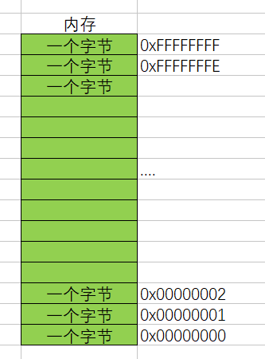
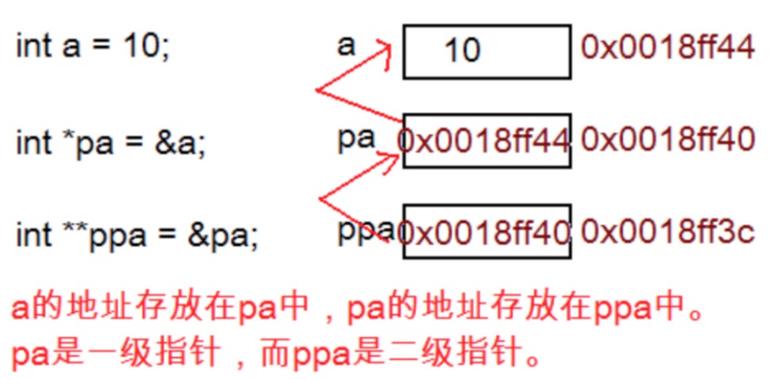
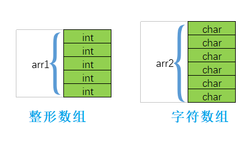
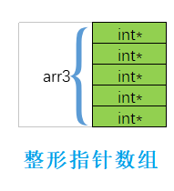

# 第六讲：指针

> 一般情况下，正常找工作时间点为**大四开学时**（**校园招聘**），这时应抓紧时间找正式工作，而学校安排的实习不应占大头.

> 短期的投入也是非常有价值的.

---

**目录：**

[TOC]

---

> 本讲学习内容：
> * 指针是什么.
> * 指针和指针类型.
> * 野指针.
> * 指针运算.
> * 指针和数组.
> * 二级指针.
> * 指针数组.

## 一、指针是什么？

> 指针是什么？
>
> 指针理解的2个要点：
> * 指针是内存中一个最小单元的编号，也就是地址.
> * 平时口语中说的指针，通常指的是指针变量，是用来存放内存地址的变量.

**总结：** **指针就是地址**，口语中说的指针通常指的是**指针变量**.

那我们就可以这样理解：

* 内存：
  * 将内存空间划分为一个个小的内存单元，每一个内存单元的大小为`1`个字节.
  * 每一个内存单元都有一个唯一的编号，这个编号也被称为**地址编号**；即`地址编号 = 地址`.
  * 写C语言程序的时候，创建的变量、数组等都要在内存上开辟空间.
  * 内存概念图：
    

* 指针变量：
  * 我们可以通过`&`（取地址操作符）取出变量的内存其实地址，把地址可以存放到一个变量中，这个变量就是**指针变量**.
  * 因此，可得出：`地址编号 = 地址 = 指针`.
  * 示例代码：
    ``` C
    #include <stdio.h>

    int main()
    {
        int a = 100;
        int arr[10];

        int* pa = &a;	//pa是专门用来存放地址（指针）的，这里的pa就被称为指针变量.

        printf("%p\n", pa);

        return 0;
    }
    ```

**总结：** 指针变量，用来存放地址的变量（存放在指针中的值都被当成地址处理）.

那这里的问题是：
* 一个小的单元到底是多大？（`1`个字节）.
* 如何编址？

经过仔细的计算和权衡我们发现**一个字节给一个对应的地址**是比较合适的.

对于`32`位的机器，假设有`32`根地址线，那么假设每根地址线在寻址的时候产生高电平（高电压）和低电平（低电压）就是（`1`或者`0`）.

那么`32`根地址线产生的地址就会是：
`00000000 00000000 00000000 00000000`.
`00000000 00000000 00000000 00000001`.
...
`11111111 11111111 11111111 11111111`.

这里就有`2`的`32`次方个地址.

每个地址标识一个字节，那我们就可以给 （`2^32Byte = 2^32/1024KB = 2^32/1024/1024MB = 2^32/1024/1024/1024GB = 4GB`） `4G`的空闲进行编址.

同样的方法，那`64`位机器，如果给`64`根地址线，那能编址多大空间，自己计算.

**这里我们就明白：**
* 在`32`位的机器上，地址是`32`个`0`或者`1`组成二进制序列，那地址就得用`4`个字节的空间来存储，所以一个指针变量的大小就应该是`4`个字节.
* 那如果在`64`位机器上，如果有`64`个地址线，那一个指针变量的大小是`8`个字节，才能存放一个地址.

**总结：**
* 指针是用来存放地址的，地址是唯一标示一块地址空间的.
* 指针的大小在`32`位平台是`4`个字节，在`64`位平台是`8`个字节.

---

## 二、指针和指针类型

这里我们再讨论一下：**指针的类型**.

我们都知道，变量有不同的类型，整形，浮点型等。那指针有没有类型呢？
准确的说：**有的**.

当有这样的代码：

``` C
int num = 10;
p = &num;
```

要将`&num`（`num`的地址）保存到`p`中，我们知道`p`就是一个指针变量，那它的类型是怎样的呢？

我们给指针变量相应的类型：
* `char  *pc = NULL;`.
* `int   *pi = NULL;`.
* `short *ps = NULL;`.
* `long  *pl = NULL;`.
* `float *pf = NULL;`.
* `double *pd = NULL;`.

这里可以看到，指针的定义方式是： `type + * + p`，其中`p`表示指针变量名称.
* `*` 说明`p`是指针变量.
* `type`的说明（内涵）：
  * `p`指向的对象的类型.
  * `p`解引用的时候访问的对象的大小是`sizeof(type)`.

其实：
* `char*` 类型的指针是为了存放 `char` 类型变量的地址.
* `short*` 类型的指针是为了存放 `short` 类型变量的地址.
* `int*` 类型的指针是为了存放 `int` 类型变量的地址.

那指针类型的意义是什么？

### 2.1 指针 +/- 整数

示例代码：

``` C
    #include <stdio.h>
    //演示实例：
    int main()
    {
        int a = 0x11223344;	//0x开头的是十六进制的数字.

        int* pa = &a;
        char* pc = &a;

        printf("%p\n", pa);
        printf("%p\n", pc);

        printf("%p\n", pa + 1);
        printf("%p\n", pc + 1);

        return 0;
    }
```

**总结：** 指针的类型决定了指针向前或者向后走一步有多大（**距离**或**步长**）.
* `整型指针 + 1` ：跳过`4`个字节.
* `字符指针 + 1` ：跳过`1`个字节.

因此，`p + n`跳过的是`n * sizeof(type)`这么多个字节.

### 2.2 指针的解引用

示例代码：

``` C
    //演示实例：
    #include <stdio.h>

    int main()
    {
        int n = 0x11223344;
        char* pc = (char*)&n;
        int* pi = &n;

        *pc = 0;	//重点在调试的过程中观察内存的变化.
        *pi = 0;	//重点在调试的过程中观察内存的变化.

        return 0;
    }
```

**总结：** 指针的类型决定了对指针解引用的时候有多大的**权限**（**能操作几个字节**）.
* `int*` 的指针解引用访问`4`个字节.
* `char*` 的指针解引用访问`1`个字节.
* `short*` 的指针解引用访问`2`个字节.
* `float*` 的指针解引用访问`4`个字节.
* `double*` 的指针解引用访问`8`个字节.

---

## 三、野指针

概念： 野指针就是**指针指向的位置是不可知的**（随机的、不正确的、没有明确限制的）.

### 3.1 野指针成因

**指针未初始化：**

``` C
    #include <stdio.h>
    int main()
    {
        int* p;	//局部变量指针未初始化，默认为随机值 - 野指针.
        *p = 20;

        return 0;
    }
```

**指针越界访问：**

``` C
    #include <stdio.h>
    int main()
    {
        int arr[10] = { 0 };
        int* p = arr;
        int i = 0;
        for (i = 0; i <= 11; i++)
        {
            //当指针指向的范围超出数组arr的范围时，p就是野指针.
            *(p++) = i;
        }
        return 0;
    }
```

**指针指向的空间释放：**

``` C
    #include <stdio.h>

    int* test()
    {
        int a = 110;

        return &a;
    }

    int main()
    {
        int* p = test();
        printf("%d\n", *p);

        return 0;
    }
```

以上代码中，`a`的空间是在进入函数时创建，退出函数时归还操作系统了；因此返回的指针`p`为野指针.

另外，在动态内存开辟时，也可能出现这类情况.

### 3.2 如何规避野指针

有效规避野指针的方法如下：
* 指针初始化.
  * 明确知道指针应该初始化为谁的地址，就直接初始化.
  * 不知道指针初始化为什么值，暂时初始化为`NULL`（空指针）.
* 小心指针越界.
* 指针指向的空间释放后，及时置为空指针（`NULL`）.
* 避免返回局部变量的地址.
* 指针使用之前检查有效性.

示例代码：

``` C
    #include <stdio.h>

    int main()
    {
        int a = 10;
        int* p = &a;

        int* ptr_1 = NULL;	//ptr_1是一个空指针，没有指向任何有效的空间；这个指针不能直接使用.
        int* ptr_2;	//ptr_2是野指针.

        if (ptr_1 != NULL)
        {
            //使用ptr_1指针.
            //...
        }

        return 0;
    }
```

关于空指针`NULL`，其定义为：

``` C
#ifndef NULL
    #ifdef __cplusplus
        #define NULL 0
    #else
        #define NULL ((void *)0)
    #endif
#endif
```

> 注意：
> * `nullptr`为C++第11版标准及之后为C++语言规定的空指针.

---

## 四、指针运算

指针运算包括三种情况：
* `指针 +/- 整数`.
* `指针 - 指针`.
* 指针的关系运算.

### 4.1 指针 +/- 整数

==示例代码 1：==

``` C
    #include <stdio.h>

    int main()
    {
        int arr[10] = { 0 };

        /* 不使用下标访问数组的方式： */
        //int arr[10];
        //int* p = arr;
        //*(p + i) == arr[i];

        int* p = &arr[0];
        int i = 0;
        int sz = sizeof(arr) / sizeof(arr[0]);

        //方式一：
        for (i = 0; i < sz; i++)
        {
            *p = i;
            p++;
        }
        for (i = 0; i < sz; i++)
        {
            printf("%d ", i[arr]);  //[ ] - 操作符.
        }
        printf("\n");

        //方式二：
        p = arr;
        for (i = 0; i < sz; i++)
        {
            *(p + i) = i;
        }
        for (i = 0; i < sz; i++)
        {
            printf("%d ", *(p + i));
        }
        printf("\n");

        return 0;
    }
```

**总结：** `*(arr + i)`、`arr[i]`、`*(i + arr)`与`i[arr]`相互等价等价.

==示例代码 2：==

``` C
    #define N_VALUES 5
    float values[N_VALUES];
    float *vp;
    //指针+-整数；指针的关系运算.
    for (vp = &values[0]; vp < &values[N_VALUES];)
    {
        *vp++ = 0;
    }
```

上述代码将`values`数组的元素从前向后全部初始化为`0`.

### 4.2 指针 - 指针

示例代码：

``` C
    #include <stdio.h>

    int main()
    {
        int arr[10] = { 0 };
        printf("%d\n", &arr[9] - &arr[0]);	//9.
        printf("%d\n", &arr[0] - &arr[9]);	//-9.

        return 0;
    }
```

总结：`指针 - 指针`得到的数值的绝对值是指针和指针之间的元素个数.

> 注意：
> * `指针 - 指针`运算的前提条件是：做运算的两个指针指向了同一块空间.

### 4.3 指针的关系运算

地址是有大小的，因此指针的关系运算就是比较指针的大小.

示例代码：

``` C
    #define N_VALUES 5
    float values[N_VALUES];
    float *vp;

    for(vp = &values[N_VALUES]; vp > &values[0];)
    {
       *--vp = 0;
    }
```

上述代码将`values`数组的元素从后向前全部初始化为`0`.

代码简化, 这将代码修改如下：

``` C
for(vp = &values[N_VALUES-1]; vp >= &values[0];vp--)
{
    *vp = 0;
}
```

实际在绝大部分的编译器上是可以顺利完成任务的，然而我们还是应该避免这样写，因为标准并不保证它可行.

**标准规定：**

> 允许指向数组元素的指针与指向数组最后一个元素后面的那个内存位置的指针比较，但是不允许与指向第一个元素之前的那个内存位置的指针进行比较.

---

## 五、指针和数组

> 指针和数组之间是什么关系呢？
> * 指针变量就是指针变量，不是数组；指针变量的大小是`4` / `8`个字节，专门用来存放地址的.
> * 数组就是数组，不是指针；数组是一块连续的空间，可以存放一个或多个类型的相同的数据.
>
> 联系：
> * 数组中，数组名其实是数组首元素的地址：`数组名 = 地址 = 指针`.
> * 数组是可以通过指针来访问的.
>   * 当我们知道数组首元素的地址的时候，因为数组又是连续存放的，所以通过指针就可以遍历访问数组.

示例代码：

``` C
    #include <stdio.h>

    int main()
    {
        int arr[10] = { 1, 2, 3, 4, 5, 6, 7, 8, 9, 10 };

        int i = 0;
        int sz = sizeof(arr) / sizeof(arr[0]);
        int* p = arr;

        printf("%p\n", arr);
        printf("%p\n", &arr[0]);
        for (i = 0; i < sz; i++)
        {
            //printf("%p == %p\n", p + i, &arr[i]);
            printf("%d ", *(p + i));
        }

        return 0;
    }
```

可见数组名和数组首元素的地址是一样的.

结论：**数组名表示的是数组首元素的地址**，但是有两种情况例外：
* `sizeof(数组名)`.
* `&数组名`.

那么这样写代码是可行的：

``` C
int arr[10] = {1,2,3,4,5,6,7,8,9,0};
int *p = arr;//p存放的是数组首元素的地址.
```

既然可以把数组名当成地址存放到一个指针中，我们使用指针来访问一个就成为可能.

例如：

``` C
    #include <stdio.h>
    int main()
    {
        int arr[] = { 1,2,3,4,5,6,7,8,9,0 };
        int* p = arr; //指针存放数组首元素的地址.
        int sz = sizeof(arr) / sizeof(arr[0]);

        int i = 0;
        for (i = 0; i < sz; i++)
        {
            printf("&arr[%d] = %p   <====> p+%d = %p\n", i, &arr[i], i, p + i);
        }
        return 0;
    }
```

所以 `p + i` 其实计算的是数组 `arr` 下标为`i`的地址.

那我们就可以直接通过指针来访问数组.

如下：

``` C
    #include <stdio.h>

    int main()
    {
        int arr[] = { 1, 2, 3, 4, 5, 6, 7, 8, 9, 0 };
        int* p = arr; //指针存放数组首元素的地址.
        int sz = sizeof(arr) / sizeof(arr[0]);
        int i = 0;
        for (i = 0; i < sz; i++)
        {
            printf("%d ", *(p + i));
        }
        return 0;
    }
```

---

## 六、二级指针

指针变量也是变量，是变量就有地址，那指针变量的地址存放在哪里？

这就是 **二级指针**.



对于二级指针的运算有：

* `*ppa`：通过对`ppa`中的地址进行解引用，这样找到的是 `pa`，`*ppa`其实访问的就是 `pa`.
    ``` C
    int b = 20;
    *ppa = &b;//等价于 pa = &b;
    ```
* `**ppa`：先通过`*ppa`找到`pa`，然后对`pa`进行解引用操作（`*pa`），那找到的是`a`.
    ``` C
    **ppa = 30;
    //等价于*pa = 30;
    //等价于a = 30;
    ```

**示例代码：**

``` C
    #include <stdio.h>

    int main()
    {
        int a = 10;
        int* p = &a;	//p是一级指针，指针变量也是变量 - 变量是在内存中开辟空间的，是变量就有地址.
        char* p2;	//p2也是一级指针.

        int** pp = &p;	//pp就是二级指针变量，二级指针变量就是用来存放一级指针变量的地址.

        /**(*pp) = 100;*/
        **pp = 100;
        printf("%d\n", a);

        int*** ppp = &pp;

        return 0;
    }
```

对于二级指针变量的声明`int** pp`：
* 第二个`*`是说明`pp`是指针变量.
* `int*`是在说明`pp`指向的是`int*`类型的变量（即指向一级指针`p`）.

**二级指针的应用实例：**

``` C
    #include <stdio.h>

    int main()
    {
        char arr_1[] = "abcdef";
        char arr_2[] = "Hello World!";
        char arr_3[] = "BIT Course.";

        char* parr[] = { arr_1, arr_2, arr_3 };

        char** p = parr;

        return 0;
    }
```

---

## 七、指针数组

> 指针数组是指针还是数组？
> * 答案：是数组——是存放指针的数组.

数组我们已经知道整型数组，字符数组.

``` C
int arr1[5];    //整型数组.
char arr2[6];   //字符数组.
```



**指针数组：** 存放指针（地址）的数组.

那指针数组是怎样的？

``` C
int* arr3[5];//是什么？
```

`arr3`是一个数组，有五个元素，每个元素是一个整型指针.



示例代码：

``` C
    #include <stdio.h>

    int main()
    {
        char arr_1[] = "abcdef";
        char arr_2[] = "Hello World!";
        char arr_3[] = "BIT Course.";

        //指针数组：
        char* parr[] = { arr_1, arr_2, arr_3 };
        int i = 0;
        for (i = 0; i < 3; i++)
        {
            printf("%s\n", parr[i]);
        }

        return 0;
    }
```

> 注意：
> * 使用`%s`打印字符串内容时，只需要提供字符串数组首地址，即可将字符串内容输出，直至遇到字符串结束标志'`\0`'则结束打印输出.

使用指针数组可以模拟二维数组的实现：

``` C
#include <stdio.h>

int main()
{
	int arr_1[] = { 1, 2, 3, 4, 5 };
	int arr_2[] = { 2, 3, 4, 5, 6 };
	int arr_3[] = { 3, 4, 5, 6, 7 };

	//指针数组：
	int* parr[] = { arr_1, arr_2, arr_3 };

	int i = 0;
	for (i = 0; i < 3; i++)
	{
		int j = 0;
		for (j = 0; j < 5; j++)
		{
			printf("%d ", parr[i][j]);
            printf("%d ", *(parr[i] + j));
		}
		printf("\n");
	}

	return 0;
}
```

> 注意：
> * 使用指针数组模拟出的二维数组与真实的二维数组可能有区别：使用指针数组模拟出的二维数组在内存中存放的空间可能不是连续的空间.

注意区分**指针数组**与**数组指针**的概念！