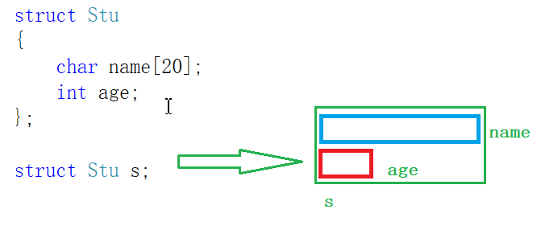

# 第七讲：结构体

---

**目录：**

[TOC]

---

> 本讲学习内容：
> * 结构体类型的声明.
> * 结构体初始化.
> * 结构体成员访问.
> * 结构体传参.

## 一、结构体的声明

### 1.1 结构的基础知识

结构是一些值的集合，这些值称为成员变量.

结构的每个成员可以是不同类型的变量.

对于复杂对象，不能通过内置类型直接描述和表示，因此就有结构体来描述复杂类型.

**结构体：** 其实是一组元素类型不一定相同的元素的集合.

### 1.2 结构体的声明

结构体声明基本方式：

``` C
struct tag  //这里的tag根据实际情况给名字.
{
    //成员列表（一个或多个）
    member-list;
}variable-list; //变量列表
```

示例代码：

``` C
    #include <stdio.h>

    //描述一个学生：
    //名字 + 年龄 + 性别.

    /* 声明结构体类型. */
    struct Stu
    {
        /* 以下name，age，sex为成员变量，是用来描述结构体对象的相关属性的. */
        char name[20];
        int age;

        //一个汉字占两个字符.
        char sex[5];	//男 女 保密.
    } s_2, s_3, s_4;	//s_2，s_3，s_4 就是结构体变量 - 全局变量.

    typedef struct Teac	//typedef - 类型重命名.
    {
        char name[20];
        int age;

        //一个汉字占两个字符.
        char sex[5];	//男 女 保密.
    } Teac;

    int main()
    {
        /* 通过结构体类型创建结构体变量. */
        struct Stu s_1;	//局部变量.
        Teac T_1;	//在C语言中，没有对结构体类型typedef，struct关键字不能省略.

        return 0;
    }
```

### 1.3 结构体成员的类型

结构的成员可以是标量、数组、指针，甚至是其他结构体.

示例代码：

``` C
    #include <stdio.h>

    struct S
    {
        int a;
        char arr[5];
        int* p;
    };

    struct B
    {
        char ch[10];
        struct S s;
        double d;
    };

    int main()
    {
        return 0;
    }
```

### 1.4 结构体变量的定义和初始化

有了结构体类型，那如何定义变量，其实很简单.

==示例代码：==

``` C
    #include <stdio.h>

    struct S
    {
        int a;
        char arr[5];
        int* p;
    }s_1 = { 100, "BIT", NULL };	//结构体变量的定义与初始化 - 声明类型的同时定义变量s_1.

    //初始化：定义变量的同时赋初值.
    int n = 2023;
    struct S s_2 = { 98, "Ax", &n };

    struct B
    {
        char ch[10];
        struct S s;
        double d;
    };

    int main()
    {
        struct S s_3 = { .arr = "abc", .p = NULL, .a = 1 };
        printf("%d %s %p\n", s_3.a, s_3.arr, s_3.p);	//. - 结构体成员访问操作符.

        //结构体嵌套初始化：
        struct B sb = { "Hello", {.a = 20, .arr = "Tues", .p = NULL}, 3.14 };

        printf("%s %d %s %p %.2lf\n", sb.ch, sb.s.a, sb.s.arr, sb.s.p, sb.d);

        return 0;
    }
```

---

## 二、结构体成员的访问

### 2.1 结构体变量访问成员

结构变量的成员是通过点操作符（`.`）访问的。点操作符接受两个操作数.

例如：



我们可以看到 `s` 有成员 `name` 和 `age`.

那我们如何访问`s`的成员？

``` C
struct S s;
strcpy(s.name, "zhangsan");//使用.访问name成员
s.age = 20;//使用.访问age成员
```

### 2.2 结构体指针访问指向变量的成员

有时候我们得到的不是一个结构体变量，而是指向一个结构体的指针.

那该如何访问成员？

如下：

``` C
    #include <stdio.h>
    #include <string.h>

    struct Stu
    {
        char name[20];
        int age;
    };

    ///* 错误示例： */
    //void set_stu(struct Stu t)
    //{
    //	t.age = 20;
    //	//t.name = "张三";	//err
    //	strcpy(t.name, "张三");	//字符串拷贝.
    //}
    void set_stu(struct Stu* ps)
    {
        (*ps).age = 20;
        strcpy((*ps).name, "张三");	//字符串拷贝.

        //结构体指针->结构体成员.
        ps->age = 20;
        strcpy(ps->name, "张三");
    }
    void print_stu(struct Stu t)
    {
        printf("%s %d\n", t.name, t.age);
    }
    int main()
    {
        struct Stu s = { 0 };
        set_stu(&s);

        print_stu(s);

        return 0;
    }
```

---

## 三、结构体传参

示例代码：

``` C
    #include <stdio.h>

    struct S
    {
        int data[1000];
        int num;
    };
    struct S s = { {1,2,3,4}, 1000 };

    //结构体传参
    void print1(struct S s)
    {
        printf("%d\n", s.num);
    }

    //结构体地址传参
    void print2(struct S* ps)
    {
        printf("%d\n", ps->num);
    }

    int main()
    {
        print1(s);	//传结构体
        print2(&s); //传地址

        return 0;
    }
```

上面的`print1()`和`print2()`函数首选`print2()`函数.

原因：

> 函数传参的时候，参数是需要压栈的.
>
> 如果传递一个结构体对象的时候，结构体过大，参数压栈的的系统开销比较大，所以会导致性能的下降.

**结论：** 结构体传参的时候，要传**结构体的地址**.