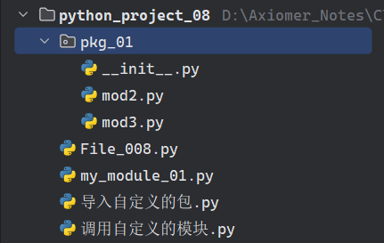

# 第八讲：Python的模块和发布、包和库

---

**目录：**

[TOC]

---

## 一、Python的模块

### 1.1 Python模块的定义和导入方式

==定义：== 后缀为`.py`的源代码.

==导入模块的方式：== 共有五种导入模块的方式，其中常用的为**前三种方式**.

* `import 模块名`.

``` Python
    # 1. import 模块名
    import math

    print(math.log2(4))
```

* `from 模块名 import 函数名`.

``` Python
    # 2. from 模块名 import 函数名
    from math import log2

    print(log2(16))
```

* `from 模块名 import *`.

``` Python
    # 3. from 模块名 import *
    from math import *

    print(log2(26))
    print(log10(100))
```

> 注意：
> * 这里的 `*` 为`通配符`.

* `import 模块名 as 别名`.

``` Python
    # 4. import 模块名 as 别名
    import math as mt

    print(mt.log2(8))
```

* `from 模块名 import 函数名 as 别名`.

``` Python
    # 5. from 模块名 import 函数名 as 别名
    from math import log10 as ln

    print(ln(100))
```

### 1.2 自定义模块

在Python中，可以使用官方提供的模块，也可以自定义模块之后在其他文件中使用.

**创建自定义模块：**

在项目`python_project_08`中创建模块文件`my_module_01.py`：

``` Python
"""
my_module_01.py
"""

# 当别人调用该模块的代码时，只允许调用test1()函数：
# 只能导入这个列表中指定的元素.
__all__ = ['test1']


def test1(a, b):
    print(a + b)


def test2(a, b):
    print(a * b)


# 只有在当前文件中调用该函数时才会执行，其他导入的文件内不符合该条件，则不会执行test1()函数调用.
if __name__ == '__main__':
    # 这是我们的测试代码：
    test1(10, 10)
```

注意：
* `__all__`变量：
  * 功能：
    * 当在其他文件中调用该变量所在模块的代码时，只能导入`__all__`变量的列表中指定的元素.
  * 性质：
    * 是一个`列表`，指定了可导入到其他文件中的元素.
  * 使用场景：
    * 当采用`from 模块名 import *`方式调用模块时，`__all__`变量起作用.
* 自定义模块中的测试代码：
  * 基本格式：
    ``` Python
    if __name__ == '__main__':
        测试代码.
    ```
  * 功能：
    * 只有在当前文件中调用测试代码时才会执行.
    * 其他导入的文件内不符合该条件，则不会执行自定义模块中的测试代码.

**调用自定义模块：**

在项目`python_project_08`中创建源文件`调用自定义的模块.py`，在源文件中调用上一步创建的自定义模块：

``` Python
"""
调用自定义的模块.py
"""
from my_module_01 import *

test1(20, 20)

'''此处不可调用test2()函数，因为在自定义模块my_module_01.py中通过__all__变量指定了在其他文件中只能导入test1()函数.'''
# test2(10, 10)
```

---

## 二、Python的包

### 2.1 Python包的定义和创建方式

==定义：== 包由很多个模块文件构成，将**众多具有相关联的功能的模块**组合在一起，其实是项目中的某一个**目录**或**文件夹**.

==创建自定义的包的方式：==

* 通过`项目 - New - Python Package`创建.
* 通过`项目 - New - Directory`创建.

> 注意：
> * 上述两种方式都可以成功创建包，但是首推第一种方式，即通过`项目 - New - Python Package`创建.
>   * 原因：通过`项目 - New - Python Package`方式创建的包目录下自动创建`__init__.py`文件，而通过`项目 - New - Directory`创建的包目录下为空，没有`__init__.py`文件，需要自行**手动创建**.
>   * `__init__.py`文件：
>       * 不是包必需的文件.
>       * 最好在自定义包下创建`__init__.py`文件，这样做符合Python中**包的标准**.

### 2.2 导入自定义的包的方式

在项目`python_project_08`中通过`项目 - New - Python Package`方式创建包`pkg_01`，包下自动创建`__init__.py`文件.



在包`pkg_01`下创建自定义模块`mod2.py`、`mod3.py`，在自定义模块中定义函数`print_hello()`：

``` Python
"""
mod2.py
"""


def print_hello():
    print('执行mod2()中的函数.')
```

``` Python
"""
mod3.py
"""


def print_hello():
    print('执行mod3()中的函数.')
```

在项目`python_project_08`中创建源文件`导入自定义的包.py`，在源文件中导入并调用上一步创建的自定义包.这里对于导入自定义的包有两种方式：

* 第一种：

``` Python
    import pkg_01.mod2
    import pkg_01.mod3

    # 调用包中模块的函数：
    pkg_01.mod2.print_hello()
    pkg_01.mod3.print_hello()
```

> 注意：
> * 在这一种导包方式下进行函数调用时，要使用函数的绝对路径（即完整的调用路径）.

* 第二种：

``` Python
    """
    __init__.py
    """

    __all__ = ['mod2', 'mod3']
```

``` Python
    # 第二种
    from pkg_01 import *

    # 必须在__init__.py文件中提供一个__all__的特殊变量.
    mod2.print_hello()
    mod3.print_hello()
```

## 三、安装Python中的第三方库

==Python中库的分类：==

Python中的库分为两类：
* 标准库：
  * Python解释器中那些自带的模块.
    * 例如：`math`.
* 第三方库：
  * 有其他第三方机构或者个人发布的具有特定功能的模块.
    * 例如：`opencv-python`.

==安装第三方库的方式：==

在`PyCharm`中，打开下方的`Terminal`窗口（`Alt + F12`），输入安装库命令即可.

**安装命令：**
* `pip install 库名称 -i 镜像源地址`.

> 注意：
> * `pip` 和 `pip3` 的区别：
>   * `pip3`是指为版本为`3.x`的`Python解释器`安装第三方库.
>   * `pip2`是指为版本为`2.x`的`Python解释器`安装第三方库.
> * 如果系统中只有版本为`3.x`的`Python解释器`，那么`pip`和`pip3`的功能相同，都是为版本为`3.x`的`Python解释器`安装第三方库.

## 三、课堂小结

Python项目开发小技巧：

* 在实际开发过程中，会由多个程序员开发同一个项目.因此会出现以下情况的**模块文件名称冲突**：
  * 自定义模块文件名称相同导致的冲突.
  * 自定义模块文件与Python内置的模块文件名称相同导致的冲突.
    * **会导致无法导入Python内置的模块！**
* 解决方法：
  * 尽量**避免和Python内置的模块名字产生冲突**.
  * **先建立一个自定义包，然后在包内创建模块**，这样可以降低模块名字相同产生冲突的概率.