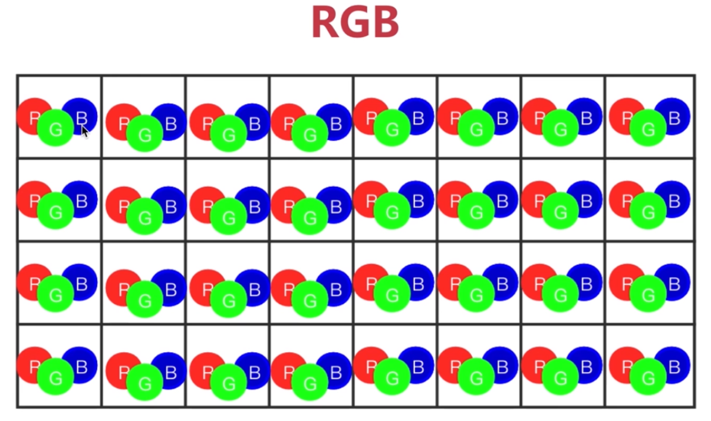
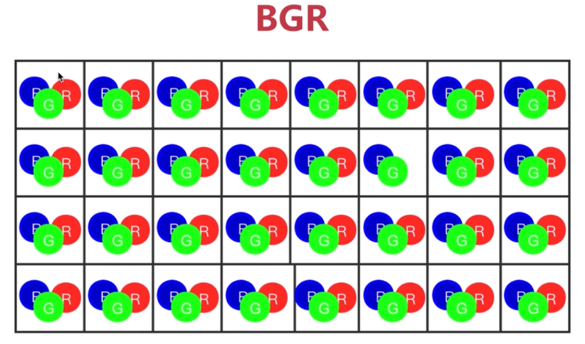
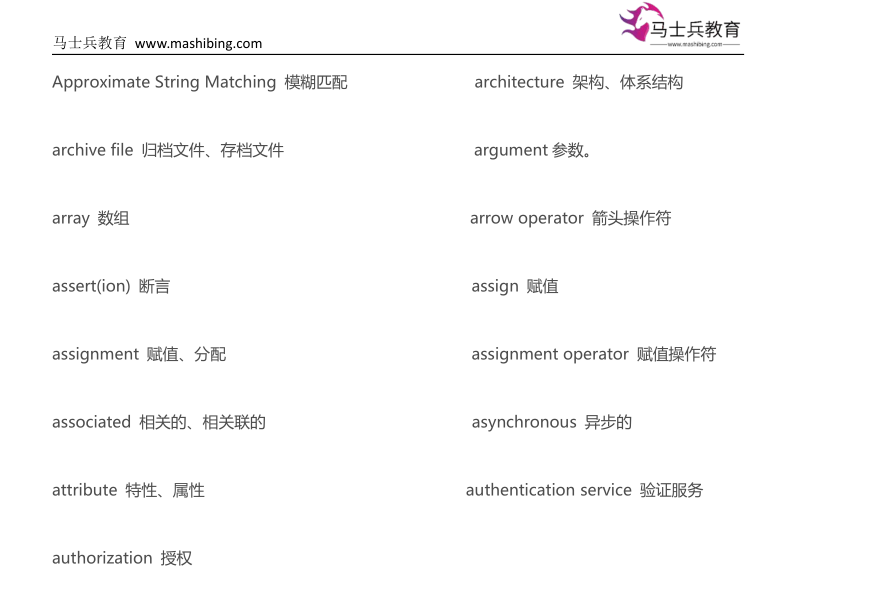

# 第十讲：图像就是矩阵

---

**目录：**

[TOC]

---

## 一、图像的本质

**像素：** 组成图像最基本的不可分割的单位.
* 像素是一个单一颜色的小方格.
* 每一个像素点由三个值组成像素上所呈现的一些色彩.
  * 像素点的三个值的范围为`0~255`.
    * `[0, 0, 0]`：黑色.
    * `[255, 255, 255]`：白色.

> `640 × 480 JPEG`：
>   * `640`和`480`分别指代图片的横和竖所包含的像素（`px`）的个数.

**色彩空间：** 采用光学加法混色的方式构建的立方空间.
* 通常我们创建一个三维坐标系，会使用`X`、`Y`和`Z`来代表三个轴；如果我们将这三个轴的代表字母换成`R`、`G`和`B`，使用`Red`代表`X轴`，`Green`代表`Y轴`，`Blue`代表`Z轴`，采用`光学加法混色`的方式构建这个立方空间的话，就形成了一个基于`RGB模型`的色彩空间了.
* 色彩空间的分类：
  * 基于图片在色彩通道上的排列顺序不同，色彩空间模型可以分为：
    * `BGR`模型（`OpenCV`默认使用的模型）.
        
    * `RGB`模型（最常见的色彩空间，人眼也是基于`RGB`的色彩空间去分辨颜色的，人的眼睛只对这三种颜色敏感）.
        

**彩色图片的本质：** 一个三维矩阵.
* 在矩阵中：
  * 每一个像素点由三个值组成像素上所呈现的一些色彩.
  * 每一个像素点通过二维的方式排列在一起组成了一个像素点的颜色通道.
* `[R G B]` -> 代表色彩.

---

## 二、自定义调色板项目

### 2.1 创建进度条

**使用到的库：**

* `numpy`：
  * 功能：矩阵处理模块.
  * 导入方式：
    * `import numpy as np`.

**使用到的库方法：**

* `createTrackbar(trackbarname, winname, value, count, onChange)`：
  * 功能：
    * 创建`TrackBar控件`.
  * 参数声明：
    * `trackbarname`：进度条名称.
    * `winname`：进度条所显示窗口的名称.
    * `value`：进度条左右两边可以调整的最小值.
    * `count`：进度条左右两边可以调整的最大值.
    * `onChange`：回调函数，即进度条中的数值改变之后自动调用的函数.

> 注意：
> * 回调函数的==函数名之后不能添加小括号==：
>   * 添加小括号表示**自己手动调用函数**.
>   * 这里应为**自动调用函数**.

* `getTrackbarPos(tracknarname, winname)`：
  * 功能：
    * 获取`TrackBar`当前值，即获取当前进度条的数值.

### 2.2 创建一个背景图片

**使用到的库方法：**

* `numpy.zeros(shape, dtype=np.uint8)`：
  * 功能：创建一个全零矩阵.
  * 参数声明：
    * `shape`：创建的新数组的形状（维度）.
      * 类型为一个有三个元素的元组：`(纵坐标, 横坐标, RGB的三个值)`.
    * `dtype`：创建的新数组的数据类型.
      * `dtype -> datatype`.
      * `unit`：无符号整数.
        * `unit8`：`8位`的无符号二进制整数，可表示`256`个数字（`0~255`）.
  * 返回值类型：
    * 给定维度的全零的矩阵.

> 注意：
> * 长为`X轴`（`横坐标`），宽为`Y轴`（`纵坐标`）.
> * 利用`cv2.resizeWindow('JvTU', 800, 600)`创建窗口时数据顺序为==长、宽==，而通过`numpy.zeros(shape, dtype=np.uint8)`创建全零矩阵时`shape`位置的元组中数据顺序为==宽、长==.

* `cv2.getTrackbarPos()`：
  * 功能：
    * 获取三个进度条的值，其实就是`RGB的值`.
  * 参数声明：
    * 第一个参数：进度条的名称.
    * 第二个参数：进度条所显示窗口的名称.
  * 返回值类型：
    * 指定窗口的进度条的数值.

### 2.3 实操代码

``` Python
    import cv2
    import numpy as np

    ''' 创建、命名窗口并修改窗口的大小. '''
    cv2.namedWindow('JvTU', cv2.WINDOW_NORMAL)
    cv2.resizeWindow('JvTU', 800, 600)

    ''' 自定义的回调函数： '''


    def call_back(value):
        print(value)


    ''' 创建三个进度条，分别代表R、G、B. '''
    # 回调函数的函数名之后不能添加小括号，添加小括号表示自己手动调用函数，而这里应为自动调用函数.
    cv2.createTrackbar('R', 'JvTU', 0, 255, call_back)
    cv2.createTrackbar('G', 'JvTU', 0, 255, call_back)
    cv2.createTrackbar('B', 'JvTU', 0, 255, call_back)

    ''' 创建调色板的背景，一开始调色板的初始背景颜色为：黑色（每一个像素点的RGB都是0）. '''
    # 思路：利用一个元素均为0的三维矩阵来表示黑色.

    # 创建一个矩阵，矩阵的元素都是0.
    img = np.zeros((600, 800, 3), dtype=np.uint8)  # 创建一个维度为三维的、有着600×800×3维数的新矩阵.

    while True:
        # 获取三个进度条的值，其实就是RGB的值.
        r = cv2.getTrackbarPos('R', 'JvTU')
        g = cv2.getTrackbarPos('G', 'JvTU')
        b = cv2.getTrackbarPos('B', 'JvTU')

        # ：是切片的符号.
        # 切片在列表中的用法：[开始位置:结束位置].
        # 注意在OpenCV默认使用的模型是BGR模型.
        img[:] = [b, g, r]  # [:]表示从第一个开始，到最后一个结束.因此这里代表每一个像素点，每一个像素点的颜色均相同.

        # 在窗口中显示调色板.
        cv2.imshow('JvTU', img)
        key = cv2.waitKey(1)
        if key == ord('q'):
            break

    # 关闭窗口.
    cv2.destroyAllWindows()
```

---

## 三、课堂小结

合格的程序员一定要记住`600个左右`的**英语单词**！
* 不要求掌握对英语单词的读音.
* **见词知意**即可.

