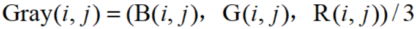
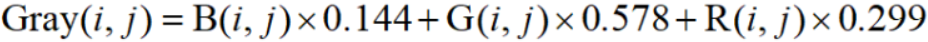

# 第十一讲：图像灰度化

> 各种图片识别过程中，都需要对图片进行灰度化.
> * **灰度化：** 把每一个像素上`R`、`G`、`B`三个通道上的值设置为一个值，即`R的值 = G的值 = B的值`，此时颜色呈现灰度，只是亮度不同.
>   * `R = G = B = 0`时，图像颜色呈现黑色.
>   * `R = G = B = 255`时，图像颜色呈现白色.
> * **图片灰度化目的：** 
>   * **简化矩阵**，减少计算机在做图像识别的计算工作量，提高运算速度.

---

**目录：**

[TOC]

---

## 一、基础知识

**图片** 主要包含以下内容：
* ==像素==
  * 即通常说的`RGB`模型，由红、绿、蓝组成.
  * `RGB`颜色模型是三维直角坐标系下的一个单位正方体，即图片中的某个像素点的取值为`(x,y,z)`.
* ==灰度==
  * 表示图像像素的明暗程度的数值，即黑白图像中点的颜色深度.
  * 范围：一般为`0-255`.
    * 白色：`255`.
    * 黑色：`0`.
  * 几何位置：
    * 对应`RGB`颜色模型的正方体中对角线的取值范围.


## 二、图片灰度方法

==方法一：== 分量法.
* 方法描述：
  * 将彩色图像中的三分量的亮度作为三个灰度图像的灰度值，可根据应用需要选取一种灰度图像.
* 计算公式：
    
==方法二：== 最大值法.
* 方法描述：
  * 将彩色图像中的三分量的亮度作为三个灰度图像的灰度值，可根据应用需要选取一种灰度图像.
* 计算公式：
    
==方法三：== 平均值法.
* 方法描述：
  * 将彩色图像中的三分量亮度求平均得到一个灰度值.
* 计算公式：
    
==方法四：== 加权平均法.
* 方法描述：
  * 根据重要性及其它指标，将三个分量以不同的权值进行加权平均.`R`、`G`、`B`前面系数即所加权值，可任意改变.
  * 每个像素的灰度值依据人眼对绿色的敏感最高，对蓝色敏感最低，来确立不同通道的权重：`B`通道权重值为`0.114`，`G`通道权重值为`0.578`，`R`通道权重值为`0.299`.
* 计算公式：


**实操代码：**

``` Python
    import cv2

    # 导入一张彩色图片.
    img = cv2.imread('Picture.png')

    ''' 1. 采用灰度平均值法将图片进行灰度处理之后呈现出来. '''
    # img = cv2.imread('Picture.png', 0) # 如果参数为1，则采用原始的RGB色彩通道对图片进行显示.
    # cv2.imshow('JvTU', img)

    ''' 2. 采用加权平均法对图片进行灰度处理之后呈现出来. '''
    gray_img = cv2.cvtColor(img, cv2.COLOR_BGR2GRAY)
    cv2.imshow('JvTU', gray_img)

    cv2.waitKey(0)

    cv2.destroyAllWindows()
```

## 三、思路延伸

> ==鼓励思路延伸==：
> 在**掌握了必要的基础知识的前提**下，对已学过的知识进行**思路的延伸**，可以拓宽学习的**深度**和**广度**.

**二值化：**

* 定义：
  * 我们在上述的灰度化中，颜色以经由三维变成了一维的（取值范围`0-255`）；当这个取值只能为`0`或者`1`的时候，便是图像的==二值化==.
    * 二值化时，颜色取值的两个值不仅限于`0`和`1`，==也可以是其他的两个值==.
* 图片二值化目的：
  * 早期人们使用计算机处理图像是在图像灰度化处理的基础上在进行操作的，但是当时的硬件水平不足，所以==处理速度很慢==，于是人们引入了图像二值化处理.
  * 二值化处理使得原本颜色的取值范围从`256`种变为`2`种，确实是==提高了计算速度==，但是==丢失的信息也多了==，因此具体采用什么方式处理，要根据具体情况来选择.

**二值化处理方式：**

* 使用到的库方法：
  * `cv2.threshold(src, thresh, maxval, type[, dst])`：
    * 参数声明：
      * `src`：表示的是图片源，必须是==灰度化图片==.
      * `thresh`：表示自定义指定的==阈值==，或者是其他算法来计算的阈值，代表最小值.
      * `maxval`：表示灰度的最大值.
      * `type`：表示划分阈值的时候使用的==方法选择参数==.
        * `cv2.THRESH_BINARY`：像素灰度值小于阈值全为`0`，大于阈值全为`255`.
        * `cv2.THRESH_BINARY_INV`：像素灰度值小于阈值全为`255`，大于阈值全为`0`.
        * `cv2.THRESH_TRUNC`：像素灰度值小于阈值不变，大于阈值变为阈值.
        * `cv2.THRESH_TOZERO`：像素灰度值小于阈值不做任何改变，大于阈值全为`0`.
        * `cv2.THRESH_TOZERO_INV`：像素灰度值小于阈值全为`0`，大于阈值不做任何改变.
    * 返回值类型：
      * 第一个返回值`retval`：阈值.
      * 第二个返回值`dst`：二值化之后的图片.
* `OTSU`算法：
  * 功能：
    * 一般而言，当无法得知用什么阈值可以获得更好的二值化图像时，可采用`OTSU`算法，==该算法会通过一系列计算，计算得出比较优的阈值==.

**二值化处理实操代码：**

``` Python
    import cv2

    # 导入一张彩色图片.
    gray_img = cv2.imread('Picture.png')

    gray_img = cv2.imread('Picture.png', 0)

    # 采用自定义阈值方法获得二值化处理之后的图片.
    ret_value, binary_img = cv2.threshold(gray_img, 160, 255, cv2.THRESH_BINARY)
    print(ret_value)

    # 采用OTSU算法来计算阈值.
    # ret_value, binary_img = cv2.threshold(gray_img, 0, 255, cv2.THRESH_BINARY + cv2.THRESH_OTSU)
    # print(ret_value)

    cv2.imshow('JvTU', binary_img)

    cv2.waitKey(0)

    cv2.destroyAllWindows()
```