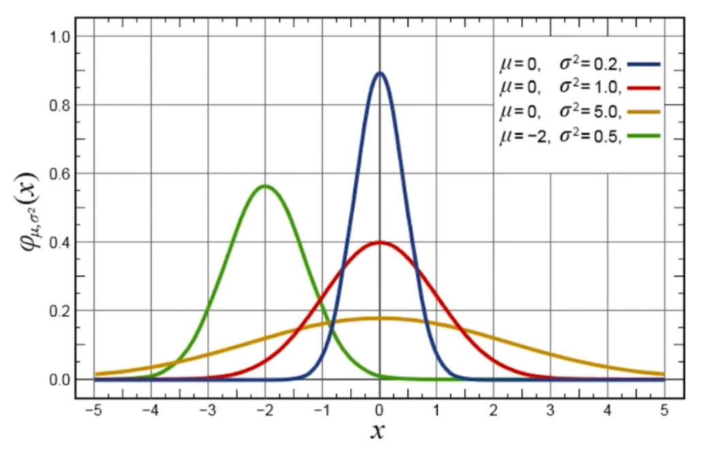
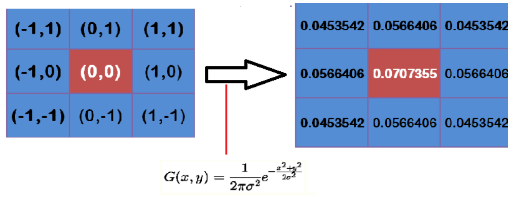
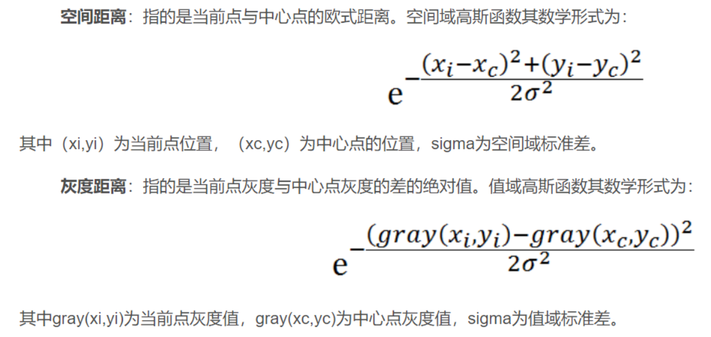
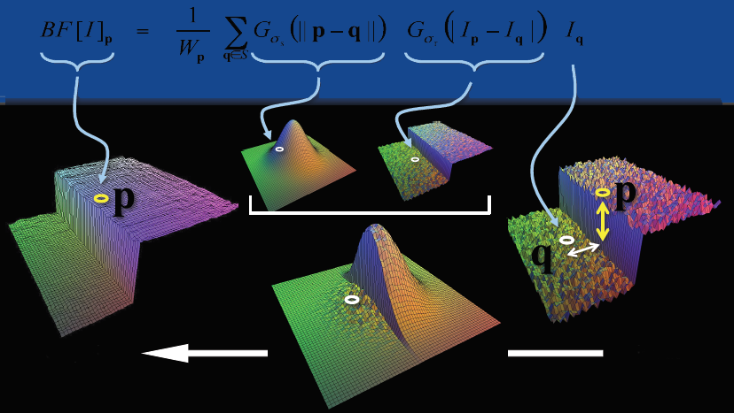

# 第十二讲：图像降噪

> 噪点：
> * 定义：
>   * 不属于原始图像的**随机亮度和颜色变化**.
> * 出现原因：
>   * 曝光不足.
>   * 相机过热.
>   * 外界信号干扰.
> * 分类：
>   * **高斯噪点**：符合高斯分布出现的噪点.
>   * **椒盐噪点**：不规律出现的黑白噪点.

---

**目录：**

[TOC]

---

## 一、高斯滤波

**高斯函数：**

* 定义：
  * 高斯函数在是符合==高斯分布==(也叫正态分布)的数据的概率密度函数.
* 几何图形：
    
* 特点：
  * 以`X轴`某一点(这一点称为均值)为对称轴，越靠近中心数据发生的概率越高，最终形成一个==两边平缓，中间陡峭==的钟型(有的地方也叫帽子)图形.
* 一般形式：
    

**高斯滤波：**

* 定义：
  * 使用符合高斯分布的==卷积核==对图片进行==卷积操作==.
* 核心思想：
  * ==让临近的像素具有更高的重要度==.
    * 对周围像素计算加权平均值，较近的像素具有较大的权重值.
* 高斯模板（卷积核）：
  * 定义：
    * 是==高斯滤波的重点==，即如何计算符合高斯分布的卷积核.
  * 计算公式：
    * 假定中心点的坐标是`(0,0)`，那么取距离它最近的`8`个点坐标，为了计算，需要设定`σ`的值.假定`σ = 1.5`，则模糊半径为`1`的高斯模板计算如下：
      
    * 特点：可以观察到==越靠近中心，数值越大，越边缘的数值越小==，符合==高斯分布==的特点.
  * 计算过程：
    * 假设现有`9`个像素点，灰度值`(0-255)`的高斯滤波计算如下：
      
      * 将这`9`个值加起来，就是中心点的高斯滤波的值.
      * 对所有点重复这个过程，就得到了高斯模糊后的图像.

> 注意：
> * 有些整数高斯模板是在归一化后的高斯模板的基础上每个数==除上左上角的值，然后取整==.
> * 卷积核的尺寸设置的越小，模糊度就越低.

**使用到的库方法：**

* `GaussianBlur(src, ksize, sigmaX[, dst[, sigmaY[, borderType]]])`：
  * 参数声明：
    * `src`：图片源.
    * `kernel`：高斯核的大小，为一个二元元组.
    * `sigmaX`：`X轴`的标准差.
    * `sigmaY`：`Y轴`的标准差，默认为`0`，且此时`sigmaY = sigmaX`，即==只考虑一个维度上的标准差==.

> 注意：
> * 在`GaussianBlur()`函数方法中如果没有指定`sigma`值，会分别从`ksize`的宽度和高度中计算`sigma`.
> * 选择不同的`sigma`值会得到不同的平滑效果.`sigma`越大，平滑效果越明显；即`sigma`的值越大，所得图片越模糊.
> * 没有指定`sigma`时，`ksize`越大，平滑效果越明显.

**实操代码：**

``` Python
  import cv2

  # 加载图片
  img = cv2.imread('Picture.png')

  ''' 1. 高斯滤波. '''
  result = cv2.GaussianBlur(img, (3, 3), sigmaX=1)

  cv2.imshow('JvTU', result)

  cv2.waitKey(0)
  cv2.destroyAllWindows()
```

---

## 二、双边滤波

**双边滤波介绍：**

==双边滤波对于图像的边缘信息能过更好的保存==.其原理为一个与空间距离相关的高斯函数与一个灰度距离相关的高斯函数相乘.



双边滤波==本质上是高斯滤波==.双边滤波和高斯滤波不同的就是:==双边滤波既利用了位置信息又利用了像素信息来定义滤波窗口的权重；而高斯滤波只用了位置信息==.

对于高斯滤波，仅用空间距离的权值系数核与图像卷积后，确定中心点的灰度值.即认为离中心点越近的点，其权重系数越大.

双边滤波中==加入了对灰度信息的权重==，即在邻域内，灰度值越接近中心点灰度值的点的权重更大，灰度值相差大的点权重越小.此权重大小，则由==值域高斯函数==确定.

两者权重系数相乘，得到最终的卷积模板.由于双边滤波需要每个中心点邻域的灰度信息来确定其系数，所以==其速度与比一般的滤波慢很多，而且计算量增长速度为核大小的平方==.



==双边滤波可以保留边缘，同时可以对边缘内的区域进行平滑处理==.

因此双边滤波的作用就相当于做了美颜.

**使用到的库方法：**

* `bilateralFilter(src, d, sigmaColor,sigmaSpace[, dst[, borderType]])`：
  * 参数声明：
    * `src`：
    * `d`：卷积核的大小，为卷积核的边长尺寸.
    * `sigmaColor`：计算像素信息使用的`sigma`.
    * `sigmaSpace`：计算空间信息使用的`sigma`.

**实操代码：**

``` Python
  import cv2

  # 加载图片
  img = cv2.imread('Picture.png')

  ''' 2. 双边滤波. '''
  result = cv2.bilateralFilter(img, 3, 20, 50)

  cv2.imshow('JvTU', result)

  cv2.waitKey(0)
  cv2.destroyAllWindows()
```

---

## 三、中值滤波

**中值滤波介绍：**

中值滤波原理非常简单, 假设有一个数组`[1, 5, 5, 6, 7, 8, 9]`，==取其中的中间值(即中位数)作为卷积后的结果值即可==.

中值滤波对 ==胡椒噪音(也叫椒盐噪音)== 效果明显.

**使用到的库方法：**

* `medianBlur(src, ksize)`：
  * 参数声明：
    * `src`：图片源.
    * `ksize`：卷积核的大小，为卷积核的边长尺寸.

**实操代码：**

``` Python
  import cv2

  # 加载图片
  img = cv2.imread('Picture.png')

  ''' 3. 中值滤波. '''
  result = cv2.medianBlur(img, 3)

  cv2.imshow('JvTU', result)

  cv2.waitKey(0)
  cv2.destroyAllWindows()
```