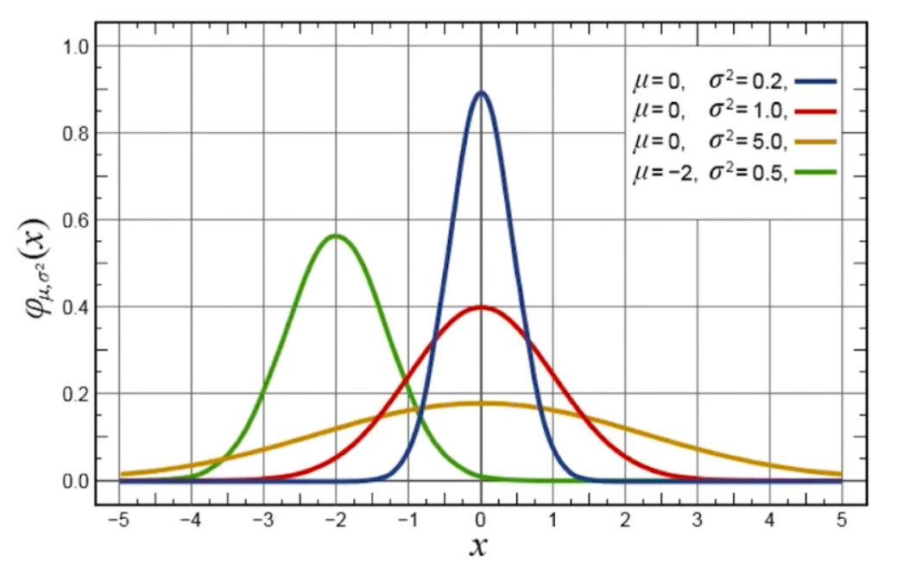
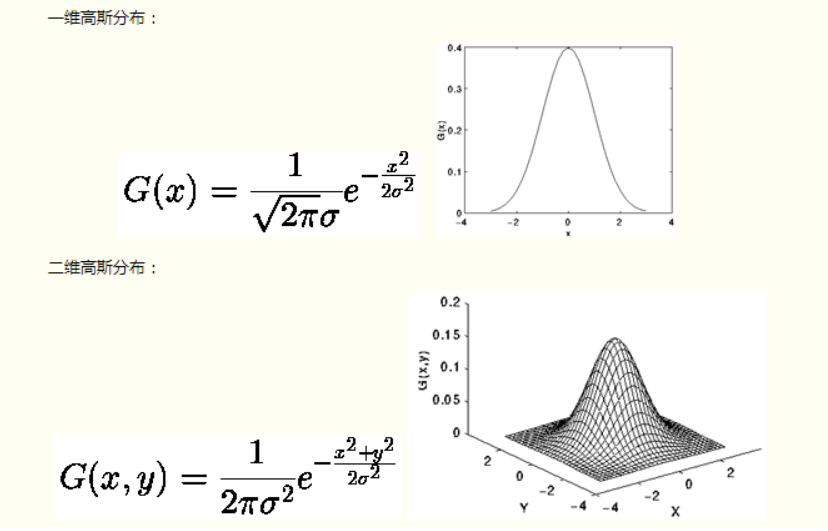

# 第十二讲：图像降噪

---

**目录：**

[TOC]

---

## 一、高斯滤波

**高斯函数：**

* 定义：
  * 高斯函数在是符合高斯分布(也叫正态分布)的数据的概率密度函数.
* 几何图形：
    
* 特点：
  * 以x轴某一点(这一点称为均值)为对称轴，越靠近中心数据发生的概率越高，最终形成一个两边平缓，中间陡峭的钟型(有的地方也叫帽子)图形.
* 一般形式：
    

**高斯滤波：**

* 定义：
  * 使用符合高斯分布的卷积核对图片进行卷积操作.
* 核心思想：
  * 让临近的像素具有更高的重要度.
    * 对周围像素计算加权平均值，较近的像素具有较大的权重值.
* 