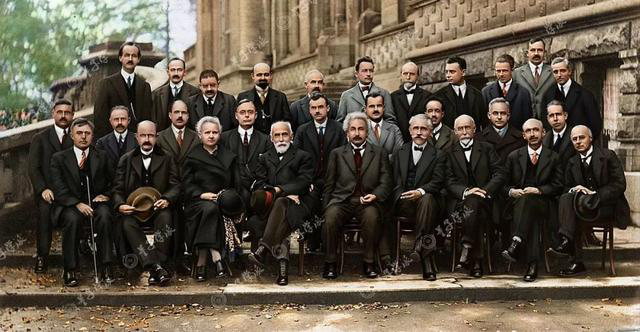
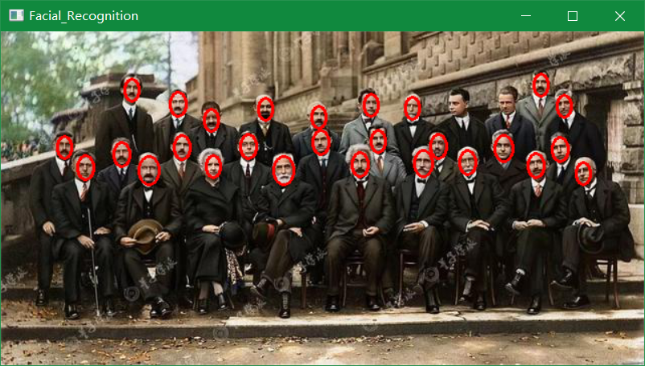

# 第十三讲：人脸识别

> 人脸识别两个阶段：
> * 第一阶段：人脸检测.
> * 第二阶段：人脸判断.
>   * 检测方法：采用**深度学习方式**（深度卷积神经网络——`CNN`识别算法）进行检测.

---

**目录：**

[TOC]

---

## 一、基本概念和定义

**特征值：** 以某种特定规则对人脸图像进行计算提取出的对于特定人脸紧凑且具鉴别性的特征向量，或者称为特征模板.
* 特点：要求同一个人的不同照片提取的特征在特征空间很近，不同人的人脸照片提取的特征在特征空间相距较远，从而达到正确识别的效果.
* 人脸识别常用特征：
  * ==哈尔特征==：反映图像中灰度变化的情况.
    * 本质上是两个矩阵像素和的差.

**分类器：** 根据特征值来界定输入数据是否属于某种类别的过滤器.

**级联分类器：** 将分类器级联起来，就构成了级联分类器，过滤效果比单一的分类器更佳.

**人脸识别模型文件：** `haarcascade_frontalface_alt2.xml`.
* 概述：基于哈尔特征计算方法进行人脸识别的模型文件.
* 路径：
  * `C:\Users\lenovo\AppData\Local\Programs\Python\Python311\Lib\site-packages\cv2\data`.

---

## 二、项目所需库函数

`detectMultiScale(image, objects, scaleFactor, minNeighbors)`

* **位置：** 位于`OpenCV`中的`人脸检测函数库`.
* **功能：** 可以检测出图片中所有的人脸，并将人脸用`vector`保存各个人脸的坐标、大小（用矩形表示）.
* **参数：** 
  * `image`：待检测图片，一般为灰度图像加快检测速度.
  * `objects`：可选参数，被检测物体的矩形框向量组.
  * `scaleFactor`：可选参数，表示在前后两次相继的扫描中，搜索窗口（卷积核）的比例系数.
    * 默认为`1.1`，即每次搜索窗口依次扩大`10%`.
  * `minNeighbors`：可选参数，表示构成检测目标的相邻矩形的最小个数（默认为`3`个）.
* **返回值类型：**
  * 返回图片中包含的全部符合要求的人脸 `faces`：
    * 是一个==包含若干个四维列表的列表==.
      * 每一个四维向量`(x, y, w, h)`：
        * `x`：人脸的横向坐标.
        * `y`：人脸的纵向坐标.
        * `w`：人脸的宽度.
        * `h`：人脸的高度.

`cv2.rectangle(img, pt1, pt2, color, thickness)`

* **功能：** 在图片`img`上画长方形.
  * 坐标原点是图片左上角，向右为`X轴`正方向，向下为`Y轴`正方向.
* **参数：**
  * `img`：图片源.
  * `pt1`：长方形框左上角坐标，为一个二元元组.
  * `pt2`：长方形框右下角坐标，为一个二元元组.
  * `color`：字体颜色，颜色通道为BGR通道模型，为一个三元元组.
  * `thickness`：字体粗细.

`cv2.ellipse(image, centerCoordinates, axesLength, angle, startAngle, endAngle, color, thickness, lineType, shift)`

* **功能：** 用于在任何图像上绘制椭圆.
* **参数：**
  * `image`：待在其上绘制椭圆的图像.
  * `centerCoordinates`：椭圆的中心坐标.
    * 坐标表示为两个值的元组，即`(X坐标值，Y坐标值)`.
      * 坐标参数须为整数.
  * `axesLength`：包含两个变量的元组，分别表示椭圆的长轴（横轴）和短轴（纵轴），即`(长轴长度，短轴长度)`.
    * 坐标参数须为整数.
  * `angle`：椭圆旋转角度，以度为单位.
  * `startAngle`：椭圆弧的起始角度，以度为单位.
  * `endAngle`：椭圆弧的终止角度，以度为单位.
  * `color`：待绘制的形状边界线的颜色.
    * 对于`BGR`色彩通道模型，通过一个元组来表示`B`、`G`、`R`通道上的颜色.
      * 例如：`(255, 0, 0)`为蓝色.
  * `thickness`：形状边界线的粗细像素.
    * 厚度像素将用指定的颜色填充形状.
  * `lineType`：可选参数，表示椭圆边界的类型.
  * `shift`：可选参数，表示中心坐标中的小数位数和轴的值.

> 注意：
> * 双斜线（`//`）：**取整除法**符号.

---

## 三、项目构建

==所选图片：==



==项目代码：==

``` Python
    import cv2

    ''' 1. 创建基于haar级联分类器. '''
    facer = cv2.CascadeClassifier('haarcascade_frontalface_alt2.xml')

    ''' 2. 导入需要人脸检测的图片，并且灰度化 '''
    img = cv2.imread('Pict.png')
    gray = cv2.cvtColor(img, cv2.COLOR_BGR2GRAY)

    ''' 3. 实现人脸识别 '''
    faces = facer.detectMultiScale(gray)

    for (x, y, w, h) in faces:
        # 使用红色矩形框来标记人脸.
        # cv2.rectangle(img, (x, y), (x + w, y + h), (0, 0, 255), 2)
        # 使用红色椭圆形来标记人脸.
        center = (x + w // 2, y + h // 2)
        cv2.ellipse(img, center, (w // 2 - 4, h // 2), 0, 0, 360, (0, 0, 255), 2)

    cv2.imshow('Facial_Recognition', img)
    cv2.waitKey(0)
    cv2.destroyAllWindows()
```

==识别结果：==

