# 第二讲：利用笔记本远程显示树莓派虚拟桌面

---

**目录：**

[TOC]

---

## 一、准备阶段

**准备材料：**

* 硬件：
  * 树莓派4B开发板；
  * 读卡器；
  * 适用于树莓派的SD内存卡；
  * 笔记本一台.
* 软件：
  * `Raspberry Pi Imager`.

**操作步骤：**

1. 首先打开树莓派官方网站：https://www.raspberrypi.org/.
   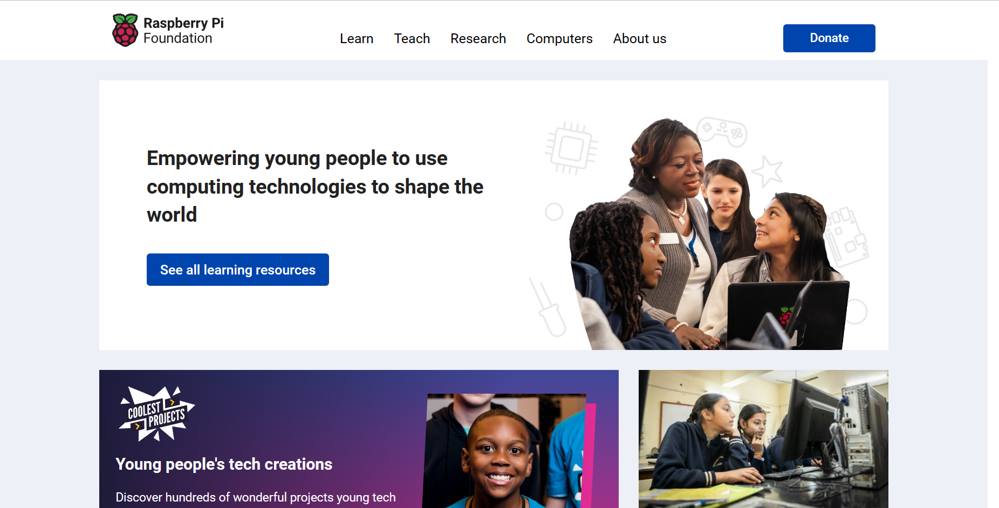
2. 点击网页上方`Computers`下拉栏中的`Visit raspberrypi.com`选项.
   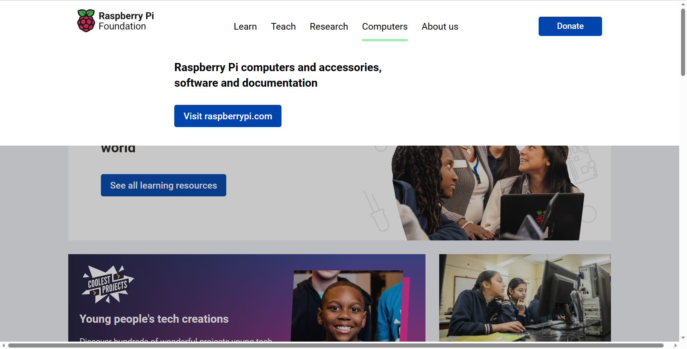
3. 点击`Software`选项，进入树莓派系统介绍与安装界面.
   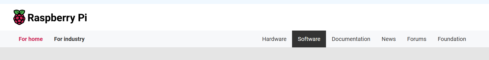
4. 下拉页面，找到树莓派官方烧录工具`Raspberry Pi Imager`的下载选项，开始下载.
   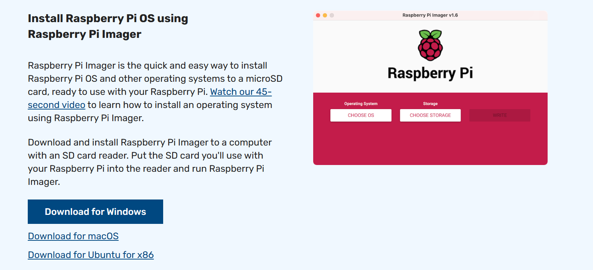
5. 安装好`Raspberry Pi Imager`之后，进入烧录界面；这是需要将树莓派的SD卡通过读卡器与笔记本电脑相连.
   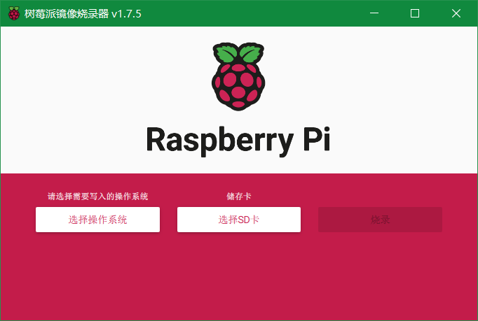
6. 在烧录软件开始界面选择需要写入的操作系统（推荐选择官方`recommend`的操作系统），以及选择储存卡（即树莓派的SD卡，已经通过读卡器与笔记本连接）.
   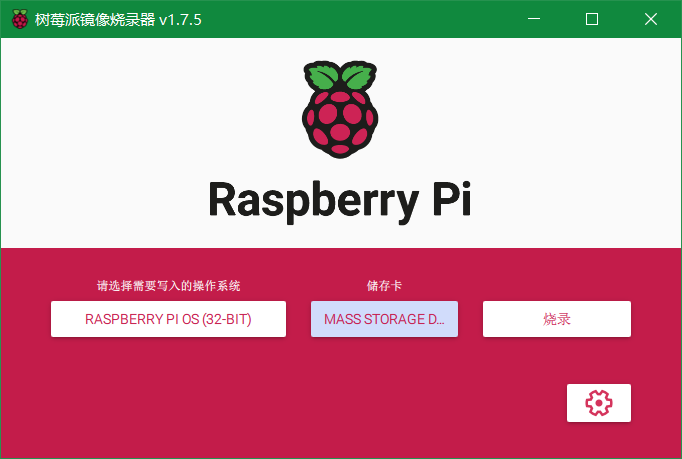
7. ==这是最关键的一步！== 在选择了操作系统和储存卡之后，界面右下角会出现齿轮图标，单击进入设置页面，在“==开启SSH服务==”、“==Set username and password==”以及“==配置WIFI==”三个选项卡前打勾，否则在使用`PuTTY`将笔记本和树莓派进行远程连接时会出现无法连接的错误.
   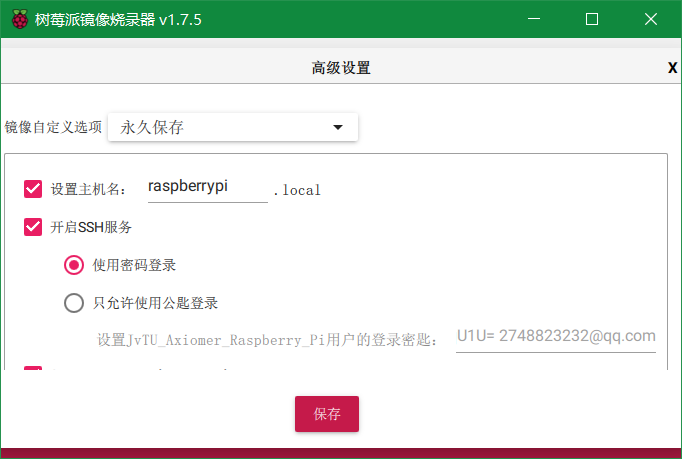
   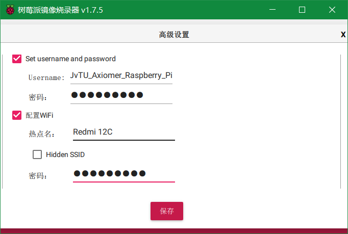
   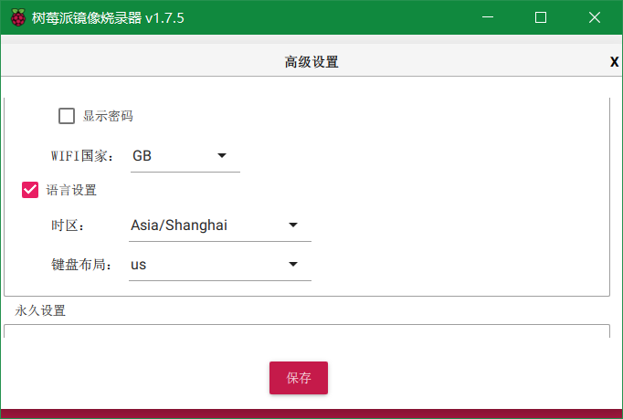
   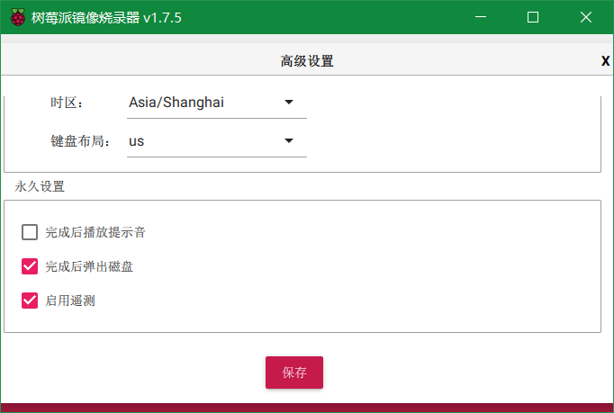
8. 配置好设置之后选择保存，并开始烧录.烧录的时间一般会在`5~10min`之内，请耐心等待.
9. 烧录成功之后，SD储存卡一般会自动从笔记本上安全弹出.此时将储存卡取下，插入树莓派的内存卡卡槽内.

**可能坑点：**

* 忘记配置烧录前的树莓派设置，从而导致之后无法将笔记本与树莓派通过`PuTTY`进行远程连接.
* 在配置`WIFI`热点名和密码时写错名称或密码，导致之后无法远程连接.
* 烧写成功之后会弹出报错警告，这是正常现象.之后已经烧录好的SD卡每次在被笔记本读取时都会弹出报错警告，这是正常现象，关掉警告即可，不必慌张.
  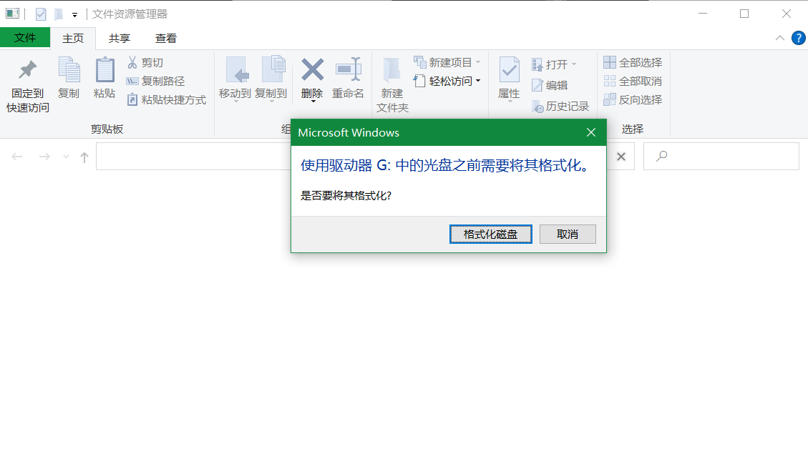

---

## 二、使用手机无线热点连接笔记本和树莓派

**准备材料：**

* 硬件：
  * 树莓派4B开发板（已插入卡内烧写有操作系统的SD卡）；
  * 适用树莓派的配电器；
  * 可以打开WLAN热点的手机一部；
  * 笔记本一台.
* 软件：
  * `PuTTY`；
  * `Advanced IP Scanner`.

**操作步骤：**

1. 将树莓派通过配电器为其供电（树莓派会有角灯亮起和闪烁）.
2. 等待大约`3~5min`，树莓派会自动连接到手机提供的热点.
3. 将笔记本连接到之前烧录时为树莓派配置的同一个无线网下（即上一步中的热点）.
4. `Win + R`打开笔记本的`cmd窗口`，输入命令`ipconfig`.
   
5. 在输出的信息中找到`无线局域网适配器 WLAN`部分，在该部分找到`IPv4 地址`一栏，记下对应的地址.
   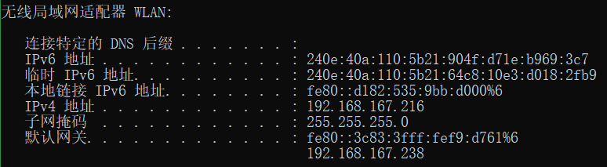
6. 打开`Advanced IP Scanner`，将欲扫描的区间范围改成将上一步记下的地址的最后一个小数点后的数字分别换成`1`和`255`的范围.
   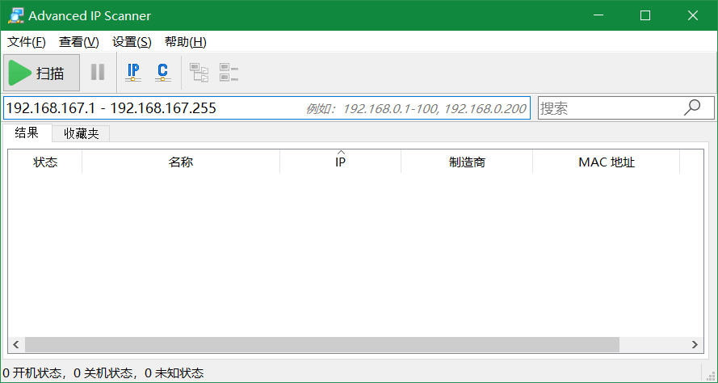
7. 打开手机端的`个人热点` - `已连接设备`，在已连接设备中找到`raspberrypi`，记下下方的字符串.
   
8. 将上一步记下的字符串与`Advanced IP Scanner`扫描结束之后列出的`MAC地址`进行匹配，匹配上的一栏中的`IP`即为树莓派的`IP地址`.
   
9. 打开`PuTTY`，在`Host Name`一栏输入上一步得到的树莓派的IP地址，点击`Open`选项，在弹出的警告窗口中点击`Accept`选项.
    
    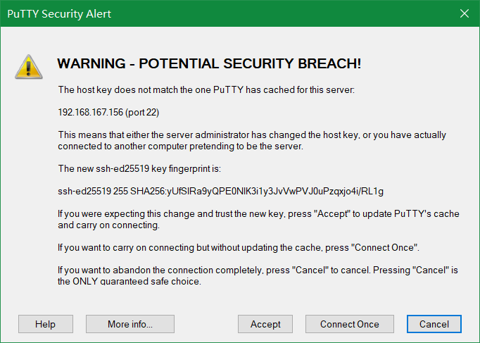
10. 在弹出的命令行窗口中输入树莓派的`Username`和`Password`（注意`Password`不可见，需要盲打），回车确认，弹出树莓派的设备信息，则连接成功.
    

**可能坑点：**

* 树莓派烧录后首次上电连接无线热点耗时较长，需要耐心等待；当手机热点信息中已连接设备界面出现了`raspberrypi`设备时，树莓派就成功连接了.
* 在使用`ipconfig`命令查询`IPv4地址`时，可能会出现该地址以`172`开头的情况，此时得到的`IPv4地址`不是正确的地址.
  * 解决方法：将`网络和共享中心` - `查看活动网络` - `连接` - `属性` - `共享`下的两个选项卡前的对勾去掉，点击确定退出，再次进入该界面将选项卡前重新打勾刷新，确认后再次退出.

---

## 三、使用网线连接笔记本和树莓派

**准备材料：**

* 硬件：
  * 树莓派4B开发板（已插入卡内烧写有操作系统的SD卡）；
  * 适用树莓派的配电器；
  * 网线一根；
  * 笔记本一台.
* 软件：
  * `PuTTY`.

**操作步骤：**

1. 将已经与手机热点成功连接之后的树莓派通过配电器为其上电.
2. 用网线两端，一端连接树莓派，一端连接笔记本.
3. 打开`控制面板` - `网络和 Internet` - `网络和共享中心`.
   
4. 点击进入`查看活动网络`一栏的`连接`，选择`属性` — `共享`，把第一个可选框打勾并选择`以太网`.
   
5. `Win + R`打开笔记本的`cmd窗口`，输入命令`arp -a`.
   
6. 通过插网线与不插网线执行`arp -a`命令输出信息相对比，找到并记下树莓派的`IP地址`.
   
7. 打开`PuTTY`，输入`IP地址`后，点击`Open`选项，会弹出警告窗口，点击`Accept`选项关闭窗口.
   
8. 输入树莓派的`Username`和`Password`，回车确认，弹出树莓派的设备信息，则连接成功.
   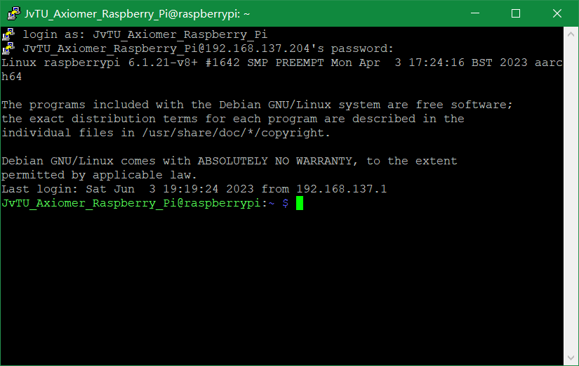

**可能坑点：**

* 通过在`cmd命令行`窗口中键入`arp -a`命令，可能会出现以下情况：
  * 情况一：获得的树莓派的`IP地址`无效.
    * 解决方法：将`网络和共享中心` - `查看活动网络` - `连接` - `属性` - `共享`下的两个选项卡前的对勾去掉，点击确定退出，再次进入该界面将选项卡前重新打勾刷新，确认后再次退出.
  * 情况二：输入树莓派的`IP地址`显示连接超时或连接错误.
    * 解决方法：多次尝试接口下的`Internet 地址`，可能有效的`IP地址`不是第一个`Internet 地址`，需多次尝试.

## 三、使用RealVNC远程桌面连接树莓派

**准备材料：**

* 硬件：
  * 树莓派4B开发板（已插入卡内烧写有操作系统的SD卡）；
  * 适用树莓派的配电器；
  * 网线一根；
  * 可以打开WLAN热点的手机一部；
  * 笔记本一台.
* 软件：
  * `RealVNC`.

**操作步骤：**

1. 使用手机无线热点连接方式或者网线连接方式成功连接笔记本和树莓派.
2. 使用`putty`开启`VNC服务`和设置合适分辨率，为后续`VNC`的使用做好提前准备.
   1. 首先输入命令：`sudo raspi-config`，按下回车后，进入配置界面.
    
   2. 通过上下键选择`Interfacing Options`，接着左右键选择`Select`，并按回车键.
    
   3. 接着上下键选择`VNC`，左右键选择`Select`，并按回车键.
    
   4. 左右键选择`Yes`，并按回车键.
    
   5. 回车键确定`OK`.
   6. 进入`Display Options`选项，设置分辨率（`1920×1080`），此处不再赘述.
2. 打开`RealVNC`，在页面上方输入树莓派的IP地址，进行远程桌面的连接.
   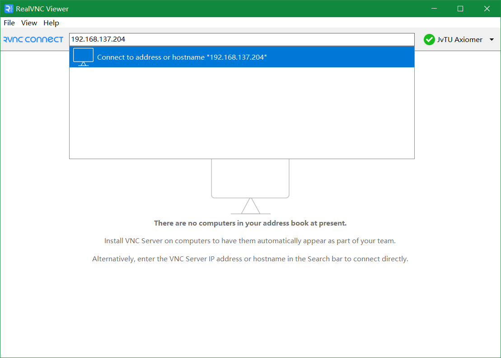
3. 输入`Username`和`Password`，点击`OK`，出现树莓派的远程桌面，则远程桌面与树莓派连接成功.
   

**可能坑点：**

* `VNC Viewer`连接树莓派分辨率不适应笔记本屏幕.
  * 解决方法：了解发现，`raspi-config`修改的是树莓派的分辨率，修改成功后树莓派本身的分辨率（包括连接显示器时的分辨率）会发生改变，但不会影响`VNC`端的分辨率；而`vncserver`这条命令修改的是`VNC`端的分辨率，但只能一次生效，开启一个`:1`的端口以供连接。因此，可以用两行`shell`解决问题：
    ``` Python
    #!/bin/sh
    vncserver -geometry 1920x1080 # 修改分辨率，并开启:1端口
    lxappearance # 解决连接后指针变成X的问题
    ```
    可以将脚本放在`pi主目录`下，每次`VNC`连接后执行一次，然后再切换窗口，由于每次开启的都是`:1`端口，所以不用每次新建，只要保留这两个就行：
    

---

## 四、实用小技巧

### 4.1 查看树莓派信息

==输入命令：==
* 安装软件：
  * `sudo apt install screenfetch`.
* 查看设备信息：
  * `screenfetch`.

==显示结果：==

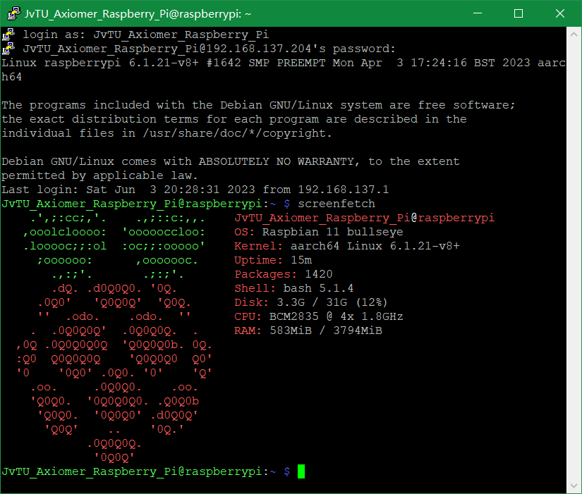

### 4.2 查看python版本和位置

==输入命令：==
* `whereis python`.

==显示结果：==

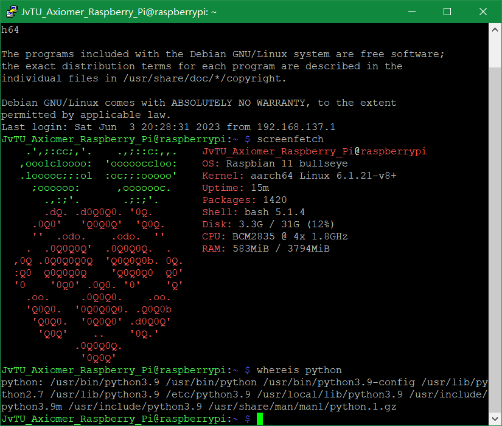

可以看到我的树莓派上既安装了版本为`3.9`的Python，也安装了版本为`2.7`的Python.