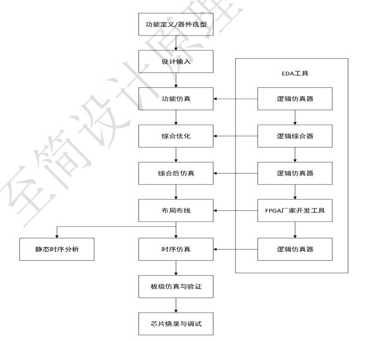

# 第二课：FPGA开发流程

---

**目录：**

[TOC]

---

FPGA 的设计流程就是利用 `EDA` 开发软件和编程工具对 FPGA 芯片进行开发的过程。原理图和`HDL`（`Hardware description language`，硬件描述语言）是两种最常用的数字硬件电路描述方法.

## 一、功能定义 / 器件选型

**功能定义：**
* 功能.
* 参数.
* 接口.

**器件选型：**
* 前提准备：
  * 明确==功能和接口的类型==.
* 综合考虑：
  * 硬件的工作速度.
  * 器件自身的资源、成本、以及性能指标.

## 二、设计输入（Design Entry）

设计师接触比较多的 HDL 语言是行为 HDL ，其主流语言为：
* `Verilog HDL`.
* `VHDL`.

这两种语言都是`IEEE`的标准.

在设计方法上，一般都采用==自顶向下==的设计方法.

另一种设计方式是使用原理图输入的方法进行设计输入.

## 三、==功能仿真（RTL-Simulation）==

功能仿真也称为综合前仿真，用户设计好数字逻辑后需要检查自己的设计是否符合预期，在不需
要综合之前通过仿真软件对电路进行逻辑验证.

在功能仿真器件电路可以不用考虑延迟等因素，仅对初步的功能进行检验。通过建立测试平台即 `Testbench`，利用波形编译器（仿真软件）和硬件描述语言建立好波形文件和激励信号，在仿真软件上会模拟实际电路的波形显示出输出波形信号，并生成报告文件.用户通过观察各个时间点信号的变化情况来验证自己所设计逻辑的正确性.

## 四、综合优化（Synthesis）

所谓综合即针对给定的电路实现功能和实现该电路的约束条件，如速度、功耗、成本及电路类型
等，通过计算机进行优化处理获得一个能满足上述要求的电路设计方案.

## 五、综合后仿真

综合后仿真是用来检查综合结果是否和原设计一致.

后仿真与前仿真的区别在于：前仿真是指综
合前的仿真，如在 `Modelsim` 对撰写的代码直接进行仿真，而后仿真是综合后的仿真，也就是功能仿真.

## 六、布局布线（Place & Routes）

布局布线可理解为利用实现工具把逻辑映射到目标器件结构的资源中从而决定逻辑的最佳布局，
选择逻辑与输入输出功能链接的布线通道进行连线，并产生相应文件（如配置文件与相关报告）.

## 七、时序仿真（Timing）

时序仿真，也称为后仿真，是指将布局布线的延时信息反标注到设计网表中来检测有无时序违规
（即不满足时序约束条件或器件固有的时序规则，如建立时间、保持时间等）现象.

## 八、板级仿真与验证

板级仿真主要应用于高速电路设计中，对高速系统的信号完整性、电磁干扰等特征进行分析，一
般都以第三方工具进行仿真和验证，在实际的工作中一般接触较少.

## 九、==编程与调试==

设计的最后一步就是芯片的编程与调试.

编程是指将 FPGA 开发工具最后产生使用的数据文件（位数据流文件，`Bitstream Generation`）加载到 FPGA 芯片中.

数据文件下载到 FPGA 芯片中以后还需要进行调试验证，逻辑分析仪（`Logic Analyzer`，`LA`）便是 FPGA 设计的主要调试工具.

目前，主流的 FPGA 芯片生产商都提供了内嵌的在线逻辑分析仪（如 `Xilinx ISE` 中的 `ChipScope`、`Altera` `QuartusII` 中的 `SignalTapII` 以及 `SignalProb`），它们只需要占用芯片少量的逻辑资源便可达到同样的效果，在实际的工程调试中发挥了极大的作用.