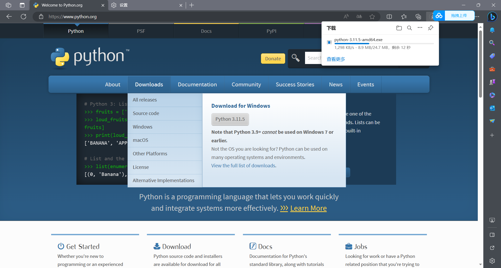
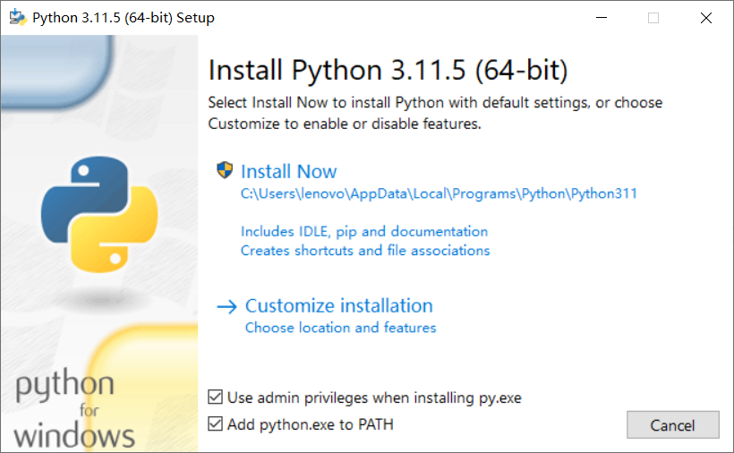
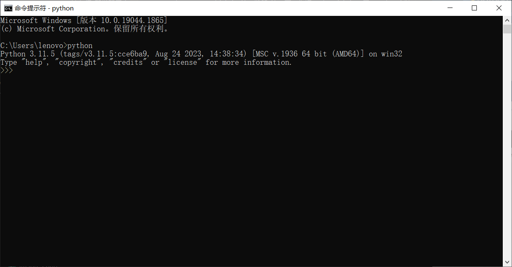
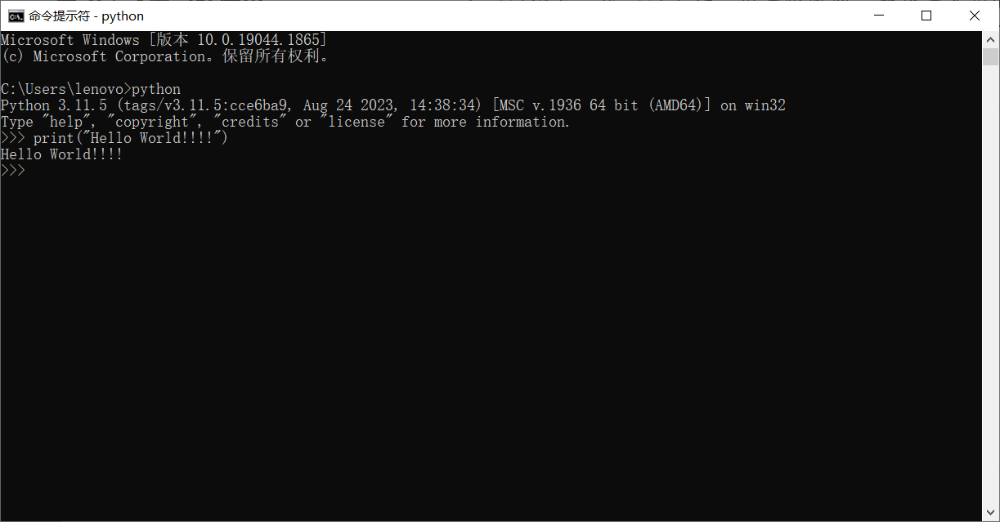
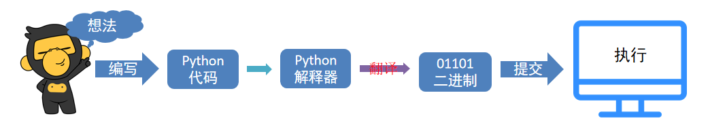

# 第一阶段-第一章：你好 Python

> 2022年，Python在**TIOBE**排行榜中奋起直追，荣登榜首.

> 课程安排：
> * Python语言基础入门
> * Python语言高阶加强.
> * 大数据分析PySpark.
>
> 深入大数据开发，也可继续深入人工智能体系.

> 挑战高薪：
> * 荣登排行榜TOP 1的明星语言：Python（软保障）.
> * 大数据开发 + 人工智能体系（硬保障）.

---

**目录：**

[TOC]

---

## 一、初识Python

### 1.1 Python的特点
* 简洁、高效.
* 丰富的第三方库.
* 应用场景丰富.

### 1.2 Python的起源

1989年，为了打发圣诞节假期，Gudio van Rossum吉多· 范罗苏姆（龟叔）决心开发一个新的解释程序（Python雏形）.

1991年，第一个Python解释器诞生.

Python这个名字，来自龟叔所挚爱的电视剧Monty Python's Flying Circus.

### 1.3 为什么选择Python？

* **优雅**.
  * 简单.
  * 易学.
  * 开发效率高.
* **适用面广泛**.

---

## 二、什么是编程语言

语言：进行沟通交流的表达方式.

编程语言：人类和计算机交流的一种专有领域语言.

计算机只能识别二进制的`0`和`1`.

编程语言无法直接和计算机沟通，因此需要翻译程序（专业名词为解释器）将代码翻译成计算机能够识别的二进制语言.

> 思考：为什么不直接把中文翻译成二进制呢？
> * 自然语言远比编程语言复杂，编程语言语法“死板”，“翻译官”更容易翻译.

---

## 三、Python安装

Python官方网站地址：`python.org`.

Python官网下载地址：`https://www.python.org/downloads`.

**下载：**

**安装：**

**验证：**


---

## 四、第一个Python程序

打开CMD（命令提示符）程序，输入Python并回车.

> 使用快捷键`win + r`，打开运行框，输入`cmd`后回车即可打开命令提示符程序.

然后，在里面输入代码回车即可立即执行：

``` Python
print("Hello World!!!!")
```



> 注意：
> * 输入的括号和引号需要使用**英文符号**.
>   * 否则，会出现报错信息：`SyntaxError: invalid character '“' (U+201C)`.
>   * 这是因为，代码中的符号是中文符号.

---

## 五、Python解释器

首先，一个基本原理是：计算机只认识**二进制**，即：`0`和`1`.

其实很简单，计算机是不会认识Python代码的。但是Python有解释器程序，如下图：



安装Python环境，本质上，就是在电脑中，安装：`Python解释器程序`.

因此，代码，随时可以写，但能不能运行，就要看电脑里面有没有解释器程序了.

**Python解释器**，是一个计算机程序，用来翻译Python代码，并提交给计算机执行.
所以，它的功能很简单，就2点：
1. 翻译代码.
2. 提交给计算机运行.

即：将Python代码翻译成计算机认识的0和1并提交计算机执行.

解释器存放在：`<Python安装目录>/python.exe`；我们在CMD（命令提示符）程序内，执行的`python`，就是上述的`python.exe`程序.

我们可以将代码，写入一个以“`.py`”结尾的文件中，使用python命令去运行它.

> “`.py`”文件：python语言的**代码文件**，里面记录了python的代码.

---

## 六、Python开发环境

Python程序的开发有许多种方式，一般我们常见的有：
* Python解释器环境内，执行单行代码.
* 使用Python解释器程序，执行Python代码文件.
* 使用第三方IDE（集成开发工具），如PyCharm软件，开发Python程序.

最常用的就是使用**PyCharm**软件进行开发.

首先，我们先下载并安装它：
- 官方网站地址：`www.jetbrains.com`.
- 官网下载地址：`https://www.jetbrains.com/pycharm/download/#section=windows`.

PyCharm是以工程为单位来创建文件的；因此想要写代码需要先创建一个**工程**.

PyCharm基础使用方法：
* 修改主题.
* 修改默认字体和大小.
* 通过快捷键快速设置字体大小.
* 汉化软件.
  * `Chinese`.
* 其他插件-翻译软件.
  * `Translation`.
* 常用快捷键.
  * `ctrl + alt + s` : 打开软件设置.
  * `ctrl + d` ：复制当前行代码.
  * `shift + alt + 上\下` ： 将当前行代码上移或下移.
  * `crtl + shift + f10` : 运行当前代码文件.
  * `shift + f6` ：重命名文件.
  * `ctrl + a` : 全选.
  * `ctrl + c\v\x` : 复制、粘贴、剪切.
  * `ctrl + f` : 搜索.