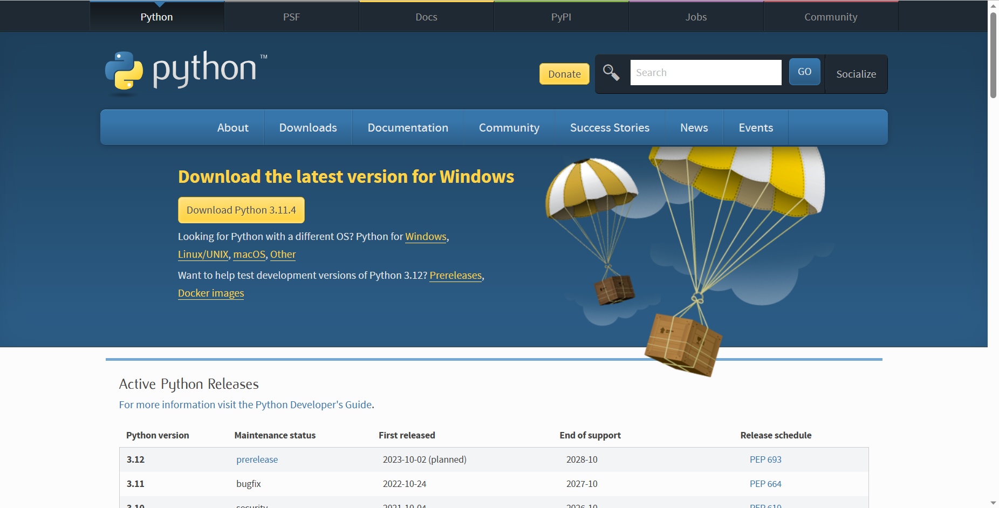
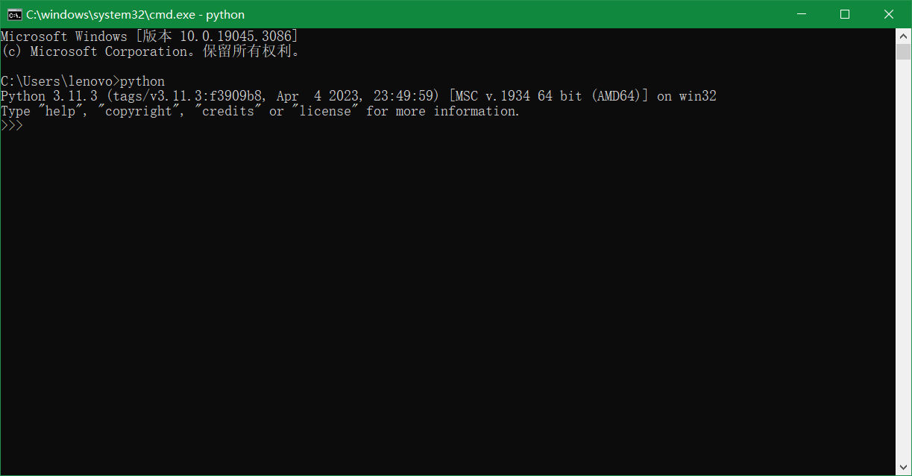
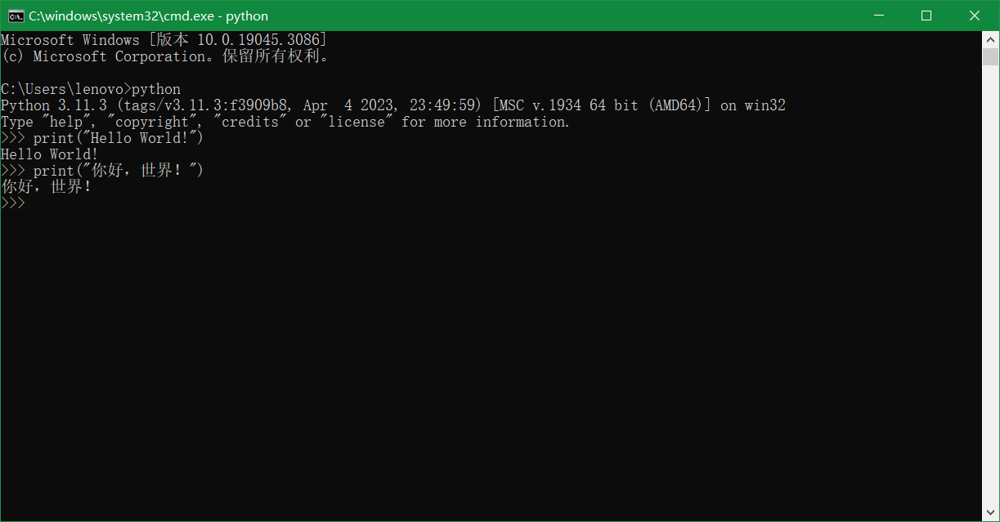

# 课程导引：Python快速入门_即学即用

> 本次学习为==第一次==学习`黑马程序员`——`Python快速入门_即学即用`课程.

> 课程体系：
> * Python语言基础入门.
> * Python语言高阶加强.
> * 大数据分析`PySpark`.

---

**目录：**

[TOC]

---

> 妙不可言的Python之旅！
>   —— 从今天开始，成为一名优雅的Pythoneer.

## 一、初识Python

**Python的特点：**

* 简洁高效.
* 丰富的应用场景.
  * 丰富的第三方库.

### Python的起源

* 创造者：`Gudio van Rossum`（`吉多范罗苏姆`，即`龟叔`）.
* 诞生原因：
  * `1989年`，吉多范罗苏姆在圣诞节的假期决心开发一个新的解释器程序，即`Python`的雏形诞生了.
* 诞生时间：`1991年`——第一个Python解释器程序诞生了.

### 为什么选择Python

==优雅==.

* 简单.
* 易学.
* 开发效率高.

==适用面广泛==.

* 人工智能 / 机器学习.
* 大数据开发.

## 二、什么是编程语言

> 语言：进行沟通交流的表达方式.

### 计算机识别的语言

计算机只认识二进制的`0`和`1`.

编程语言即人类和计算机交流的一种专有领域语言.

### 编程语言翻译过程

代码 -> 翻译程序（`解释器` / `翻译器`） -> 计算机.

### 编程语言工作原理

将人类的想法，翻译成计算机可以识别的二进制，让计算机工作.

## 三、Python安装

### 下载

想要使用Python语言编写程序，我们必须下载Python安装包并配置Python环境.

> Python官方网站：
> * `python.org`.

### 安装



### 验证



## 四、第一个Python程序

> Python文件的后缀名：
> 
> * `.py`.
> 
> 即：`.py`文件是Python语言的代码文件，里面记录了Python的代码.

``` Python
print("Hello World!")

print("你好，世界！")
```



> 注意：
> * `括号`和`双引号`需要使用英文符号.

**小练习：**

> 请在“命令提示符”（`CMD`）程序内，通过Python，向屏幕上输出：零基础，学Python，月薪过万，就来黑马程序员。

``` Python
print("零基础，学Python，月薪过万，就来黑马程序员。")
```

> 一些常见问题：
> * 命令提示符（`cmd`）程序打开方式：
>   * 使用快捷键：`win + r`打开运行输入框，在框内输入`cmd`即可打开命令提示符.
> * 命令提示符内，输入`python`出现：`'python' 不是内部或外部命令，也不是可运行的程序或批处理文件`.
>   * 错误原因：安装Python的时候，没有勾选：`add python 3.10 to PATH`的选项.
>   * 解决方式：卸载Python并重新安装Python，在安装时注意勾选这个选项；然后重新打开命令提示符程序，即可.
> * 执行出现：`SyntaxError: invalid character '“' (U+201C)`.
>   * 错误原因：代码中的符号是中文符号.
>       * 代码中的双引号和小括号为英文符号.

## 五、Python解释器

### Python解释器工作流程

想法 -> Python代码 -> Python解释器 -> 翻译 -> `01101`二进制代码 -> 交付计算机执行程序.

### Python解释器工作原理及功能

**Python解释器的位置：**

位于`<Python>`的安装目录下：文件`/python.exe`.

**Python解释器的工作原理：**

Python解释器，是一个计算机程序（`python.exe`），用来翻译Python代码，并提交给计算机执行.

**Python解释器的功能：**

* 翻译代码.
* 提交给计算机运行.

## 六、Python开发工具

### PyCharm简介

Python程序的开发有许多种方式，一般我们常见的有：
* Python解释器环境内，执行单行代码.
* 使用Python解释器程序，执行Python代码文件.
* 使用第三方IDE（集成开发工具），如PyCharm软件，开发Python程序.

> 最常用的就是使用PyCharm软件进行开发.

PyCharm集成开发工具（`IDE`），是当下全球Python开发者，使用最频繁的工具软件.

绝大多数的Python程序，都是在PyCharm工具内完成的开发.

本次课程全程基于PyCharm软件工具，来讲解Python.

> JetBrains官方网站：
> * `www.jetbrains.com`.
> `JetBrains-PyCharm`下载地址：
> * `https://www.jetbrains.com/pycharm/download/#section=windows`.

PyCharm需要以“==工程==”为单元，供我们使用.因此想要用PyCharm写代码，需要==先创建一个工程==.

> 注意：
> * 如果想要安装最新版的PyCharm，不需要卸载本地的旧版本PyCharm，直接在`JetBrains-PyCharm`官方网站下载最新版本的PyCharm并运行其安装程序，安装程序会自动帮助使用者卸载完成本地的旧版本PyCharm.

### PyCharm的使用方式

* 新建项目：
  * `New Project`.
    * 创建一个新项目.
  * `Open`.
    * 打开原有的项目.
  * `Get from VCS`.
    * 从代码托管平台上克隆项目.
* `PyCharm`中一键调整代码格式快捷键：
  * `Ctrl + Alt + L`.

> 注意：
> 在使用PyCharm关闭项目时，如果出现卡死在`Closing Project`关闭界面的情况，在不改变PyCharm版本的情况下，有两种解决方法：
> * 在PyCharm右上角菜单栏中通过路径`文件 - 清除缓存... - 清除并重启（R）`对PyChar的缓存进行清除，达到快速关闭项目的目的.
> * 在P有Charm右上角菜单栏中通过路径`文件 - 设置... - 工具 - 共享索引`，在`公开共享索引`下的`下载项目依赖项的预构建共享索引-Python软件包`的下拉栏中选择`不下载，使用本地索引选项`，也可以达到快速关闭项目的目的.

PyCharm常用快捷键：
* `ctrl + alt + s` : 打开软件设置.
* `ctrl + d` ：复制当前行代码.
* `shift + alt + 上\下` ： 将当前行代码上移或下移.
* `crtl + shift + f10` : 运行当前代码文件.
* `shift + f6` ：重命名文件.
* `ctrl + a` : 全选.
* `ctrl + c\v\x` : 复制、粘贴、剪切.
* `ctrl + f` : 搜索.