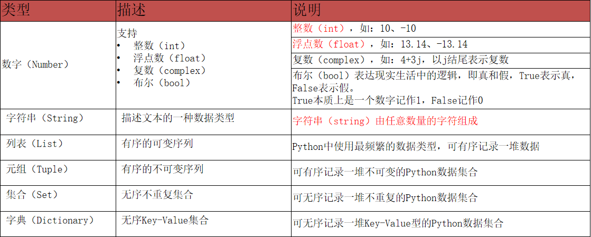

# 第一讲：Python基础语法

---

**目录：**

[TOC]

---

## 一、字面量

### 什么使字面量

字面量：在代码中，被写下来的的固定的值，称之为字面量.

### 常用的值类型

Python中常用的有6种值（数据）的类型：



> 字符串（`string`）：
> * 又称文本，是由任意数量的字符如中文、英文、各类符号、数字等组成，所以叫做字符的串.
> * Python中，字符串需要用双引号（`"`）包围起来；即被引号包围起来的，都是字符串.

### 示例程序

``` Python
    666
    13.14
    "黑马程序员"

    # 基于print语句完成字面量的输出：
    print(666)
    print(13.14)
    print("黑马程序员")

```

## 二、注释

### 注释的定义和作用

**注释：** 在程序代码中对程序代码进行解释说明的文字.

**作用：** 注释不是程序，==不能被执行==，只是对程序代码进行解释说明，让别人可以看懂程序代码的作用，能够大大增强程序的可读性.

### 注释的分类

**单行注释：** 以 `#`开头，`#`右边的所有文字当作说明，而不是真正要执行的程序，起辅助说明作用.

单行注释一般用于对一行或一小部分代码进行解释.

> 注意：`#`号和注释内容一般建议以==一个空格==隔开.

**多行注释：** 以一对三个双引号引起来（`""" 注释内容 """`）来解释说明一段代码的作用使用方法.

多行注释一般对：Python文件、类或方法进行解释.

### 示例程序

``` Python
    """
    本代码演示了：
    - 各类字面量的写法.
    - 通过print语句输出各类字面量.
    """

    # 写一个整数字面量.
    666
    # 写一个浮点数字面量.
    13.14
    # 写一个字符串字面量.
    "黑马程序员"

    # 通过print语句输出各类字面量.
    print(666)
    print(13.14)
    print("黑马程序员")

```

## 三、变量

### 变量的定义

**变量：** 在程序运行时，能储存计算结果或能表示值的抽象概念.

* 简单的说，变量就是在程序运行时，记录数据用的.

* 变量的**特征**就是，变量存储的数据，是可以发生改变的.

**变量的定义格式：**
* `变量名称 = 变量的值`.
  * **变量名称**：每一个变量都有自己的名称，称之为：变量名，也就是变量本身.
  * **`=`**：赋值，表示将等号右侧的值，赋予左侧的变量.
  * **变量的值**：每一个变量都有自己存储的值（内容），称之为：变量值.

### 示例程序

``` Python
    """
    演示Python中变量的相关操作.
    """

    # 定义一个变量，用来记录钱包余额.
    money = 50
    # 通过print语句，输出变量记录的内容.
    print("钱包还有：", money, "元")  # 输出多份数据，用逗号隔开即可.

    # 买了一个冰淇淋，花费10元.
    money = money - 10
    print("买了冰淇淋，花费十元，还剩余：", money, "元")

    # 假设，每隔一小时，输出一下钱包的余额.
    print("现在是下午1点，钱包余额剩余：", money, "元")
    print("现在是下午2点，钱包余额剩余：", money - 10, "元")

```

## 四、数据类型

### `type()`语句

可以通过`type()`语句来得到数据的类型.
* 语法：
  * `type(被查看类型的数据)`.

> 我们通过`type(变量)`可以输出类型，这是查看的是变量存储的数据的类型.
> 因为，在Python中，变量无类型，但是它存储的数据有.

### 示例程序

``` Python
    # 方式1：使用print直接输出类型信息.
    print(type("黑马程序员"))
    print(type(666))
    print(type(11.345))

    # 方式2：使用变量存储type()语句的结果.
    string_type = type("黑马程序员")
    int_type = type(666)
    float_type = type(11.345)
    print(string_type)
    print(int_type)
    print(float_type)
    # 方式3
    name = "黑马程序员"
    name_type = type(name)
    print(name_type)

```

> 注意：
> * `str`是`string`的缩写.

## 五、数据类型转换

## 六、标识符

## 七、运算符

## 八、字符串扩展

## 九、数据输入